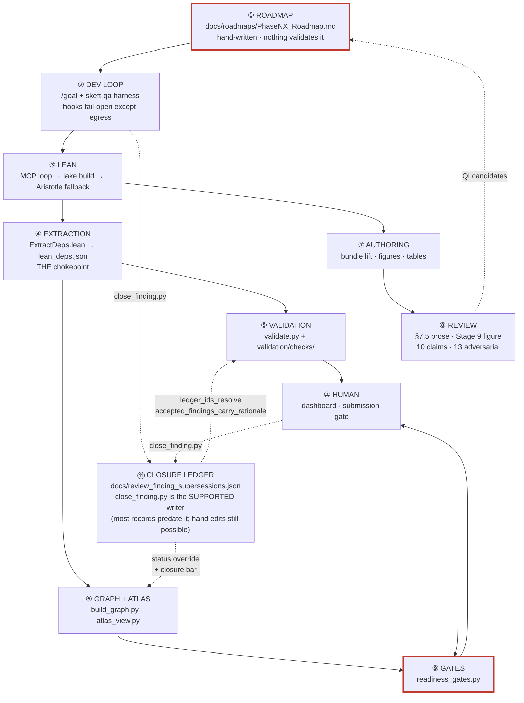

# End-to-end map — roadmap to signed-off publication

> **Answers:** How does work get from a roadmap to a signed-off publication?
>
> *(TODO-D8: this line is the required-content contract. `README.md`'s ownership
> table assigns this question to this document; `architecture_inventory_fresh`
> asserts the two agree verbatim, so the assignment cannot drift silently.)*

**Living document.** Start at [`README.md`](README.md). States no counts — every census
figure is in [`SURFACE_INVENTORY.md`](SURFACE_INVENTORY.md), which is derived and gated.

This is the **spine**: the path work travels from a roadmap to a signed-off publication, and
**where that path is broken today**. It describes present state only. The investigation that
produced it — including the claims that did not survive verification — is in
[`../audits/2026-08-06-e2e-map/`](../audits/2026-08-06-e2e-map/); history belongs there, not
here.

The quality layer's interior — artifact writers, the review-finding pipeline, human decision
points, claim lineage — is [`QA_QI_INFRASTRUCTURE_MAP.md`](QA_QI_INFRASTRUCTURE_MAP.md).

---

## 1. The spine



**The one structural fact worth internalising:** ④ is a chokepoint. Everything quantitative
downstream — counts, the atlas, the graph, the frontier — derives from `lean/lean_deps.json`.
Below that node drift is structurally impossible. Above it, every hand-maintained registry is
a surface that can rot, and this map's job is to say which ones are gated.

**The two ends are the weak ones.** ① has no mechanization at all, and ⑨ contains gates that
return verdicts they did not compute. Everything in between is substantially sound.

---

## 2. ① Roadmap → wave authorization

Waves are declared in `docs/roadmaps/`. Most files follow `Phase<N><X>_Roadmap.md`, but the
directory also holds topic roadmaps (`FormulaRefSweep_Roadmap.md`), bundle-discharge roadmaps
(`D10_Discharge_Roadmap.md`), lab notebooks and plans — **do not scope a search for a wave to
the `Phase*` prefix.** The roadmap is where a phase's scope, its waves, and design decisions
are recorded.

**Nothing validates a roadmap.** No check module references `docs/roadmaps/`, and no
`*_close.md` files exist there. The roadmap layer — where scope and waves are declared — is
entirely unmechanized. **This is the single largest ungated seam in the map.**

**The one code path that reads a roadmap fails open.**
`.claude/plugins/skeft-qa/scripts/notebook_lib.py` wraps the read in
`except Exception: return None`, so an unreadable or absent roadmap is indistinguishable from
one with nothing to say.

⚠️ **Placement concern.** The graph schema is declared in `docs/KNOWLEDGE_GRAPH.md`, with a
delta in `temporary/working-docs/sentence_kg_schema_delta.md` and a parallel edge table inside
`docs/roadmaps/Phase5v_Roadmap.md`. The canonical statement of the graph's shape lives outside
`docs/architecture/` — in a phase roadmap and a working doc — which is a plausible root cause
of "we don't know our own system."

---

## 3. ② The `/goal` development loop

Contract in both `CLAUDE.md`s (the Stop hook is a GO signal, never coercion) and
`docs/dev-loops/HARNESS_GUIDE.md`. Implementation in `.claude/plugins/skeft-qa/`. The hook
roster is in [`SURFACE_INVENTORY.md`](SURFACE_INVENTORY.md#hooks).

Every hook fails open except the `PreToolUse(WebSearch|WebFetch)` **egress guard**, which is
the one unambiguously fail-closed control in the system.

**Live gaps:**

- 🔴 **The running egress guard is not the committed one.** The cached plugin builds under
  `~/.claude/plugins/cache/` differ from the repo copy, and **no drift detector exists**. A
  fail-closed control can therefore enforce older policy than the one in git.
  ⚠️ *Not a defect to patch piecemeal:* plugin changes deploy on merge-to-main plus a
  deliberate refresh, as a unit. The gap is the **absent drift detector**, not the deployment
  model.
- **`active_issues.json` is written by every harvest and read by nothing.**
  `_read_active_issues` in `harness_common.py` has zero callers repo-wide, while
  `HARNESS_GUIDE.md` and other surfaces describe it as feeding the re-injection.
- **`docs/dev-loops/PRE_DECISIONS.md` names a slash command that does not exist**
  (`/skeft-qa:trace`). A mandatory-read doc promises tooling never built.

---

## 4. ③④ Lean formalization and the extraction chokepoint

Spec: `WAVE_EXECUTION_PIPELINE.md` Stages 3a/3b/4/5 + Invariants #4, #9, #10, #15, #16, #17.
The extraction cache's staleness key is documented in
[`QA_QI_INFRASTRUCTURE_MAP.md`](QA_QI_INFRASTRUCTURE_MAP.md#2-artifact-generation--writers-triggers-staleness-keys).

**Invariant #4 (zero `sorry`) is enforced by `lean_zero_sorry`**, which never softens the
verdict to a warning — it has no `--strict` leg, so a `sorryAx` in any declaration's axiom
closure is a hard failure on a default run. `lake build` exits 0 on a `sorry`, and
`axiom_closure_allowlist` catches `sorryAx` only warn-first, so neither alone carries the
invariant.

It reads `docs/counts.json` rather than the extraction directly, and returns
`passed=True, measured=False` when that file is absent or unparseable — the documented
cannot-measure contract, not a soft pass. The commit gate does not depend on it: tier 0
greps lake's own output with a quote-agnostic regex, independently.

### Aristotle — the design is sound; one conjunct is inert

ADR-006 accepts the toolchain divergence *because* "the verify-then-graft gauntlet (D2) is the
safety mechanism", so the gauntlet's soundness carries that decision.

**The operating workflow:** a hard roadmap item is attempted by hand for significant effort; a
file with `sorry`s is created and submitted; **we pull in what we can.** Partial fills are the
expected outcome, not a failure.

- `GauntletResult.passed` ANDs several conjuncts, one being `zero_sorry`, which scans a
  **whole-library** `lake build` for a fixed-string quote style the current toolchain does not
  emit. It is therefore **inert** — always equal to `build_ok`.
- ⚠️ **Do not "fix" it naively.** Were the pattern to match, the conjunct would reject **any**
  graft leaving a `sorry` anywhere in the library — i.e. every legitimate partial fill — and
  auto-revert it. The inert conjunct is closer to intended behaviour than a working one.
  **Open design question:** scope `zero_sorry` to target decls (matching `kernel_pure`) rather
  than the whole library. As written it can only ever be vacuous or hostile to partial fills.
- The real safety check is `kernel_pure`, and it is correctly built: computed over **target
  decls only** from the `sorryAx` primitive in `axiom_deps_core` — scoped right, and
  toolchain-independent. The gauntlet regenerates `lean_deps.json` before judging it, and a
  refresh that raises sets `kernel_pure = False` rather than falling through to a stale read.

### Live gap

**Invariant #9's registry-completeness clause has no enforcement anywhere.**
`PLACEHOLDER_TOTAL_COUNT` is defined as `len(PLACEHOLDER_THEOREMS)` and asserted against
itself; `counts.json`'s `theorems_placeholder` is written by `update_counts.py` and displayed
by its consumers. **Nothing compares them**, though the invariant requires it.

---

## 5. ⑤ Validation

How it is built: [`VALIDATION_ARCHITECTURE.md`](VALIDATION_ARCHITECTURE.md) · when each gate
runs and what each computes: [`VALIDATION_GATE_TOPOLOGY.md`](VALIDATION_GATE_TOPOLOGY.md) ·
what a new check owes: [`CHECK_AUTHORING_GUIDE.md`](CHECK_AUTHORING_GUIDE.md).

Execution order is semantic — the `*_fresh` regenerators rewrite artifacts later checks read.
The one property worth naming on the spine is that **`measured` is a separate field from
`passed`**: a check that could not measure keeps returning `passed` but stops counting as
evidence, which is what makes the `--ci` coverage floor meaningful.

---

## 6. ⑥ Graph, atlas, dashboard — the trust layer

Schema: `docs/KNOWLEDGE_GRAPH.md`, which carries an **Emitted?** column naming each declared
edge type that has no emitter and the gate that queries it.

**Live gaps, worst first:**

- 🔴 **The freshness layer is entirely inert.** Every graph node carries the epoch as
  `last_modified` — one distinct value across the whole graph — and a declared input,
  `docs/verification_log.jsonl`, does not exist. `Phase5v_Roadmap.md` calls this "the
  highest-value capability".
- 🔴 **Some edge types the readiness gates query have no emitter at all** — `PRODUCES`,
  `SUPPORTS` and `CONTRADICTS` — so those gates return verdicts they did not compute. Guarded against growth
  by `gate_edge_types_are_emitted`; see [gate topology §4](VALIDATION_GATE_TOPOLOGY.md) for
  which gate each starves.

  **`PRODUCES` is an expired deferral, and the mechanism that hid it is the lesson.**
  `Phase5v_Roadmap.md` defers it to Wave 4; Wave 4 closed DONE without it, and the string
  appears nowhere from that heading onward. Nobody noticed because `ProductionRunHealth`
  **fired** — through its secondary prose-regex leg, not the `PRODUCES` edges it was designed
  around. A working fallback masked a primary path that was never built. **A gate that fires
  is not a gate that measures what it claims to.**
- 🔴 **The Postgres + AGE mirror is schema-complete and data-empty.** Every vertex label
  exists and queries cleanly; the graph holds essentially nothing, because the write is opt-in
  (`--sync-pg`) and is not run routinely.
  ⚠️ **The risk is the READ path:** `provenance_dashboard.py` honours `SK_EFT_GRAPH_SOURCE=pg`.
  Setting it serves a near-empty graph from a mirror whose labels all exist, so nothing looks
  obviously wrong — an empty result from a well-formed schema is indistinguishable from a
  graph that genuinely holds nothing.
- **`BACKED_BY.link_state` produces only two of the five declared states.** The three that
  encode *verification* (`llm_verified_only`, `human_verified`, `stale`) are never emitted,
  because the enrichment pass that would set them belongs to the freshness layer above.
- **`Sentence.verification` is never derived.** The sentence layer is the declared ratification
  axis for human verification; it records no verification state for any sentence.
- **`audit_log.jsonl` is two unrelated record genres under one filename.**
  `scripts/sentence_state.py` is the declared sole writer of `AuditEvent` records, and the
  extractor reads exactly its shape. The reviewer agents independently adopted the same
  filename for free-form Stage-9/10/13 session logs, which are correctly skipped — they carry
  neither `target_id` nor `actor`, so materialising them would manufacture integrity
  violations. **Nothing validates either genre.**

---

## 7. ⑦⑧ Authoring and review

Spec: `WAVE_EXECUTION_PIPELINE.md` Stages 9/10/13 · `docs/BUNDLE_LIFT_PROCEDURE.md` ·
`docs/LATE_PHASE6_ABSORPTION_PROTOCOL.md` · `docs/BUNDLE_DIRECTORY_SCHEMA.md`.

**Authoring and review are separate surfaces over a shared reference set.** Drafting is the
`paper-authoring` skill, loaded either by the lead writing in-context or by a `paper-drafter`
agent dispatched over one section; review is the `prose-reviewer` agent. All three bind to the
same `references/` directory inside the skill, by path, so a drafting rule and a review
criterion cannot diverge into two standards.

⚠️ **`paper-drafter` produces manuscript prose but writes no file** — it returns a section and
the lead places it, so one serializing writer owns the monolithic `paper_draft.tex`. What does
not change is that nothing downstream records an agent produced the prose. Its obligations are
therefore internal — above all, a section that cites
prior work is written against that work read in full for the portion being written, because
every layer below verifies that a source *resolves*, never that the prose represents it
faithfully. `QA_QI_INFRASTRUCTURE_MAP.md` §1 carries the plane diagram and the full rule.

The reviewer runs at `BUNDLE_LIFT_PROCEDURE.md` §7.5 — **before**
Stage 9 and before the claims sub-gate — because its output is a restructuring instruction, and
restructuring after figures and claims have been reviewed invalidates both.

It is the fourth reviewer, and the split is by question, not by stage: figure asks *does it
render*, claims asks *is it backed*, adversarial asks *is it wrong*, prose asks *does it land*.
Nothing before it asked the last one. Its deterministic floor — the prose rules a machine can
decide, em-dash and reader-facing voice among them — is enforced by checks and does not depend
on an agent running at all; the agent judges what a check cannot.

**"Stage 10" names one stage, and this map uses its claims-review gate.**
`WAVE_EXECUTION_PIPELINE.md` names **Stage 10 = PAPER DRAFT** and carries claims review as a
**sub-gate inside** it — the stage does not close until that review is clean.
`BUNDLE_LIFT_PROCEDURE.md` §9, the `stage10_status` metadata field and `gate_precheck.py s10`
all use "Stage 10" for that sub-gate: the same stage narrowed to its exit condition. Everything
below uses that narrower sense, because it is what the machinery keys on.
The finding→gate pipeline and its silent drops are in
[`QA_QI_INFRASTRUCTURE_MAP.md`](QA_QI_INFRASTRUCTURE_MAP.md#3-the-review-pipeline--how-a-finding-becomes-a-gate).

**Live gaps:**

- ~~**The two `stage*_status` gaps — the missing promotion actor and the unenforced ordering
  rule.**~~ **BOTH CLOSED — this entry was stale and self-contradicting.** The "missing
  promotion actor" is `scripts/record_review.py`, which this same document names as the actor
  in §8; the "unenforced ordering rule" is the registered check
  `bundle_reviewer_stage_ordering`, which a closure reviewer confirmed live by seeding a
  violation (`stage13=green` with `stage9=not_started`) and observing `passed=False`.

  Listing as a *live gap* something the same file names the mechanism for, two sections down,
  is the heading-vs-body contradiction this document set already produced twice. Verify rather
  than trust either statement:

  ```bash
  uv run python scripts/validate.py --check bundle_reviewer_stage_ordering
  uv run python scripts/record_review.py --help      # --doc REQUIRED for --stage 13
  ```
- ⚠️ **A review written in an unrecognised heading style mints nothing, silently.** The
  extractor's accepted forms, and why the risk is a NEW form rather than the existing corpus,
  are in [`QA_QI_INFRASTRUCTURE_MAP.md` §3](QA_QI_INFRASTRUCTURE_MAP.md#the-dialect-question--narrow-but-no-longer-single).
  Bundle-era reviews reach the gates: they are the largest source of `ReviewFinding` nodes in
  the graph, and `review_docs_mint_findings` passes across every document carrying an
  unresolved severity-labelled heading.
- **Figure checking is scoped to a subset of bundles**, and within it the drift comparison is
  the advisory leg. Four legs block: a missing figure function, a missing PNG, a render
  failure, and illegibility. Note that most of the figure
  registry is legacy `paperNN_` figures, so the uncovered *bundle* population is much smaller
  than the registry size suggests — check the registry rather than assuming either extreme.
~~`tables_fresh` cannot fail on staleness.~~ **REPAIRED and this line was stale.** `_verify_regeneration` is wired into `check_tables_fresh` and the stale branch now returns `passed=False` (`freshness.py:344`). The R4-I7 fix changed the behaviour and did not update the document describing it — architecture rule 2, missed. Verify: `uv run python scripts/validate.py --check tables_fresh`.
  is a self-healing regenerator wearing a gate's interface. Compounding it: every `tables.py`
  on disk sits under a legacy `paperNN_*` directory, so **no publication bundle is wired to
  the table pipeline at all.**
- **Figure PHYSICS is unverified** — the structural checks that run cover render-match,
  legibility, trace counts, axis labels, NaN/Inf and palette. Why the declared `physics_checks`
  do not close that gap is in
  [`VALIDATION_ARCHITECTURE.md` §6](VALIDATION_ARCHITECTURE.md#6-what-this-subsystem-does-not-do),
  which owns the coverage-gap statement.

---

## 8. ⑨⑩ Gates and human sign-off

Roster and priorities: [`SURFACE_INVENTORY.md`](SURFACE_INVENTORY.md#readiness-gates). What
each gate computes, and what actually blocks:
[`VALIDATION_GATE_TOPOLOGY.md`](VALIDATION_GATE_TOPOLOGY.md). Where a human decides:
[`QA_QI_INFRASTRUCTURE_MAP.md`](QA_QI_INFRASTRUCTURE_MAP.md#4-human-decision-points).

### The promotion path — how a bundle reaches submission-ready

**This is the state machine, and its most important property is that one transition has no
actor.** Two fields move independently: the three `stage*_status` fields, hand-owned; and the
derived `readiness`/`blockers_open` fields, script-owned.

| # | transition | performed by |
|---|---|---|
| 1 | bundle created → `stage9/10/13_status = "pending"` | `bundle_source_manifest.py:129-131` |
| 2 | **`"pending"` → `"green"` on any of the three stages** | `scripts/record_review.py` (ADR-011 Phase 2) |
| 3 | `"green"` → `"pending"` when new content is appended | `bundle_append.py:320-325` |
| 4 | findings → `blockers_open`, `open_findings`, `readiness` | `bundle_readiness.write_metadata_counts` |
| 5 | **an open finding → `fixed` / `accepted`, un-blocking its gate** | `scripts/close_finding.py` (ADR-012) |
| 5b | **a closed finding → `reopened`, which reads back as `open`** | `scripts/close_finding.py --status reopened` |
| 6 | all conditions met → submission | operator runs `gate_precheck.py submission` |

**Exit condition** (`BUNDLE_LIFT_PROCEDURE.md` §12) — iterate §8→§9→§10→§11 until all
**five** hold: `stage9_status == "green"` · `stage10_status == "green"` ·
`stage13_status == "green"` · `blockers_open == 0` · `stage13_redo_required == false`.

⚠️ **`freshness_stale` is NOT an exit condition**, and this map listed it as a sixth.
`BUNDLE_LIFT_PROCEDURE.md:395` states the rule in terms: it is an mtime signal, not a
readiness verdict, and *"treating it as a readiness verdict misled two reviewers and one
remediation"* — the correction landed in `LATE_PHASE6_ABSORPTION_PROTOCOL.md` on
2026-07-31. **The exit gate is `stage13_redo_required`.** Re-committing the error here,
in the document a reader reaches first, is how a corrected mistake comes back.

**The derived verdict** (`bundle_readiness.py:370-391`), in evaluation order:

```
n_blockers > 0            → RED
not review_recorded       → YELLOW (unreviewed)
open_findings > 5         → YELLOW
otherwise                 → GREEN
  …then GREEN is withdrawn if a P1 gate is blocked,
     or if the P1 gates could not be computed at all
```

**Transition 2 was unimplemented until 2026-08-08.** No code path wrote `"green"` to any
`stage*_status`; the only writers set `"pending"`, so every green in the corpus was a hand edit
and bundle status could not be read as evidence of review. `scripts/record_review.py` is now that
writer, and it refuses a Stage-13 green while a prerequisite stage is unfinished, a Stage-13
verdict with no `--kind`, and a `--doc` that is not on disk.

Hand edits remain possible and are not forbidden — they are caught after the fact by
`bundle_reviewer_stage_ordering` and `bundle_stage13_claim_consistent`, not prevented.

**What IS enforced.** Two guards, both real:

- `stage13_status == "green"` with **live** blockers > 0 is illegal
  (`bundles_readiness.py:321`, added 2026-08-03). It compares against the recomputed count, not
  the stored one, so hand-editing `blockers_open` to 0 trips the other leg instead.
- `readiness` withholds GREEN when a P1 gate is blocked **or when the P1 gates could not be
  computed** — "could not compute" and "nothing blocked" are deliberately not the same value
  (`_blocked_p1_gates_by_paper` returns `None`, and the caller withholds).
- **The open blocking-severity population is ratcheted, per bundle** (ADR-012 P5). A bundle
  whose live open count at any severity in `BLOCKING_SEVERITIES` exceeds its recorded ceiling
  fails `bundle_stage13_claim_consistent`. The ceilings are **data**
  (`docs/required_open_ceilings.json`), not a literal roster in the check —
  `bundle_registry_consistency` Leg C forbids the literal, and a per-file allowlist would have
  blinded that gate to the whole module. A finding that resolves to no bundle reaches no
  per-bundle ceiling, so those are ratcheted separately by
  `UNATTRIBUTED_OPEN_BLOCKING_CEILING`. **Leg 2 is keyed on the finding ids the aggregation
  actually returned, so the two legs are complements over one id set and cover the open
  blocking population by construction.** Both carry zero headroom and may only be
  **lowered**, in the commit that lowers the population.

  ⚠️ **The predicate is the whole guarantee, and it has now been wrong twice.** Leg 1 first
  counted `major` alone, which left the open criticals that *do* reach a bundle ratcheted by
  nothing at all. Leg 2 then keyed on *"carries neither `inferred_paper` nor
  `inferred_bundle`"* — a **proxy** for "the aggregation did not reach it", and wrong for the
  pre-bundle-era corpus (ADR-012 D7): those findings carry an `inferred_paper`, so leg 2
  skipped them, and their paper maps to no bundle, so leg 1 never saw them. Eight open
  blocking findings sat outside both legs while this paragraph claimed they could not.
  **Both times the fix was to assert the decider instead of the proxy**, and both times it
  required re-deriving the baseline: a measurement is scoped by its predicate, and changing
  what it keys on voids it. That re-derivation is not a ratchet being raised; a broader
  predicate gets its own baseline, frozen at the live count, and shrinks from there.

  ⚠️ This ratchets **growth**, and adds no severity to the blocking set. `major` has been in
  `BLOCKING_SEVERITIES` since 2026-07-31; it blocked before this change and blocks the same way
  after it. What was missing was any pressure against the open population rising.

**The ordering rule** — Stages 9 and 10 GREEN before 13, `BUNDLE_LIFT_PROCEDURE.md` §10 — is
enforced twice since ADR-011 Phase 2: `record_review.py` refuses to write such a verdict, and
`validate.py --check bundle_reviewer_stage_ordering` fails on one that reaches the tree anyway.
It is a genuinely separate assertion from the green-with-blockers guard: D6 satisfied that one
while violating this one, holding `stage9: not_started`, `stage10: skeleton`, `stage13: green`
and **zero** blockers.

**`review_recorded` now discriminates review KIND** (ADR-011 Phase 2d). It previously did not:
any document referenced by `stage13_review_doc` satisfied it, so a targeted attribution sweep
counted the same as a full adversarial pass — which is how a bundle whose Stage 10 never ran
reached GREEN. GREEN is now withheld unless `stage13_review_kind` is `full-adversarial`, and
withheld again when the bundle has no `claims_review.json` at all. Both follow this layer's
existing pattern: a thing NOT MEASURED must not render as measured-and-fine.

D1, D2 and D3 all cite `docs/audits/stage13_attribution_sweep_2026-06-10.md` as their Stage-13
evidence, so the distinction is live, not hypothetical.

**The status enum has drifted.** `Phase7a_Roadmap.md:91-93` declares
`pending | green | red` (plus `yellow` for stage 13). The live corpus uses **five** values —
`green`, `pending`, `pending-redo`, `skeleton`, `not_started` — three of them undeclared.
`BUNDLE_READINESS_HEATMAP.md` surfaces non-enum values verbatim rather than rejecting them.

**Live gaps:**

- **`NarrativeGrounding` passes vacuously for any paper carrying no `interesting` ProseClaim**,
  because `SUPPORTS` has no emitter — while remaining a sole P1 blocker for the papers that do
  carry one.
- **`ProductionRunHealth`'s run-linkage leg cannot fire**: `ProductionRun` nodes have no
  outgoing edges. Only its prose-regex leg can block.
- **Stage 14 detects nothing.** `qi_register.py --stats` derives zero QI items from the full
  finding population: every gate-id sits in Closed Items and `unclassified` is skipped, so the
  derivation is saturated shut. **The Stage-13 → Stage-14 escalation path — how a recurring
  paper-level defect becomes a tracked process item — cannot fire at all.** Regenerating would
  therefore replace the current Open items with nothing, and they are not reproducible.
- **Invariant #8 is satisfiable but not from the surface that offers it.** The dashboard's
  confirm action mutates an in-memory dict and declines to persist — **printing exactly why
  and naming the working route** (`scripts/wave2_flip_provenance.py`). A UX limitation with a
  tracked owner, not a broken invariant.

---

## 9. Why the process law names owners instead of values

`WAVE_EXECUTION_PIPELINE.md` is the law, and it cites the artifact that owns each fact rather
than copying the fact: `validate.BUNDLE_CODES` for the bundle roster, `lean/lean-toolchain` for
the toolchain pin, `validate.py --list` for the check roster. Its stage count is tied to the
`## Stage N` headings that define it.

**The mechanism is the finding:** *a rule text that enumerates a roster is a hardcoded roster.*
`bundle_registry_consistency` Leg C exists because that pattern is known-bad in code, and the
law is written to the same discipline — an enumerated roster in prose goes stale exactly as an
enumerated roster in code does, but nothing fails when it happens.

⚠️ **Prose rosters have no mechanical guard.** `architecture_inventory_fresh`'s
`no_counts_in_narratives` leg covers `docs/architecture/` only; the law is outside its scope.
The discipline there rests on authors naming owners. Tracked as ADR-010 §D7.
