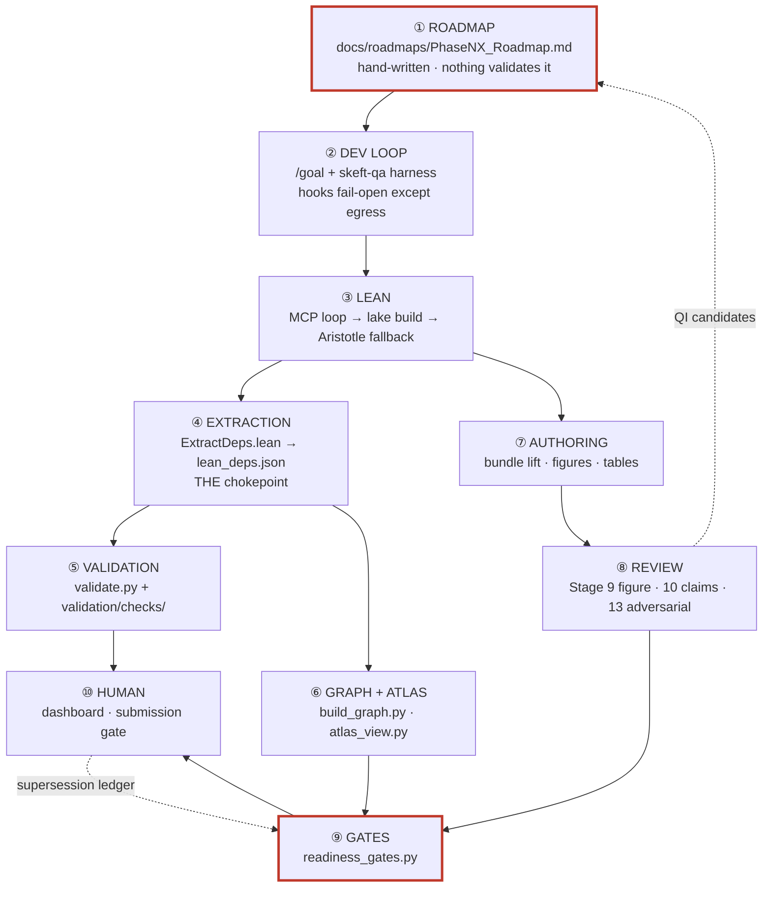

# End-to-end map — roadmap to signed-off publication

**Living document.** Start at [`README.md`](README.md). States no counts — every census
figure is in [`SURFACE_INVENTORY.md`](SURFACE_INVENTORY.md), which is derived and gated.

This is the **spine**: the path work travels from a roadmap to a signed-off publication, and
**where that path is broken today**. It describes present state only. The investigation that
produced it — including the claims that did not survive verification — is in
[`../audits/2026-08-06-e2e-map/`](../audits/2026-08-06-e2e-map/); history belongs there, not
here.

The quality layer's interior — artifact writers, the review-finding pipeline, human decision
points, claim lineage — is [`QA_QI_INFRASTRUCTURE_MAP.md`](QA_QI_INFRASTRUCTURE_MAP.md).

---

## 1. The spine

**The one structural fact worth internalising:** ④ is a chokepoint. Everything quantitative
downstream — counts, the atlas, the graph, the frontier — derives from `lean/lean_deps.json`.
Below that node drift is structurally impossible. Above it, every hand-maintained registry is
a surface that can rot, and this map's job is to say which ones are gated.

**The two ends are the weak ones.** ① has no mechanization at all, and ⑨ contains gates that
return verdicts they did not compute. Everything in between is substantially sound.

---

## 2. ① Roadmap → wave authorization

Waves are declared in `docs/roadmaps/Phase<N><X>_Roadmap.md`. The roadmap is where a phase's
scope, its waves, and design decisions are recorded.

**Nothing validates a roadmap.** No check module references `docs/roadmaps/`, and no
`*_close.md` files exist there. The roadmap layer — where scope and waves are declared — is
entirely unmechanized. **This is the single largest ungated seam in the map.**

**The one code path that reads a roadmap fails open.**
`.claude/plugins/skeft-qa/scripts/notebook_lib.py` wraps the read in
`except Exception: return None`, so an unreadable or absent roadmap is indistinguishable from
one with nothing to say.

⚠️ **Placement concern.** The graph schema is declared in `docs/KNOWLEDGE_GRAPH.md`, with a
delta in `temporary/working-docs/sentence_kg_schema_delta.md` and a parallel edge table inside
`docs/roadmaps/Phase5v_Roadmap.md`. The canonical statement of the graph's shape lives outside
`docs/architecture/` — in a phase roadmap and a working doc — which is a plausible root cause
of "we don't know our own system."

---

## 3. ② The `/goal` development loop

Contract in both `CLAUDE.md`s (the Stop hook is a GO signal, never coercion) and
`docs/dev-loops/HARNESS_GUIDE.md`. Implementation in `.claude/plugins/skeft-qa/`. The hook
roster is in [`SURFACE_INVENTORY.md`](SURFACE_INVENTORY.md#hooks).

Every hook fails open except the `PreToolUse(WebSearch|WebFetch)` **egress guard**, which is
the one unambiguously fail-closed control in the system.

**Live gaps:**

- 🔴 **The running egress guard is not the committed one.** The cached plugin builds under
  `~/.claude/plugins/cache/` differ from the repo copy, and **no drift detector exists**. A
  fail-closed control can therefore enforce older policy than the one in git.
  ⚠️ *Not a defect to patch piecemeal:* plugin changes deploy on merge-to-main plus a
  deliberate refresh, as a unit. The gap is the **absent drift detector**, not the deployment
  model.
- **`active_issues.json` is written by every harvest and read by nothing.**
  `_read_active_issues` in `harness_common.py` has zero callers repo-wide, while
  `HARNESS_GUIDE.md` and other surfaces describe it as feeding the re-injection.
- **`docs/dev-loops/PRE_DECISIONS.md` names a slash command that does not exist**
  (`/skeft-qa:trace`). A mandatory-read doc promises tooling never built.

---

## 4. ③④ Lean formalization and the extraction chokepoint

Spec: `WAVE_EXECUTION_PIPELINE.md` Stages 3a/3b/4/5 + Invariants #4, #9, #10, #15, #16, #17.
The extraction cache's staleness key is documented in
[`QA_QI_INFRASTRUCTURE_MAP.md`](QA_QI_INFRASTRUCTURE_MAP.md#2-artifact-generation--writers-triggers-staleness-keys).

**Invariant #4 (zero `sorry`) is enforced by `lean_zero_sorry`**, which never softens the
verdict to a warning — it has no `--strict` leg, so a `sorryAx` in any declaration's axiom
closure is a hard failure on a default run. `lake build` exits 0 on a `sorry`, and
`axiom_closure_allowlist` catches `sorryAx` only warn-first, so neither alone carries the
invariant.

It reads `docs/counts.json` rather than the extraction directly, and returns
`passed=True, measured=False` when that file is absent or unparseable — the documented
cannot-measure contract, not a soft pass. The commit gate does not depend on it: tier 0
greps lake's own output with a quote-agnostic regex, independently.

### Aristotle — the design is sound; one conjunct is inert

ADR-006 accepts the toolchain divergence *because* "the verify-then-graft gauntlet (D2) is the
safety mechanism", so the gauntlet's soundness carries that decision.

**The operating workflow:** a hard roadmap item is attempted by hand for significant effort; a
file with `sorry`s is created and submitted; **we pull in what we can.** Partial fills are the
expected outcome, not a failure.

- `GauntletResult.passed` ANDs several conjuncts, one being `zero_sorry`, which scans a
  **whole-library** `lake build` for a fixed-string quote style the current toolchain does not
  emit. It is therefore **inert** — always equal to `build_ok`.
- ⚠️ **Do not "fix" it naively.** Were the pattern to match, the conjunct would reject **any**
  graft leaving a `sorry` anywhere in the library — i.e. every legitimate partial fill — and
  auto-revert it. The inert conjunct is closer to intended behaviour than a working one.
  **Open design question:** scope `zero_sorry` to target decls (matching `kernel_pure`) rather
  than the whole library. As written it can only ever be vacuous or hostile to partial fills.
- The real safety check is `kernel_pure`, and it is correctly built: computed over **target
  decls only** from the `sorryAx` primitive in `axiom_deps_core` — scoped right, and
  toolchain-independent. The gauntlet regenerates `lean_deps.json` before judging it, and a
  refresh that raises sets `kernel_pure = False` rather than falling through to a stale read.

### Live gap

**Invariant #9's registry-completeness clause has no enforcement anywhere.**
`PLACEHOLDER_TOTAL_COUNT` is defined as `len(PLACEHOLDER_THEOREMS)` and asserted against
itself; `counts.json`'s `theorems_placeholder` is written by `update_counts.py` and displayed
by its consumers. **Nothing compares them**, though the invariant requires it.

---

## 5. ⑤ Validation

How it is built: [`VALIDATION_ARCHITECTURE.md`](VALIDATION_ARCHITECTURE.md) · when each gate
runs and what each computes: [`VALIDATION_GATE_TOPOLOGY.md`](VALIDATION_GATE_TOPOLOGY.md) ·
what a new check owes: [`CHECK_AUTHORING_GUIDE.md`](CHECK_AUTHORING_GUIDE.md).

Execution order is semantic — the `*_fresh` regenerators rewrite artifacts later checks read.
The one property worth naming on the spine is that **`measured` is a separate field from
`passed`**: a check that could not measure keeps returning `passed` but stops counting as
evidence, which is what makes the `--ci` coverage floor meaningful.

---

## 6. ⑥ Graph, atlas, dashboard — the trust layer

Schema: `docs/KNOWLEDGE_GRAPH.md`, which carries an **Emitted?** column naming each declared
edge type that has no emitter and the gate that queries it.

**Live gaps, worst first:**

- 🔴 **The freshness layer is entirely inert.** Every graph node carries the epoch as
  `last_modified` — one distinct value across the whole graph — and a declared input,
  `docs/verification_log.jsonl`, does not exist. `Phase5v_Roadmap.md` calls this "the
  highest-value capability".
- 🔴 **Some edge types the readiness gates query have no emitter at all** — `PRODUCES`,
  `SUPPORTS` and `CONTRADICTS` — so those gates return verdicts they did not compute. Guarded against growth
  by `gate_edge_types_are_emitted`; see [gate topology §4](VALIDATION_GATE_TOPOLOGY.md) for
  which gate each starves.

  **`PRODUCES` is an expired deferral, and the mechanism that hid it is the lesson.**
  `Phase5v_Roadmap.md` defers it to Wave 4; Wave 4 closed DONE without it, and the string
  appears nowhere from that heading onward. Nobody noticed because `ProductionRunHealth`
  **fired** — through its secondary prose-regex leg, not the `PRODUCES` edges it was designed
  around. A working fallback masked a primary path that was never built. **A gate that fires
  is not a gate that measures what it claims to.**
- 🔴 **The Postgres + AGE mirror is schema-complete and data-empty.** Every vertex label
  exists and queries cleanly; the graph holds essentially nothing, because the write is opt-in
  (`--sync-pg`) and is not run routinely.
  ⚠️ **The risk is the READ path:** `provenance_dashboard.py` honours `SK_EFT_GRAPH_SOURCE=pg`.
  Setting it serves a near-empty graph from a mirror whose labels all exist, so nothing looks
  obviously wrong — an empty result from a well-formed schema is indistinguishable from a
  graph that genuinely holds nothing.
- **`BACKED_BY.link_state` produces only two of the five declared states.** The three that
  encode *verification* (`llm_verified_only`, `human_verified`, `stale`) are never emitted,
  because the enrichment pass that would set them belongs to the freshness layer above.
- **`Sentence.verification` is never derived.** The sentence layer is the declared ratification
  axis for human verification; it records no verification state for any sentence.
- **`audit_log.jsonl` is two unrelated record genres under one filename.**
  `scripts/sentence_state.py` is the declared sole writer of `AuditEvent` records, and the
  extractor reads exactly its shape. The reviewer agents independently adopted the same
  filename for free-form Stage-9/10/13 session logs, which are correctly skipped — they carry
  neither `target_id` nor `actor`, so materialising them would manufacture integrity
  violations. **Nothing validates either genre.**

---

## 7. ⑦⑧ Authoring and review

Spec: `WAVE_EXECUTION_PIPELINE.md` Stages 9/10/13 · `docs/BUNDLE_LIFT_PROCEDURE.md` ·
`docs/LATE_PHASE6_ABSORPTION_PROTOCOL.md` · `docs/BUNDLE_DIRECTORY_SCHEMA.md`.

⚠️ **"Stage 10" means two different things, and this map uses the bundle sense.**
`WAVE_EXECUTION_PIPELINE.md` names **Stage 10 = PAPER DRAFT**, with claims review as a
sub-step *after* Stage 10 and before Stage 11 — it is not a numbered stage there.
`BUNDLE_LIFT_PROCEDURE.md` names **Stage 10 = claims review**, and that is the sense carried
by the `stage10_status` metadata field and by `gate_precheck.py s10`. Everything below uses
the bundle sense, because that is what the machinery keys on. Tracked as **B6** in
[`.working-docs/ARCHITECTURE_TODOs.md`](.working-docs/ARCHITECTURE_TODOs.md).
The finding→gate pipeline and its silent drops are in
[`QA_QI_INFRASTRUCTURE_MAP.md`](QA_QI_INFRASTRUCTURE_MAP.md#3-the-review-pipeline--how-a-finding-becomes-a-gate).

**Live gaps:**

- **The "Stages 9 and 10 before 13" hard gate has no enforcement point.** A bundle can sit at
  `stage13_status: green` with `stage9_status: not_started`.
- **Nothing in the codebase writes a `stage*_status` to `green`.** The only writers set
  `"pending"`. Every green is a hand edit, and the reviewer agents that would earn one have no
  write path to the field they gate on.
- ⚠️ **A review written in an unrecognised heading style mints nothing, silently.** The
  extractor's accepted forms, and why the risk is a NEW form rather than the existing corpus,
  are in [`QA_QI_INFRASTRUCTURE_MAP.md` §3](QA_QI_INFRASTRUCTURE_MAP.md#the-dialect-question--narrow-but-no-longer-single).
  Bundle-era reviews reach the gates: they are the largest source of `ReviewFinding` nodes in
  the graph, and `review_docs_mint_findings` passes across every document carrying an
  unresolved severity-labelled heading.
- **Figure checking is scoped to a subset of bundles**, and within it the drift comparison is
  advisory; legibility is the only blocking figure assertion. Note that most of the figure
  registry is legacy `paperNN_` figures, so the uncovered *bundle* population is much smaller
  than the registry size suggests — check the registry rather than assuming either extreme.
- **`tables_fresh` cannot fail on staleness.** Its stale branch appends a `Detail` and falls
  through to `passed=True`; only a non-zero subprocess or an unrunnable generator fails it. It
  is a self-healing regenerator wearing a gate's interface. Compounding it: every `tables.py`
  on disk sits under a legacy `paperNN_*` directory, so **no publication bundle is wired to
  the table pipeline at all.**
- **Figure PHYSICS is unverified** — the structural checks that run cover render-match,
  legibility, trace counts, axis labels, NaN/Inf and palette. Why the declared `physics_checks`
  do not close that gap is in
  [`VALIDATION_ARCHITECTURE.md` §6](VALIDATION_ARCHITECTURE.md#6-what-this-subsystem-does-not-do),
  which owns the coverage-gap statement.

---

## 8. ⑨⑩ Gates and human sign-off

Roster and priorities: [`SURFACE_INVENTORY.md`](SURFACE_INVENTORY.md#readiness-gates). What
each gate computes, and what actually blocks:
[`VALIDATION_GATE_TOPOLOGY.md`](VALIDATION_GATE_TOPOLOGY.md). Where a human decides:
[`QA_QI_INFRASTRUCTURE_MAP.md`](QA_QI_INFRASTRUCTURE_MAP.md#4-human-decision-points).

**Live gaps:**

- **`NarrativeGrounding` passes vacuously for any paper carrying no `interesting` ProseClaim**,
  because `SUPPORTS` has no emitter — while remaining a sole P1 blocker for the papers that do
  carry one.
- **`ProductionRunHealth`'s run-linkage leg cannot fire**: `ProductionRun` nodes have no
  outgoing edges. Only its prose-regex leg can block.
- **Stage 14 detects nothing.** `qi_register.py --stats` derives zero QI items from the full
  finding population: every gate-id sits in Closed Items and `unclassified` is skipped, so the
  derivation is saturated shut. **The Stage-13 → Stage-14 escalation path — how a recurring
  paper-level defect becomes a tracked process item — cannot fire at all.** Regenerating would
  therefore replace the current Open items with nothing, and they are not reproducible.
- **Invariant #8 is satisfiable but not from the surface that offers it.** The dashboard's
  confirm action mutates an in-memory dict and declines to persist — **printing exactly why
  and naming the working route** (`scripts/wave2_flip_provenance.py`). A UX limitation with a
  tracked owner, not a broken invariant.

---

## 9. Why the process law names owners instead of values

`WAVE_EXECUTION_PIPELINE.md` is the law, and it cites the artifact that owns each fact rather
than copying the fact: `validate.BUNDLE_CODES` for the bundle roster, `lean/lean-toolchain` for
the toolchain pin, `validate.py --list` for the check roster. Its stage count is tied to the
`## Stage N` headings that define it.

**The mechanism is the finding:** *a rule text that enumerates a roster is a hardcoded roster.*
`bundle_registry_consistency` Leg C exists because that pattern is known-bad in code, and the
law is written to the same discipline — an enumerated roster in prose goes stale exactly as an
enumerated roster in code does, but nothing fails when it happens.

⚠️ **Prose rosters have no mechanical guard.** `architecture_inventory_fresh`'s
`no_counts_in_narratives` leg covers `docs/architecture/` only; the law is outside its scope.
The discipline there rests on authors naming owners. Tracked as ADR-010 §D7.
