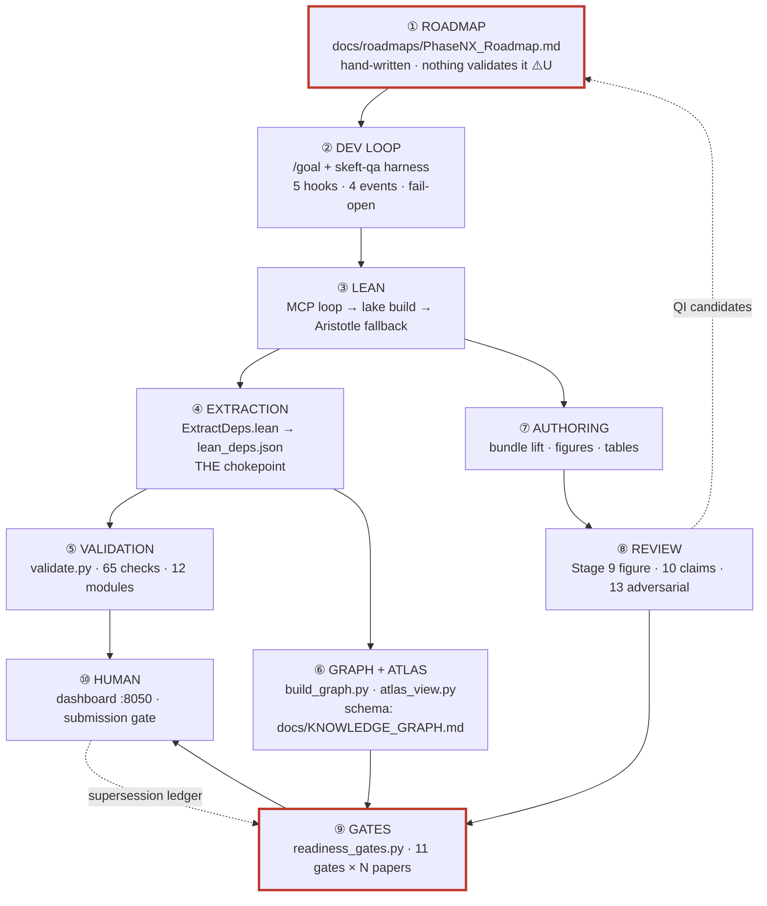

# End-to-end map — roadmap to signed-off publication

**Status: IN PROGRESS, and deliberately shipped incomplete.** Written 2026-08-06.

This is the narrative half of the architecture map. The **census** half —
every check, gate, hook, agent, command, graph type, registry and bundle — is
[`SURFACE_INVENTORY.md`](SURFACE_INVENTORY.md), which is *derived* by
`scripts/architecture_inventory.py` and gated by `validate.py --check
architecture_inventory_fresh`. Counts belong there, not here; a number written into a
narrative is a number that rots.

---

## 0. How to read this file — the provenance tags are the point

Every load-bearing claim carries one of:

| tag | meaning |
|---|---|
| ✅ **V** | **Verified by the author against the implementation**, with the command or `file:line` that establishes it. Quote these. |
| ⚠️ **U** | **Reported by a survey agent, NOT yet verified.** Carries the exact check to run. **Do not quote these as fact.** |
| ❌ **X** | Reported and then **refuted or materially narrowed** on verification. Recorded so it is not re-reported. |

**Why this is not decoration.** This map was commissioned because the project kept
discovering blind spots mid-flight. On the day it was written, four survey agents each
produced a headline finding, and **three of the four overstated at least one** in a way
that would have changed what got fixed. The author independently overstated two more.
An unmarked claim in this codebase has empirically been about a one-in-three chance of
being someone's inference. §9 is the ledger.

**The reading order that failed, and the one that works.** Twice on 2026-08-06 the author
concluded "X does not exist" from a grep over implementation vocabulary that found
nothing — once for the zero-`sorry` gate (it exists, warn-first), once for the graph
schema (it exists, at `docs/KNOWLEDGE_GRAPH.md`). **Read the governing document first,
build the intended picture, and only then verify the code against it.** Absence is a
claim requiring positive evidence, not a null search result.

---

## 1. The spine

**The one structural fact worth internalising:** ④ is a chokepoint. Everything
quantitative downstream — counts, the atlas, the graph, the frontier — derives from
`lean/lean_deps.json`. Below that node drift is structurally impossible. Above it,
every hand-maintained registry is a surface that can rot, and the map's job is to say
which ones are gated.

---

## 2. ① Roadmap → wave authorization

Waves are declared in `docs/roadmaps/Phase<N><X>_Roadmap.md`. The roadmap is where a
phase's scope, its waves, and — importantly — **schema and design decisions** are
recorded.

- ✅ **V** The **graph schema is declared in `docs/KNOWLEDGE_GRAPH.md`** (§Graph Schema:
  "Node Types (26)" at `:54`, "Edge Types (25)" at `:129`), with a **"Wired in"** column
  naming the wave that was to implement each edge. `temporary/working-docs/sentence_kg_schema_delta.md`
  is a *delta* to it (`:5` names `docs/KNOWLEDGE_GRAPH.md` as the affected doc).
  `docs/roadmaps/Phase5v_Roadmap.md:311` carries a parallel edge table.
- ✅ **V** **The schema doc contradicts itself.** `:54` says 26 node types, `:129` says 25
  edge types, but `:312` says *"Extracts 13 node types + 11 edge types"* and `:341` says 13
  again. Checked by reading all four lines.
- ✅ **V** **Nothing validates a roadmap.** Measured: **0** of the check modules under
  `scripts/validation/checks/` reference `docs/roadmaps/`, and **0** `*_close.md` files
  exist there. The roadmap layer — where scope, waves, and (per §2 above) the graph schema
  itself are declared — is entirely unmechanized. This is the single largest ungated seam
  in the map.
  ✅ **V** The one code path that *reads* a roadmap fails open:
  `.claude/plugins/skeft-qa/scripts/notebook_lib.py:201-204` wraps the read in
  `except Exception: return None`, so an unreadable or absent roadmap is indistinguishable
  from one with nothing to say.

**Concern (author, ✅V):** the schema lives in a *phase roadmap*, a *working doc*, and a
`docs/` file that disagrees with itself — not in `docs/architecture/`. That placement is a
plausible root cause of "we don't know our own system": the canonical statement of the
graph's shape is somewhere nobody looks.

---

## 3. ② The `/goal` development loop

Contract in both `CLAUDE.md`s (the Stop hook is a GO signal, never coercion) and
`docs/dev-loops/HARNESS_GUIDE.md`. Implementation in `.claude/plugins/skeft-qa/`.

✅ **V** Five hooks across four events, from the plugin manifest (see
[`SURFACE_INVENTORY.md`](SURFACE_INVENTORY.md#hooks), derived): `SessionStart`
(re-inject), `PreCompact` (stage durable artifacts), `SessionEnd` (marker cleanup),
`PreToolUse(AskUserQuestion)` (question guard → coach), `PreToolUse(WebSearch|WebFetch)`
(egress guard — the only **fail-closed** one). Plus one git `pre-commit`.

- ✅ **V** 🔴 **The running egress guard is not the committed one.** All **three** cached
  plugin builds under `~/.claude/plugins/cache/skeft-local/skeft-qa/{57c1067d9d23,
  25e3d4971d89, 5885890e36b1}/scripts/harness_web_egress_guard.py` differ from the repo
  copy by **70 lines**, and **none** contains `_PATH_WHITELIST` (3 occurrences in repo) or
  `isa-afp` (1 in repo). Verified by direct `diff` and `grep -c` against all three.
  A fail-closed control is enforcing older policy than the one in git, and **no drift
  detector exists**. ⚠️ **Not a defect to patch:** the project owner deploys plugin changes
  on merge-to-main plus a deliberate plugin refresh, as a unit — piecemeal cache edits are
  explicitly not wanted while infrastructure is in flight. Recorded so the *absence of a
  drift detector* is not confused with the *deployment model*.
- ✅ **V** `_read_active_issues` (`.claude/plugins/skeft-qa/scripts/harness_common.py:237`)
  has **zero callers** repo-wide. The writer (`scripts/system2_register.py:360`) is live and
  tested. So `active_issues.json` is written every harvest and read by nothing, while
  `HARNESS_GUIDE.md:161` and three other surfaces describe it as feeding the re-injection.
- ❌ **X** *"`/skeft-qa:trace` is routed to by `coach.md:26` and selected by
  `stall_detector.py:113`."* **Narrowed.** Those two name the *rung* ("E — forensic
  arc-trace"); neither invokes a command. Only `docs/dev-loops/PRE_DECISIONS.md:42,128`
  names the slash command `/skeft-qa:trace`, and ✅**V** it does not exist (6 commands on
  disk, `trace` not among them). A mandatory-read doc promises tooling never built — a doc
  defect, not a broken control path.
- ❌ **X** *"The ≤4k `/goal` prompt cap is prose-only; the payload appends unbounded."*
  **Refuted.** ✅**V** there is a real, enforced budget:
  `ADDITIONAL_CONTEXT_LIMIT = 10000` (`harness_common.py:208`),
  `PAYLOAD_MAX_CHARS = ADDITIONAL_CONTEXT_LIMIT - _WRAPPER_RESERVE` (`:219`), and the
  assembly loop admits a block only `if len("\n\n".join(parts + [block])) <
  PAYLOAD_MAX_CHARS` (`:651`) — "included whole only if it fits, never required, never
  truncated mid-text" (`:620`). The specific 4k figure was **deliberately retired**:
  `:218` records *"zero payload-budget pressure (CORE_MAX_CHARS retired)"*. `:204` further
  documents that Claude Code does not truncate but writes overflow to a session file and
  hands the model a path. A retired constant read as an unenforced one.

---

## 4. ③④ Lean formalization and the extraction chokepoint

Spec: `WAVE_EXECUTION_PIPELINE.md` Stages 3a/3b/4/5 + Invariants #4, #9, #10, #15, #16, #17.
Plane detail: [`../audits/2026-08-06-e2e-map/PLANE-lean.md`](../audits/2026-08-06-e2e-map/PLANE-lean.md).

- ✅ **V** **Extraction scope has a latent staleness gap.** `compute_lean_hash()`
  (`scripts/extract_lean_deps.py:61`) hashes `lean/SKEFTHawking/**/*.lean` — 2 038 files —
  but **not `lean/SKEFTHawking.lean`**, the root aggregate that alone decides which modules
  are extracted. A content change to the aggregate (adding or removing an import — i.e.
  changing the extraction scope) therefore does not invalidate the cache.
  The docstring documents an *earlier* fix that widened the walk to subdirectories: it went
  deeper and never went **up**. Same class as the 25 orphaned modules repaired by hand on
  2026-08-06 (`566c0fa1`).
- ❌ **X** *(author's error)* This map first said the file **was stale on disk**. **Refuted.**
  That was inferred from mtime ordering — and the guard is **content-hash**, not mtime, so
  mtime proves nothing. Checked properly: `lean_deps.json` holds **2 036 modules** against
  **1 962** imported by the aggregate (the only import absent from extraction is
  `SKEFTHawking.AxiomClosure`, infrastructure). The content is current. The gap above is
  **latent**, not live — a distinction that changes whether anyone needs to act today.
- ✅ **V** **Invariant #4 (zero `sorry`) was detected but not enforced** on a default run.
  `axiom_closure_allowlist` DOES catch a `sorry` (`sorryAx` enters the axiom closure and is
  outside the allowlist) but is WARN-first — `passed=not strict` (`lean_toolchain.py`), hard-
  failing only under `--strict`. `lake build` **exits 0 on a `sorry`** (measured directly:
  a probe `theorem t : 1 + 1 = 3 := by sorry` emits ``declaration uses `sorry` `` and
  returns 0). Closed 2026-08-06 by `lean_zero_sorry`, which hard-fails always.
- **Aristotle — the design is sound; one conjunct is inert, and "fixing" it naively would
  break the workflow.** ADR-006 is explicit that the toolchain divergence is an accepted
  risk *because* "**the verify-then-graft gauntlet (D2) is the safety mechanism**"
  (`ADR-006:85`), so the gauntlet's soundness carries that decision.

  The operating workflow, per the project owner: *a hard roadmap item is attempted by hand
  for significant effort; a file with `sorry`s is created and submitted; **we pull in what
  we can**.* **Partial fills are the expected outcome, not a failure.**

  - ✅ **V** `GauntletResult.passed` ANDs five conjuncts (`aristotle_submit.py:686-689`),
    one being `zero_sorry`, which is set from a **whole-library** `lake build` scan
    (`:705-707`) matching the fixed string `"declaration uses 'sorry'"` — straight quotes.
    Lean v4.32.0 emits **backticks** (measured directly), and the project documents exactly
    this hazard at `scripts/pre-commit-sync.sh:68-71` — *"QUOTE STYLE IS LOAD-BEARING …
    Do NOT re-narrow this to a fixed string"* — where the hook correctly uses
    `declaration uses .?sorry.?`. So `zero_sorry` is currently **inert**: always equal to
    `build_ok`.
  - ❌ **X** *(author's error)* First written up as a safety hole. **It is not.** Had the
    pattern matched, the conjunct would reject **any** graft leaving a `sorry` anywhere in
    the library — i.e. every legitimate partial fill — and auto-revert it. The inert
    conjunct is closer to the intended behaviour than a working one would be.
  - ✅ **V** The real safety check is step 3, and it is correctly built: `kernel_pure` is
    computed over **target decls only** (`:719-721`) from the `sorryAx` primitive in
    `axiom_deps_core` — scoped right, and toolchain-independent.
  - ⚠️ **U** Remaining genuine question: step 2's `lake build SKEFTHawking.ExtractDeps`
    compiles the `.olean` but the JSON is written by `scripts/extract_lean_deps.py`, and
    `_load_lean_deps()` (`:189`) reads the file with no staleness check — so step 3 may read
    pre-graft data. **To verify:** run a graft and compare `lean_deps.json` mtime across it.
  - **Open design question, not a defect:** should `zero_sorry` be scoped to target decls
    (matching `kernel_pure`) rather than the whole library? As written it can only ever be
    vacuous or hostile to partial fills.
- ❌ **X** *"`PLACEHOLDER_TOTAL_COUNT` has zero consumers."* **False** — it is imported at
  `tests/test_substrate_integrity_gates.py:18` and asserted at `:60`.
  ⚠️ **U** But the substance survives the correction: that assertion reads
  `PLACEHOLDER_TOTAL_COUNT == len(PLACEHOLDER_THEOREMS) == 26` — a tautology (`len(X) ==
  len(X)`) plus a hardcoded literal — and never reads `docs/counts.json`. Invariant #9
  requires the registry to match `counts.json theorems_placeholder`.
  ✅ **V** **Nothing compares them.** `theorems_placeholder` is *written* by
  `update_counts.py:217` and *read* by `build_graph.py:2339` and
  `update_inventory_index.py:152` — every consumer displays it; none checks it against
  `PLACEHOLDER_TOTAL_COUNT`. The registry-completeness clause of Invariant #9 has no
  enforcement anywhere.
- ✅ **V** `tests/test_lean_integrity.py:172` uses `lean_dir.glob("*.lean")` — **not**
  `rglob` — so every module in a subdirectory is unscanned. Read directly. The same
  non-recursive-glob defect that `compute_lean_hash`'s docstring records having fixed
  elsewhere.

---

## 5. ⑤ Validation

Architecture: [`VALIDATION_ARCHITECTURE.md`](VALIDATION_ARCHITECTURE.md) ·
when each gate runs: [`VALIDATION_GATE_TOPOLOGY.md`](VALIDATION_GATE_TOPOLOGY.md) ·
what a new check owes: [`CHECK_AUTHORING_GUIDE.md`](CHECK_AUTHORING_GUIDE.md) ·
defect landscape: [`QA_QI_INFRASTRUCTURE_MAP.md`](QA_QI_INFRASTRUCTURE_MAP.md).

✅ **V** 65 checks in 12 modules, execution order semantic (the `*_fresh` regenerators
rewrite artifacts later checks read). Roster derived in
[`SURFACE_INVENTORY.md`](SURFACE_INVENTORY.md#validation-checks).

The suite's defining discipline, and its live guards, are documented in the companion
files above; this map does not restate them. The one addition worth naming here is that
**`measured` is a separate field from `passed`** — a check that could not measure keeps
returning `passed` but stops counting as evidence, which is what makes the `--ci` coverage
floor meaningful.

---

## 6. ⑥ Graph, atlas, dashboard — the trust layer

Schema: `docs/KNOWLEDGE_GRAPH.md`. Plane detail:
[`../audits/2026-08-06-e2e-map/PLANE-graph.md`](../audits/2026-08-06-e2e-map/PLANE-graph.md).

- ✅ **V** **Schema conformance, measured by diffing the doc against the AST:**

  | | |
  |---|---|
  | edge types **declared** (`KNOWLEDGE_GRAPH.md:129`) | 25 |
  | edge types **emitted** (`build_graph.py`) | 22 |
  | declared, never emitted | `CONTRADICTS`, `IMPACTED_BY`, `PRODUCES`, `SUPERSEDES`, `SUPPORTS` |
  | emitted, never declared | `CLAIMS_APEX`, `USES` |

  ⚠️ Note on the author's own contribution: **`CLAIMS_APEX` was added to the graph on
  2026-08-06 without updating the schema doc.** The map's author produced schema drift
  while mapping schema drift.
- ✅ **V** 🔴 **The freshness layer is entirely inert.** All **47 341** graph nodes carry
  `last_modified = '1970-01-01T00:00:00Z'` — one distinct value across the whole graph.
  A declared input, `docs/verification_log.jsonl`, does not exist.
  `Phase5v_Roadmap.md:823` calls this "the highest-value capability".
- ✅ **V** Three of the five unemitted edge types are **queried by readiness gates**
  (`PRODUCES`, `SUPPORTS`, `CONTRADICTS`), so those gates return verdicts they did not
  compute. Guarded since 2026-08-06 by `validate.py --check gate_edge_types_are_emitted`,
  which derives both populations by AST and fails on any undisclosed dead type.
- ❌ **X** *(author's own error, corrected twice)* First reported as "a wiring accident";
  then over-corrected to "healthy documented deferral". ⚠️ **U** The survey's position —
  **expired deferral**: Wave 4 shipped without `PRODUCES`, and `Phase5v_Roadmap.md:442`
  defers the *rendering*, not the emitter. **To verify:** read the Wave-4 close section of
  `Phase5v_Roadmap.md` and confirm `PRODUCES` was in scope and not delivered.
- ✅ **V** **The sentence layer is blind to every publication bundle.**
  `build_graph.py:2386` reads `if d.is_dir() and d.name.startswith('paper')`, so the
  bundle directories — `D*`, `E*`, `F`, `I*`, `L*` — are skipped entirely. Read directly.
  This is the same `startswith('paper')` filter that was removed from `cluster_detect.py`
  and the freshness guard earlier on this branch; `build_graph` was missed.
  ✅ **V** **Measured cost:** **2 116** `Sentence` nodes materialise against **3 432** v2
  sentences on disk — **1 316 lost**, precisely the bundle population that filter excludes.
- ✅ **V** 🔴 **The audit-trail layer produces nothing, and fails silently.**
  `AuditEvent` nodes: **0**. `LOGGED_BY` edges: **0**. Yet the source data exists —
  **20 `papers/*/audit_log.jsonl` files, 239 records**.
  The cause is a **producer/consumer schema mismatch**: `extract_audit_event_nodes`
  (`build_graph.py`) requires a top-level `id` — `eid = ev.get('id'); if not eid: continue`
  — while the records the reviewer agents actually write carry `stage`, `severity`,
  `bundle_target`, `timestamp`, `reviewer`, `round`, `section`, `category`, `finding`,
  `figure`. `id` is not among the ten most common keys. Essentially every record is skipped.
  It is silent **twice**: the skip emits nothing, and the summary log is guarded by
  `if nodes:` — so an extraction yielding zero prints no line at all. Absence rendered as
  *silence*, a variant of the branch's signature defect.
  **This is the concrete cost of §2's finding that nothing validates conformance to the
  declared schema.** Both halves are individually "working": the agents write well-formed
  audit records, the extractor reads well-formed records. They disagree about which shape
  is well-formed, and nothing in the system compares them.
- ✅ **V** **`BACKED_BY.link_state` is hardcoded, and the pass meant to fix it never runs.**
  `build_graph.py:2667` emits `'link_state': 'resolved',  # enriched post-hoc by
  last_modified pass`. Read directly.
  ❌ **X** *(author's error, caught on re-measurement)* This first said **every**
  `BACKED_BY` edge therefore claims `resolved`. **Wrong.** Measured on a built graph:
  `resolved` **1 927**, `missing_target` **217** — the extractor does derive
  `missing_target` for unresolvable targets, so the `:2667` literal is one branch, not a
  blanket. I read a hardcoded literal as the whole story without measuring the output.
  ✅ **V** What survives, and is the real finding: the schema declares **five** link states
  (`resolved` / `llm_verified_only` / `human_verified` / `stale` / `missing_target`) and
  only **two** are ever produced. The three that encode *verification* — the entire point
  of the field — are never emitted, because the enrichment pass that would set them belongs
  to the freshness layer verified inert above.
- ✅ **V** **`Sentence.verification` is never derived.** All **2 116** Sentence nodes carry
  `verification: None`. The sentence layer is the declared ratification axis for human
  verification (`sentence_kg_schema_delta.md` §3.4); it currently records no verification
  state for any sentence in the project.
- ✅ **V** **The gate roster and the per-paper verdict rule are each implemented twice.**
  Roster: `readiness_gates.GATES` vs `provenance_dashboard.py:5140` `GATE_DEFS`, whose own
  comment calls itself *"the canonical list of the 11 readiness gates"* — two things cannot
  both be canonical. Verdict: `bundles_readiness.classify_readiness:552` /
  `partition_readiness:584` vs `provenance_dashboard.py:5194` `_classify_paper`.
  Neither pair is cross-checked, and the dashboard is the surface a human reads before
  signing off — so the copy most likely to be believed is the one nothing validates.

---

## 7. ⑦⑧ Authoring and review

Spec: `WAVE_EXECUTION_PIPELINE.md` Stages 9/10/13 · `docs/BUNDLE_LIFT_PROCEDURE.md`
(frozen 14-step Stage-10) · `docs/LATE_PHASE6_ABSORPTION_PROTOCOL.md` ·
`docs/BUNDLE_DIRECTORY_SCHEMA.md`. Plane detail:
[`../audits/2026-08-06-e2e-map/PLANE-publication.md`](../audits/2026-08-06-e2e-map/PLANE-publication.md)
and the figures/tables detail in the same directory.

- ✅ **V** **The "Stages 9 and 10 before 13" hard gate has no enforcement point.**
  `papers/D6/bundle_metadata.json` reads `stage9_status: not_started`,
  `stage10_status: skeleton`, `stage13_status: green`. Read directly.
- ✅ **V** **The finding extractor parses one report dialect.**
  `extract_review_finding_nodes` scans `papers/AutomatedReviews/<date>/*.md` for
  *"numbered `### N.N — ...` headings with severity glyphs (🔴/🟡/🔵)"* — the
  **adversarial** reviewer's format. A report written in another dialect yields no
  `ReviewFinding` nodes, hence no `FLAGS` edges, hence no gate movement.
  ⚠️ **U** the corollary — that the figure- and claims-reviewer bundle outputs are in fact
  written in a different dialect (letter-coded classes, no `- **Severity:**`) and so reach
  no gate. **To verify:** open one `claims_review.json` / bundle figure report and test it
  against the heading + glyph pattern.
- ✅ **V** **Nothing in the codebase writes a `stage*_status` to `green`.** The only
  writers set `"pending"`: `bundle_append.py:321,323,325` and
  `bundle_source_manifest.py:129-131`. Every green in `papers/*/bundle_metadata.json` is
  therefore a hand edit — which is how D6 sits at `stage13_status: green` with
  `stage9_status: not_started` (§8 above). The reviewer agents that would earn a green
  have no write path to the field they gate on.
- ✅ **V** **Figure coverage is two bundles wide.** `bundles_readiness.py:132` filters the
  registry with `if not fs.name.startswith(("d11_", "d12_")): continue`, so of 137
  registered figures only the D11/D12 ones are checked at all — and within those, the
  drift comparison is emitted `warning=True`, i.e. advisory. Legibility is the only
  blocking figure assertion, and it too is D11/D12-scoped.
- ✅ **V** **`tables_fresh` cannot fail on staleness.** `freshness.py:329` is
  `return CheckResult(passed=True, details=details)`; the stale branch appends a `Detail`
  and falls through to it. The only `passed=False` exits are a non-zero subprocess or an
  unrunnable generator. It is a self-healing regenerator wearing a gate's interface.
  ✅ **V** the scope half: **9 `tables.py` files exist, every one under a legacy
  `paperNN_*` directory — zero of the 21 publication bundles is wired to the table
  pipeline.** So the freshness machinery, even if it could fail, would not cover a single
  publication target.
- ✅ **V** **The 137 declared `physics_checks` are inert strings.** Every `FigureSpec`
  declares assertions like `mach_crosses_one`, `T_H_dominates`, `curves_cross` — and the
  only read of the field anywhere is `scripts/review_figures.py:2818`, which copies it into
  the review manifest for a downstream LLM. Nothing evaluates them. The structural checks
  that DO run cover trace counts, axis labels, NaN/Inf and palette — not physics.

---

## 8. ⑨⑩ Gates and human sign-off

✅ **V** 11 gates (8 × P1, 3 × P2) — roster derived in
[`SURFACE_INVENTORY.md`](SURFACE_INVENTORY.md#readiness-gates).

- ✅ **V** `NarrativeGrounding` blocks exactly the papers carrying an `interesting`
  ProseClaim — **9 such claims across 7 papers** — and passes vacuously for every other
  paper, because `SUPPORTS` has no emitter. It is the sole P1 blocker on D6, D8 and D10.
  Measured against a built graph.
- ✅ **V** `ProductionRunHealth`'s run-linkage leg cannot fire: **18 ProductionRun nodes,
  zero outgoing edges** (17 status `unknown`, 1 `success`). Its second leg — a prose regex
  for "Monte Carlo evidence" — can still block.
- ❌ **X** *"Stage 14 destroys its own register, violating Invariant #13."* **Refuted as
  stated.** Invariant #13 (`WAVE_EXECUTION_PIPELINE.md:687`) promises verbatim preservation
  only of `## Closed Items` and explicitly describes Open Items as auto-derived. Current
  state ✅**V**: **10 Open / 13 Closed**.
  ⚠️ **U** The narrower live finding: with all 11 gate-ids closed and `unclassified` skipped
  (`qi_register.py:165,170-171` — ✅**V** those lines read as described), the derivation
  returns nothing, so **Stage 14 can no longer surface a new QI item**. **To verify:** run
  the clustering in memory against current findings and confirm it returns `[]`.
- ❌ **X** *"The dashboard cannot satisfy Invariant #8"* — **materially narrowed, and it was
  the item this map briefly flagged as its most severe.** ✅**V** the dashboard's confirm
  action does mutate an in-memory dict (`provenance_dashboard.py:1272-1274`) and its
  `--write` path does decline to persist — **but it prints exactly why, and names the
  working route**: *"returned without writing provenance.py. Use
  `scripts/wave2_flip_provenance.py`, which does persist `human_verified_date`. Tracked as
  R5-MAJ1 in docs/audits/2026-08-05-pr-review-2/FINDINGS_REGISTER_PASS2.md"*
  (`:5464-5468`). So Invariant #8 **is** satisfiable, by a different tool, and the gap is
  already a tracked finding with an owner. A UX limitation, not a broken invariant.

---

## 9. The overstatement ledger

Kept because the calibration is the deliverable.

| claim | source | outcome |
|---|---|---|
| "Invariant #4 has no gate; nothing else covered it" | author | **wrong** — `axiom_closure_allowlist` detects it, warn-first |
| "There is no graph schema" | author | **wrong** — `docs/KNOWLEDGE_GRAPH.md` |
| "PRODUCES/SUPPORTS/CONTRADICTS are healthy deferred debt" | author | **over-corrected** — deferrals appear to have expired |
| "`/skeft-qa:trace` is routed to by coach + stall_detector" | devloop survey | **narrowed** — those name the rung, not a command |
| "Stage 14 destroys its own register" | publication survey | **refuted** — Open Items are derived by design |
| "17 **failed** production runs" | QA assessment | **narrowed** — status is `unknown`, not `failed` |
| "NarrativeGrounding is structurally always blocked" | QA assessment | **narrowed** — blocks only the 7 papers with `interesting` claims |

Two failure modes, both worth naming:
1. **Absence from a null search.** Grep the implementation vocabulary, find nothing,
   conclude nothing exists. Cure: read the governing doc first.
2. **Severity inflation on a real defect.** The underlying finding is usually genuine; the
   characterisation overshoots and would have driven the wrong fix.

---

## 10. What remains

- **~15 ⚠️U claims** above, each with its check. Verify, retag, and delete the ⚠️ marker.
- Fold in the four plane reports under `docs/audits/2026-08-06-e2e-map/` once their claims
  are verified.
- Two **intended-vs-actual** sections not yet written: what the pipeline *says* Stages 1–14
  do versus what runs, and the harness's intended vs actual re-injection payload.
- ✅**V** Known drift in the law itself, to reconcile: `WAVE_EXECUTION_PIPELINE.md:5` says
  "these 12 stages" (there are 14); `:317` says "Checks (16 total)" (65); `:80` and `:689`
  freeze the roster at "18 targets" (21); `:191` says "we run 4.29.1" (live
  `lean-toolchain` is **v4.32.0**); `:529` says there is "no separate per-repo CLAUDE.md"
  (there is one).
