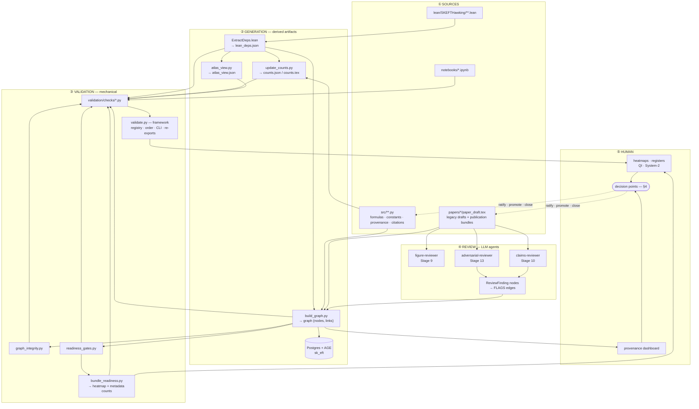
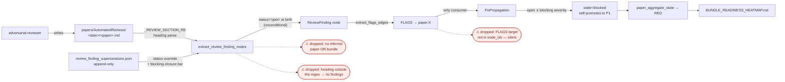

# QA / QI infrastructure — the quality layer's interior

**Living document.** Start at [`README.md`](README.md).

This opens up the subsystems the [`END_TO_END_MAP`](END_TO_END_MAP.md) spine references but
does not enter: which derived artifact has which writer and staleness key, how a review
finding becomes a gate verdict (and where it silently doesn't), where a human actually
decides, and the claim-lineage detector.

**It states no counts.** Every census figure — checks, gates, hooks, agents, node and edge
types, registries, bundles — lives in [`SURFACE_INVENTORY.md`](SURFACE_INVENTORY.md), which
is derived and gated. This document names *mechanisms*; magnitudes are looked up.

> **What is NOT here, and where it went.** Per [`README.md`](README.md)'s ownership split:
> per-gate semantics and what actually blocks are in
> [`VALIDATION_GATE_TOPOLOGY.md`](VALIDATION_GATE_TOPOLOGY.md); the systemic-pattern ledger
> and the obligations a check inherits are in
> [`CHECK_AUTHORING_GUIDE.md`](CHECK_AUTHORING_GUIDE.md); how the suite is built is in
> [`VALIDATION_ARCHITECTURE.md`](VALIDATION_ARCHITECTURE.md). Those documents own their
> tables; this one does not duplicate them.

---

## 1. The five planes

**The system is well-designed in its architecture and substantially broken in its wiring.**
That sentence is the thesis of this whole directory, and every section below is an instance.

---

## 2. Artifact generation — writers, triggers, staleness keys

Every derived artifact, its sole writer, and how staleness is detected. **The staleness key
is the load-bearing column:** content-hash and content-compare are sound; mtime is weaker;
*none* means drift is undetectable.

| artifact | writer | staleness key | auto-synced? |
|---|---|---|---|
| `lean/lean_deps.json` | `extract_lean_deps.py` | **content hash** of every `.lean` under `SKEFTHawking/` **plus the root aggregate `lean/SKEFTHawking.lean`** | yes |
| `docs/counts.json` / `.tex` | `update_counts.py` | mtime vs sources | yes |
| `papers/*/tables/*.tex` | `render_paper_tables.py` | mtime | yes |
| Inventory-Index autogen blocks | `update_inventory_index.py` | **content compare** | yes |
| `lean/atlas_view.json` | `atlas_view.py` | **content compare** (rebuilds) | yes |
| `docs/ATLAS_HEATMAP.md` | `atlas_heatmap.py` | **content compare** | yes |
| `lean/SKEFTHawking/KernelNoGos.lean` | `gen_kernel_nogos_module.py` | **content compare** | yes |
| `docs/architecture/SURFACE_INVENTORY.md` | `architecture_inventory.py` | **content compare**, gated by `architecture_inventory_fresh` | no — deliberately |
| `papers/claim_clusters.json` | `cluster_detect.py` | mtime | via check only |
| `docs/PERMANENT_TRACKED_HYPOTHESES.md` | `render_tracked_hypotheses.py` | content compare, **hard-fail, never auto-written** | no |
| `papers/cluster_bundle_index.json` | `bundle_clusters.py` | **none** | **no** |
| `docs/BUNDLE_READINESS_HEATMAP.md` | `bundle_readiness.py` | **none** | **no** |
| `docs/QI_REGISTER.md` | `qi_register.py` | **none** — *re-parses its own Closed Items* | **no** |
| PG + AGE `sk_eft` | `build_graph.write_graph_to_pg` | **none** (full delete + rewrite) | opt-in only |
| `figures/provenance_graph.json` | `build_graph --out` | **none** | **no** |

**The root-aggregate clause in row 1 is load-bearing.** `lean/SKEFTHawking.lean` sits one
level *above* the hashed subtree and alone decides which modules are in scope for extraction.
A hash covering only the subtree would leave the single edit that changes scope — adding or
removing an import there — invisible to the cache. Widening the subtree walk does not address
this: the gap is one level up, not deeper.

**Concurrency.** `harness_lock.regen_lock` is **skip-and-use-cache, never block-and-wait**:
a bounded poll, then yield `False`. The lock reports contention honestly; what matters is what
each caller does with that signal.

- `load_lean_deps()` logs a **WARNING** naming the blast radius — counts, atlas, graph and
  axiom-closure results for that run reflect the previous extraction — and proceeds on the
  existing file.
- `sync.py` records every skipped artifact and prints **`sync INCOMPLETE`**, naming them.
  Its exit code stays 0, deliberately: another process is doing the work, so failing the
  caller would be wrong.

On an internal error the lock fails *open* by yielding `True`, i.e. it proceeds with the
regeneration — the safe direction, and not to be confused with the contention path.

⚠️ The suite's auto-regenerating freshness checks shell out **with no lock at all**.

**Cost.** `build_graph_json()` is called from several checks in one validate run, and each
call internally re-runs the node extractors **except its own** — plus a full edge pass —
inside `extract_readiness_gate_nodes`, which builds a pre-gate graph view to break the
gate↔graph recursion. `build_graph_json` itself is not cached, so the whole build repeats per call. (Two internal name indices are `lru_cache`d, and the dashboard keeps its own graph cache — neither is shared with the validate path.)

---

## 3. The review pipeline — how a finding becomes a gate

**Silent-drop points**, ranked by observed damage:

1. A finding with neither `inferred_paper` nor `inferred_bundle` is dropped from bundle
   aggregation.
2. `_emit` is a **no-op when the FLAGS target is absent** from `node_ids` — no log. This
   produced a bundle false-green.
3. Ambiguous paper-key prefix → all edges skipped (info-level log only).
4. `papers/AutomatedReviews/*/*.md` is a **one-level glob**; a review filed deeper is
   invisible.
5. A finding heading outside `_REVIEW_SECTION_RE` mints **no** nodes — a whole round of
   blockers reads exactly like a clean round. Partially guarded, post-hoc, by
   `review_docs_mint_findings`.

**`FixPropagation` is the only evaluator that reads FLAGS.** Every other gate is blind to
review findings.

### The dialect question — narrow, and the live risk is a NEW form

`_REVIEW_SECTION_RE` accepts a **shape**, not a list: a 3-to-5-level heading, an optional
keyword prefix, an identifier of up to three dot-parts with an optional letter block and letter
suffixes, and a separator restricted to a spaced em/en dash or a colon. `build_graph.py` carries
the pattern and the on-disk forms that drove each widening; **read it there rather than
re-enumerating the forms here** — a list of accepted forms beside a regex is the
hand-maintained-list failure this map documents elsewhere. It was widened after a round in
which every form on disk minted **zero** findings, making real reviews invisible.

**So the live risk is a NEW form, not the existing corpus.** A review written in a heading
style outside the accepted set mints nothing, silently — drop point (5) above. Review output
landing in the directory is still not *sufficient* to become a finding.

**Bundle-level Stage-13 reports reach the gates.** They are the largest single source of
`ReviewFinding` nodes in the graph, and `review_docs_mint_findings` passes across every
document carrying an unresolved severity-labelled heading. A document whose severities appear
only inside PASS/RESOLVED notes carries no open findings and is deliberately **skipped**, not
failed.

### Re-measure a filed finding before you fix it

**A finding's count, consumer and effort estimate are claims, not measurements** — including
findings this project filed itself. An entry written from a sample and never summed reads
exactly like one written from a full count.

The VERIFIES resolver is the worked example. Two rules gate it, each closing a direction the
resolver could fail in: a ref rooted at a **module alias** is a Python module, never a Lean
declaration (without this it fabricated Lean-targeted edges, resolving the *tail* of a Python
name against Lean short names — `np.all` → `FaultTolerance.Pauli.all`); and a **dotted** ref
resolves only as a full Lean name, never by its tail (without this it dropped test nodes,
keying ids on `module::function` with the class omitted).

**Its consumer is `last_modified.py`'s VERIFIES propagation**, where a bad edge stamps an
unrelated test file's mtime onto Lean nodes. No readiness gate consumes it — the gates read
`formula:` targets only.

⚠️ **A measurement is scoped by a predicate, and fixing what that predicate keyed on voids
it.** Re-derive the number, the consumer and the blast radius against the current tree before
acting on any of them.

---

## 4. Human decision points

Where a human actually decides. Several are structurally enforced as human-only
(`disable-model-invocation: true`, or a tier clamp an agent cannot lift).

| decision | surface | human-only enforcement |
|---|---|---|
| Arm a `/goal` loop | `/skeft-qa:goal-prompt` | **structural** |
| Promote System-2 finding → `human-reviewed` | `/skeft-qa:debrief` | **structural** (`_clamp_tier` caps every other writer at `agent-reviewed`) |
| Close / misfile a System-2 finding | `/debrief` | **structural** — `## Misfiled` reachable only here |
| Integrate a process win into the harness | `/debrief` | per-win sign-off; *"self-improving, never self-mutating"* |
| Graduate a finding → standing pre-decision | `/debrief` → `PRE_DECISIONS.md` | **structural** |
| Sign off a structural-prevention proposal | `/debrief` | never auto-applied |
| Close a QI item (System-1) | `QI_REGISTER.md` block move | Invariant #13 preserves Closed Items verbatim |
| Approve a new project-local `axiom` | Invariant #15 + `AXIOM_METADATA` | policy + `axiom_closure_allowlist` |
| Toggle the AskUserQuestion guard | `/skeft-qa:goal-guard` | **structural** |
| Verify a parameter for submission | provenance dashboard | Invariant #8 |
| Declare a bundle's apex theorems | `papers/<bundle>/bundle_metadata.json` | ADR-010 §D5a — full per-bundle context review, one at a time |

**Inside a `/goal` loop the human is deliberately absent**: the AskUserQuestion guard denies,
logs to `blocked_questions.jsonl`, and redirects to the `coach` agent. The question reaches a
human only asynchronously via harvest → System-2 register → `/debrief`.

---

## 5. Claim lineage — the Class-1 detector

**Chain-of-backing** resolves every claims-reviewer sentence link against the live graph.
`scripts/chain_canonicalize.py --report` is its instrument.

`theorem-absent` means **a manuscript sentence names a Lean theorem that does not exist**.
The population splits into genuine cases and artifacts, and the artifact half falls in four
individually-fixable classes: kernel axioms that have no graph node though the
claims-reviewer spec instructs agents to emit them; `module:` prefix double-mangling;
by-design inductive-constructor filtering; and mis-tagged link kinds.

Two genuine failure shapes are severe enough to name:

- **A discharged axiom is still cited.** `gapped_interface_axiom` was retired; the project's
  axiom count is zero.
- **A name that is not a declaration is still cited.** `gap_solution_bounded` sits in
  `TetradGapEquation.lean` inside a comment block, under the note *"This theorem is FALSE as
  originally stated"* — so it is not merely false, it is not a declaration at all. One
  citation is a documented waiver: I1 cites it deliberately as history.

⚠️ **Search for these names in their LaTeX-escaped form.** A draft writes
`gapped\_interface\_axiom`, so a scan for the raw identifier reports zero manuscript hits and
is wrong: the name is in 14 drafts, and `gap\_solution\_bounded` is in I1's.

Read in the drafts, the two names split cleanly:

- **Most manuscript mentions are accurate history.** D2, D4, D5, F, L2, `paper8` and
  `paper21` all state the conversion — *"formerly `axiom gapped_interface_axiom`, converted to
  a tracked `Prop` on 2026-05-19"* — and I1 describes `gap_solution_bounded` as a
  commented-out stub. Naming a retired thing as retired is correct, not drift.
- **No draft states either as live.** Every one of the 25 mentions carries a historical
  qualifier — *"formerly"*, *"since retired into the tracked Prop `TPFConjecture`"*,
  *"was refactored"*. `validate.py --check axiom_count_prose_consistency` scans all 64 drafts
  against `docs/counts.json` (`lean.axioms = 0`) and reports zero stale claims.

⚠️ **Splitting these sentences on `.` gives the wrong answer**, because the qualifier usually
follows a dotted Lean module filename — the split truncates at that dot, before the qualifier,
and a present-tense claim appears where none exists. Cite `axiom_count_prose_consistency`'s verdict rather than
re-deriving one.

So the manuscript prose is sound, and the defect is confined to the **chain links**: a
fictitious audit trail, gated by the check above.

`--report` emits a breakdown by **resolution class** — `resolved` / `suggested` / `invalid` /
`unresolvable`, each split into named sub-kinds with example links. `--paper <dir>` limits the
run to one paper directory. It does **not** rank bundles, and it does not by itself surface
bundles with no chain-of-backing or bundles for which Stage 10 never ran; those are answered
by inspecting which directories carry a `claims_review.json` at all.

**Target existence is now gated; the rest of the report still is not.**
`validate.py --check chain_backing_targets_resolve` fails when a chain link of kind
theorem/axiom/lemma names a target that resolves against no population — project declaration,
module, Lean core axiom, or external root — after normalizing the hand-written notation
variants. It is a **ratchet at the live measured backlog**, so the standing population is
reported by paper every run and can only shrink.

⚠️ **The resolver is the whole check, and a naive one manufactures findings.** Membership in
declaration names alone reports more than three times the true figure: most of the difference
is legitimate module targets, short names, kernel axioms, and `module:X` / `X (module)`
notation. Resolve against every population a target may name, and normalize first.

The rest of `--report`'s output — resolution classes, suggested retargets — still gates on
nothing. The instrument produces the right answer and is connected to nothing that can stop a
submission: the systemic pattern
([`CHECK_AUTHORING_GUIDE`](CHECK_AUTHORING_GUIDE.md)), inside the subsystem built to detect
exactly that pattern in the papers.

---

## 6. The standing lesson

⚠️ **A filed finding's blast radius is a claim, not a measurement.** A finding carries a
count, a consumer, a function name and an effort estimate, and each of those is an assertion
in its own right — an entry written from a sample rather than a sum reads exactly like one
that was counted.

**Re-measure the scope before fixing, even when you wrote the finding yourself.** A fix is
only as good as the partition it rests on, and a partition inherited from prose is not a
partition. Re-derive the count, the consumer and the blast radius against the current tree
before acting on any of them.

**Out of scope, verified non-overlapping.** The Codex control plane (`scripts/lean_slots/*`,
`.codex/*`, ADR-008) has zero references to `validate.py`, `register_check`,
`gate_precheck`, `bundle_readiness` or `build_graph`.
