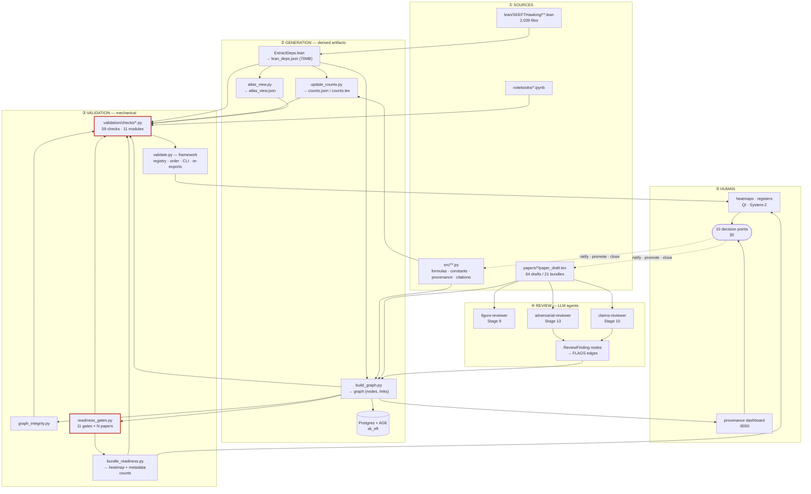
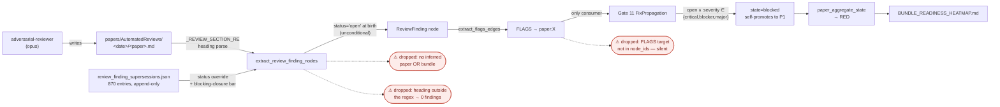
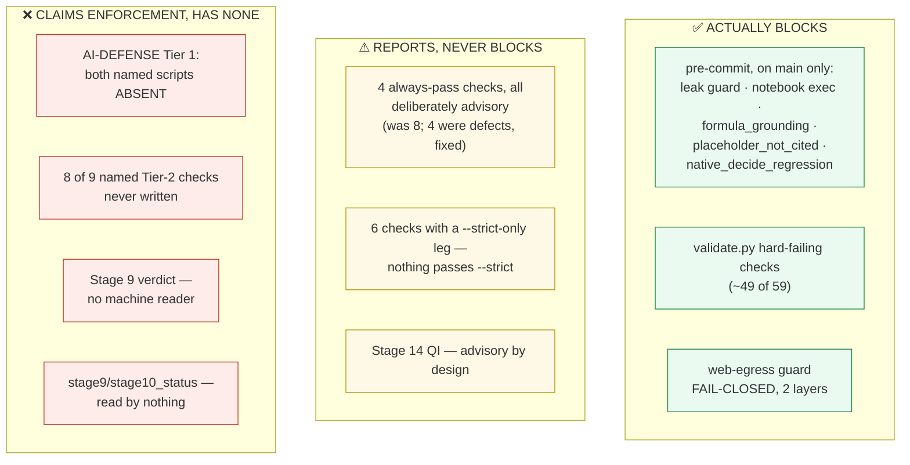

# QA / QI Infrastructure Map

**Status:** production artifact. Map of the complete quality layer — code, agents, hooks, artifacts,
gates, and human decision points. **Reflects the ADR-009 delivered state.**
**Date:** first written 2026-08-03; **brought to the delivered state 2026-08-04.**
**Basis:** `scripts/validate.py` read in full (7,778 lines at first writing) by the author; four read-only
reconnaissance sweeps over the artifact-generation, readiness/bundle, agent/hook/register, and
test-coverage subsystems; **every load-bearing claim independently verified against source by the author.**
Where a reconnaissance claim did not survive verification it is marked and corrected in §8.

**2026-08-04 re-basis.** Read in full on the ADR-009 branch: `validate.py` (post-split), all **twelve**
`validation/checks/*.py`, `validate_helpers.py`, `extract_lean_deps.py`, `readiness_gates.py`,
`bundle_readiness.py`, `gate_precheck.py` and `pre-commit-sync.sh`. Every figure below is either measured
on that date or explicitly marked historical. `build_graph.py` is **not** among them — claims about it
here rest on caller analysis and its own in-source comments, and are marked where they appear.

**Companion documents:** [ADR-009](../adrs/ADR-009-validation-suite-modularization.md) (the validation-suite
decision) · [ADR-004](../adrs/ADR-004-substrate-integrity-gates.md) (R1–R5) ·
[ADR-002](../adrs/ADR-002-native-decide-policy.md) · [ADR-005](../adrs/ADR-005-derived-proof-atlas.md) ·
[ADR-007](../adrs/ADR-007-kernel-nogo-ledger-and-negative-frontier.md) ·
`docs/audits/2026-08-01-publication-readiness/SYNTHESIS.md`.

> **How to read this map.** The system is genuinely well-designed in its *architecture* and substantially
> broken in its *wiring*. Section 6 is the important one: it separates what **actually blocks** from what
> **reads as blocking**. If you take one thing from this document, take that table.

---

## 1. The five planes

Red-outlined nodes carry the enforcement defects in §6.

> **Plane ③ is the ADR-009 delivered state (Phases 0–3 complete 2026-08-04).** `scripts/validate.py` was a
> single 7,900-line file when this map was first written. It is now **~740 lines of framework** —
> result-type and check re-exports, the `_CHECKS` registry, `_CANONICAL_ORDER`, `run_checks`, reporting,
> the CLI, and `BUNDLE_CODES` for the roster gate — with **all 59 check bodies** in **twelve** modules
> under `scripts/validation/checks/`. Sizes measured 2026-08-04; the largest is `citations` at **965**:
>
> | module | checks | | module | checks |
> |---|---|---|---|---|
> | `physics` | 9 | | `lean_substrate` | 6 — name/body/prose-gated substance |
> | `lean_toolchain` | 7 — build + trust surface | | `papers_prose` | 6 — prose vs the numbers |
> | `bundles_readiness` | 6 — metadata · gates · roster | | `freshness` | 6 — the artifact regenerators |
> | `citations` | 4 — provenance + primary sources | | `reviews` | 4 — the supersession ledger |
> | `graph_atlas` | 3 | | `lean_statements` | 3 — does the STATEMENT prove anything |
> | `notebooks` | 3 | | `prose_lean_refs` | 2 — do cited names resolve |
>
> **`lean_statements` was split from `lean_substrate` on 2026-08-04** (the latter measured 1,079). The seam
> is the one `lean_substrate`'s own header argued: the type-thinness classifier is name- and
> tactic-agnostic *by design*, because `proxy_body_audit` is name-gated and excludes `norm_num`/`decide`
> bodies, so a theorem whose STATEMENT proves nothing slips past it. Three candidate partitions were
> scored for shared module-level names before choosing; all three shared none, and this one is the only
> balanced split. ⚠️ It sets **no line-count threshold** — `citations` (965) and `bundles_readiness` (904)
> sit in the same band and are not defects.
>
> Shared layers: `validation/_registry.py` (result types + registry), `_config.py` (the three runtime
> flags), `_tex.py` (LaTeX scanning), and `scripts/validate_helpers.py` (the single path anchor, plus
> `ensure_lean_deps_fresh`). Each has **one owner, reached by attribute at call time** — never imported by
> value, which is what makes a flag or a monkeypatched path actually reach the check that reads it.
>
> **The structural moves changed nothing any check measures**, verified at every boundary against a
> baseline taken before the move — most recently `CHARACTERIZATION HELD — 49 checks identical` across the
> `lean_statements` split. **The Phase-3 semantic fixes DID change verdicts, deliberately**, and §6 and §7
> below are rewritten to the post-fix reality rather than the state this map first recorded.

---

## 2. Artifact generation — writers, triggers, staleness keys

Every derived artifact, its sole writer, and how staleness is detected. **Staleness key is the load-bearing
column:** content-hash and content-compare are sound; mtime is weaker; *none* means drift is undetectable.

| Artifact | Writer | Staleness key | Auto-synced? |
|---|---|---|---|
| `lean/lean_deps.json` (70 MB) | `extract_lean_deps.py` | **content hash** of `**/*.lean` → `.hash` | yes (E1) |
| `docs/counts.json` / `.tex` | `update_counts.py` | mtime vs sources | yes (E2) |
| `papers/*/tables/*.tex` | `render_paper_tables.py` | mtime | yes (E3) |
| Inventory-Index autogen blocks | `update_inventory_index.py` | **content compare** | yes (E4) |
| `lean/atlas_view.json` | `atlas_view.py` | **content compare** (rebuilds) | yes (E5) |
| `docs/ATLAS_HEATMAP.md` | `atlas_heatmap.py` | **content compare** | yes (E6) |
| `lean/SKEFTHawking/KernelNoGos.lean` | `gen_kernel_nogos_module.py` | **content compare** | yes (E7) |
| `papers/claim_clusters.json` | `cluster_detect.py` | mtime | via check only |
| `docs/PERMANENT_TRACKED_HYPOTHESES.md` | `render_tracked_hypotheses.py` | content compare, **hard-fail, never auto-written** | no |
| `papers/cluster_bundle_index.json` | `bundle_clusters.py` | **none** | **no** |
| `docs/BUNDLE_READINESS_HEATMAP.md` | `bundle_readiness.py` | **none** | **no** |
| `docs/QI_REGISTER.md` | `qi_register.py` | **none** — *re-parses its own Closed Items* | **no** |
| PG + AGE `sk_eft` | `build_graph.write_graph_to_pg` | **none** (full delete + rewrite) | opt-in only |
| `figures/provenance_graph.json` | `build_graph --out` | **none** | **no — ~4 months stale** |

**Concurrency.** `harness_lock.regen_lock` is **skip-and-use-cache, never block-and-wait**: 5 s bounded poll,
then yield `False`. On skip, `load_lean_deps()` silently returns the stale 70 MB file, and downstream
generators write `counts.json` / `counts.tex` / `atlas_view.json` from stale input **and report success**.
The lock also fails *open* on any internal error. Only two real call sites take it; the suite's three
auto-regenerating checks (`counts_fresh`, `tables_fresh`, `claim_clusters_fresh` — now in
`validation/checks/freshness.py`) shell out **with no lock at all**.

**Cost.** `build_graph_json()` runs **4×** per validate run, and each run internally re-executes 16 node
extractors plus a full edge pass inside `extract_readiness_gate_nodes` (verified, `build_graph.py:2544-2601`)
to break gate↔graph recursion. Net **≈8 extraction passes and ≈20 parses of a 70 MB file per run**, ~15 s
per build. There is no shared graph handle.

---

## 3. The review pipeline — how a finding becomes a gate

**Silent-drop points**, ranked by observed damage. (A sixth, outside this pipeline, was found and fixed
2026-08-03: `extract_python_test_nodes` keyed its id on `module::function` with the class omitted and
deduped on it, dropping **66 of 4,416** test nodes — and those nodes are what feed the VERIFIES coverage
edges Gate 4 reads, so a dropped node took its formula-targeted edges with it.)

**The VERIFIES resolver was wrong in both directions at once**, and both are now fixed (ADR-009 §Deferred
item 7). Against the dropped nodes above, `extract_verifies_edges` *fabricated* Lean-targeted edges by
resolving the **tail** of a Python name against Lean short names — `np.all` → `FaultTolerance.Pauli.all`,
`v` (from `import validate as v`) → `EWMassMatrixInputs.v`. **144 of 536** Lean-targeted edges were
phantom; all 17 declarations that lost an edge lost every edge they had. Two rules now gate the branch: a
ref rooted at a **module alias** is a Python module, never a Lean declaration; and a **dotted** ref may
resolve only as a full Lean name, never by its tail. ⚠️ **Gate 4 was named as the victim and is not one** —
it reads `formula:` targets only, so it never saw these edges. The consumer that did is
`last_modified.py`'s VERIFIES propagation, which stamped an unrelated test file's mtime onto Lean nodes.
A worked example of the standing lesson in §9: *the named blast radius is a claim, not a measurement.*

1. A finding with neither `inferred_paper` nor `inferred_bundle` is dropped from bundle aggregation.
2. `_emit` is a **no-op when the FLAGS target is absent** from `node_ids` — no log. This produced the D11 false-green.
3. Ambiguous paper-key prefix → all edges skipped (info-level log only).
4. `papers/AutomatedReviews/*/*.md` is a **one-level glob**; a review filed deeper is invisible.
5. A finding heading outside `_REVIEW_SECTION_RE` mints **zero** nodes — a whole round of blockers reads exactly like a clean round. (Partially guarded, post-hoc, by `review_docs_mint_findings`.)

**Gate 11 is the only evaluator that reads FLAGS.** Every other gate is blind to review findings.

---

## 4. The 11 readiness gates

| # | Gate | P | Can block? | What it actually computes |
|---|---|---|---|---|
| 1 | CitationIntegrity | 1 | ✅ | `\bibitem{}` keys ⊆ `PrimarySource` nodes. **Registry coverage only** — no DOI/title/author match, contra its doc |
| 2 | CrossPaperConsistency | 1 | ✅ | `CONTRADICTS` edges; cross-paper `REPORTS` value disagreement → `needs-recheck` |
| 3 | ParameterProvenance | 1 | ✅ | every `DEPENDS_ON → param:*` has `human_verified_date` |
| 4 | ComputationCorrectness | 1 | ✅ | grounded formulas have a non-`{bounds,unknown}` `VERIFIES` edge |
| 5 | LeanProofSubstance | 1 | ✅ | cited theorems ∌ `PlaceholderMarker` |
| 6 | AssumptionDisclosure | 1 | ✅ | each consumed hypothesis appears as a lowercased substring of the tex (heuristic by design) |
| 7 | NarrativeGrounding | 1 | ✅ | every `interesting` ProseClaim has ≥1 `SUPPORTS` |
| 8 | ProductionRunHealth | 1 | ✅ | linked runs not failed; MC-evidence prose needs a successful run |
| 9 | NumericalFreshness | 2 | ❌ | stale `REPORTS`, inline literals, table mtimes → **only ever `needs-recheck`** |
| 10 | FirstClaimVerification | 2 | ❌ | counts `first-claim` tags; the ledger node type **does not exist** |
| 11 | FixPropagation | 2→**1** | ✅ | open blocking findings; **self-promotes to P1 when blocking** |

**`evaluate_all_gates` converts any evaluator exception into `state='open'` — never `blocked`.** A crashing
gate is indistinguishable from a clean one. `READINESS_GATES.md` documents gates 9 and 10 as blocking; they
cannot.

---

## 5. Human decision points

Ten places a human actually decides. Six are structurally enforced as human-only
(`disable-model-invocation: true`, or a tier clamp an agent cannot lift).

| Decision | Surface | Human-only enforcement |
|---|---|---|
| Arm a `/goal` loop | `/skeft-qa:goal-prompt` | **structural** |
| Promote System-2 finding → `human-reviewed` | `/skeft-qa:debrief` | **structural** (`_clamp_tier` caps every other writer at `agent-reviewed`) |
| Close / misfile a System-2 finding | `/debrief` | **structural** — `## Misfiled` reachable only here |
| Integrate a process win into the harness | `/debrief` | per-win sign-off; *"self-improving, never self-mutating"* |
| Graduate a finding → standing pre-decision | `/debrief` → `PRE_DECISIONS.md` | **structural** |
| Sign off a structural-prevention proposal | `/debrief` | never auto-applied |
| Close a QI item (System-1) | `QI_REGISTER.md` block move | Invariant #13 preserves Closed Items verbatim |
| Approve a new project-local `axiom` | Invariant #15 + `AXIOM_METADATA` | policy + `axiom_closure_allowlist` |
| Toggle the AskUserQuestion guard | `/skeft-qa:goal-guard` | **structural** |
| Verify a parameter for submission | provenance dashboard | Invariant #8 |

**Inside a `/goal` loop the human is deliberately absent**: the AskUserQuestion guard denies, logs to
`blocked_questions.jsonl`, and redirects to the `coach` agent. The question reaches a human only
asynchronously via harvest → System-2 register → `/debrief`.

---

## 6. Enforcement reality — what actually blocks

**This is the section that matters.** The architecture implies far more enforcement than exists.

### The three tiers, concretely

**Blocks.** The commit gate runs exactly **three** validate checks and only hard-blocks on `main`; it exits
0 in a worktree, on missing `uv`, and on any check crash. `.git/hooks/pre-commit` is local-only and
uncommitted, so **a fresh clone has no mechanical gate at all.** The web-egress guard is the one
unambiguously fail-closed control in the system.

**Reports but never blocks.** Eight checks were structurally incapable of returning `passed=False`.
**Four remain, all four deliberately advisory with a stated reason** (`elaboration_knob_watchlist`,
`paper_toolchain_pin_drift`, `viz_consistency`, `inventory_index_autogen_fresh` — dispositioned
individually in ADR-009 §Deferred item 3). Of the four that were defects: `paper_latex_compiles` computed
its verdict and discarded it (**measured: D3 fails with 2 fatal LaTeX errors**), and `count_literals` /
`numerical_literals` were WARN-only pending a retrofit whose target — "all 15 papers" — receded as the
corpus grew to 64; both are now ratchets. And — `readiness_submission_gate` was repaired 2026-08-03 (ADR-009 **§Deferred item 2**;
cited here as "Phase 3 item 1" until 2026-08-04 — that was `RESUME_STATE`'s cost-ordering, not the ADR's
canonical numbering) and now
hard-fails when any paper has a blocked gate. It had been **inverted**: failing only when *zero*
`ReadinessGate` nodes existed and passing when it measured RED, marked only by an inline
`# WARN not FAIL during rollout`, with a `--strict` path its docstring promised and the body never
referenced. Measured at repair: **61 of 64 papers RED, verdict `True`** — which is why 14 bundles sat at
`stage13_status: green` with open blockers. It now reports RED as RED, and `validate.py` fails on it by
design.

**What actually fails today — measured, not inferred.** A full run on the ADR-009 branch 2026-08-04
(`docs/validation/reports/validation_20260804T174135Z.json`, 447 s): **57 of 59 passed, 2 failed, 1,053
warnings.** Both failures are intentional, and **neither is clearable by infrastructure work**:

| red check | why | who clears it |
|---|---|---|
| `readiness_submission_gate` | *"0 green / 3 yellow / **61 red** across 64 papers"* — the identical measurement it used to print while returning PASS | the publication workstream, per paper |
| `bundle_metadata_matches_graph` | **14 of 21 bundles** assert `stage13_status: "green"` with open blockers | the publication workstream. ⚠️ **Not fixable by re-running `bundle_readiness.py`** — `write_metadata_counts` owns `blockers_open`/`advisories_open`/`readiness` and deliberately does **not** write `stage13_status`, which is hand-asserted |

For contrast, the last pre-refactor run (2026-08-01, main-equivalent) reported **58 of 59 passing** on the
same tree the publication audit found unsubmittable with 80 P0 findings. **The suite going from 58/59 green
to 57/59 red is the deliverable**, not a regression.

**Claims enforcement, has none.** `docs/AI-DEFECT-DEFENSE-LAYER.md` names
`scripts/pre_commit_hook.sh` and `scripts/install_pre_commit.sh` as its Tier-1 implementation. **Verified:
both absent.** Of its nine named Tier-2 checks, one is registered. Pipeline Invariant #16 cites the document
as canonical — under a filename that is also wrong.

### Test protection over the gates themselves

| | at first mapping | now (2026-08-04) |
|---|---|---|
| Checks with a test that would **fail on a seeded defect** | **5** of 59 | **10** of 59 |
| Checks tested only by `assert result.passed` on the live tree | 11 | 11 |
| Checks with **no test at all** | 37 | 32 |
| Tests asserting the check **count or registration order** | **0** | **25** (three suites) |
| Tests freezing the **cannot-measure population** | 0 | **3** |

The five that gained a both-directions test are the ones Phase 3 repaired:
`readiness_submission_gate`, `native_decide_regression`, `count_literals`, `numerical_literals` and
`paper_latex_compiles` (`tests/test_readiness_submission_gate.py`, `test_native_decide_ratchet.py`,
`test_always_pass_dispositions.py`). Each ships assertions in both directions and was mutation-verified.

⚠️ **"Named in a test" is not coverage.** All 59 checks appear in
`test_validate_registry_contract.py`'s frozen list, so a scan for check names reports 59/59 and means
nothing. The row above counts only tests that would FAIL on a seeded defect — the distinction this
map's §7 exists to enforce.

A check rewritten to `return CheckResult(passed=True, details=[])` still passes all eleven green-only tests.

**What ADR-009 Phase 0–2 did and did not change here.** The per-check number is *deliberately* unchanged: the
25 new tests protect the **framework and the migration contract**, not the check bodies. They freeze the check
count and registration order, assert that `_CANONICAL_ORDER` covers every registered check and that the sort
runs after the last registration, prove each runtime flag reaches the checks that read it, forbid a check
module from deriving a path from `__file__` or aliasing one by value, hold `validate.py` to one module
identity, and freeze the 54-name external surface. Every one is mutation-verified in both directions.

That is the migration's safety net, and it is not test coverage of the checks themselves. **Raising the
per-check number is D5's standing obligation** — every new or modified check ships a mutation test — and it
is the work that closes the §7 pattern. The split makes it tractable (a domain module fits in one read); it
does not perform it.

---

## 7. The systemic pattern

Six independent mechanisms, one shape: **absence of measurement rendered as success.**

| Mechanism | Reports | Actually |
|---|---|---|
| ~~`readiness_submission_gate`~~ | ~~pass~~ | ✅ **FIXED 2026-08-03** — hard-fails on any blocked gate; 11 tests, 5 mutations |
| ~~`paper_latex_compiles`~~ | ~~pass~~ | ✅ **FIXED 2026-08-03** — hard-fails on a real compile failure; D3 was failing silently |
| ~~the population's silent growth~~ | ~~unbounded~~ | ✅ **RATCHETED 2026-08-04** — `tests/test_cannot_measure_baseline.py` freezes the 22 `(check, kind)` pairs that return PASS on cannot-measure and fails in **both** directions: a new one, or a converted one left stale in the baseline. Measured: **60 cannot-measure sites, 35 FAIL / 25 PASS (58% converted)** |
| ~~split `lean_deps` readers~~ | ~~consistent~~ | ✅ **FIXED 2026-08-04** — five readers ran before `counts_fresh` (29) and three after, so on a wave close they validated *different extractions*. `validate.main()` now takes one snapshot up front (full runs only; `--check` is exempt because the commit gate forbids ExtractDeps) |
| `check_bundle_source_freshness` | "fresh: all N source paper(s)…" | returns `None` for sourceless keys, compares zero files, **writes `freshness_stale: false`** |
| `evaluate_all_gates` | `open` | any evaluator exception → `state='open'`, which `paper_aggregate_state` maps to **YELLOW, not RED** (`readiness_gates.py:759-765`; confirmed in source 2026-08-04) |
| `_blocked_p1_gates_by_paper` | no downgrade | returns `{}` on **any** exception (`bundle_readiness.py:274-299`), silently dropping the P1-gate downgrade that stops a bundle rendering GREEN — through the error path of the function added to fix that very defect |
| `harness_lock` on contention | "regenerate: succeeded" | wrote derived artifacts from stale input |
| AI-Defense Tier 1 | documented as implemented | files do not exist |

**Four of the eight rows are now closed, and the shape of the fix is the template for the rest:** the
verdict must be *derived* from what the check measured, never asserted alongside it. In every remaining row
the code computes the right answer and then discards it.

**On the type system — the obvious fix was tried and rejected, with the measurement.** `CheckResult.passed`
is a bare `bool` with no `UNEVALUATED` state, and adding one was ADR-009 §Deferred item 4. It is
**DECLINED**: `passed` is D2 contract item 5 — the `--json` payload, `gate_precheck.py` and
`pre-commit-sync.sh` all read it — so a third state is a contract break, not a local refactor. Converting
the 25 PASS sites wholesale is likewise declined: five are *optional toolchain absent* (failing a build
because pdfminer is missing is its own defect), three are advisory by design, eight are the H4 `lean_deps`
divergence deliberately kept visible, and two are the annotated H1-silent sites.

**So the pattern is now bounded rather than eliminated**, which is the honest outcome: the population is
frozen and every addition must be a recorded decision. The two rows above that live in the *readiness*
layer (`evaluate_all_gates`, `_blocked_p1_gates_by_paper`) are outside that ratchet's reach — neither
returns a `CheckResult`, so the scanner cannot see them — and closing them is publication-workstream work.

---

## 8. Claim lineage — the Class-1 detector

A fifth subsystem sits alongside the four above: **chain-of-backing**, which resolves every claims-reviewer
sentence link against the live graph. `scripts/chain_canonicalize.py --report` is its instrument.

Whole corpus, 2026-08-03: **3,442 links — 87% resolved, 121 `theorem-absent`, 112 `invalid-target`,
84 `formula-absent`.**

`theorem-absent` means **a manuscript sentence names a Lean theorem that does not exist**. Root-caused:
**~71 genuine, ~50 artifact.** The artifact half falls in four individually-fixable classes — kernel axioms
(`propext`, `Classical.choice`, `Quot.sound`) that have no graph node though the claims-reviewer spec
instructs agents to emit them; `module:` prefix double-mangling; by-design inductive-constructor filtering;
and mis-tagged link kinds.

Two of the genuine cases are severe:

- **A discharged axiom is still cited 15×.** `gapped_interface_axiom` was retired 2026-05-19; the project's
  axiom count is 0.
- **A theorem commented out as FALSE is still cited 5×.** `gap_solution_bounded` sits at
  `TetradGapEquation.lean:308-325` under the note *"This theorem is FALSE as originally stated."*
  (One of the five is a documented waiver: I1 cites it deliberately as history.)

Per-bundle, the instrument also **ranks** severity. D7 is the only bundle with more absent than resolved
links (15 vs 12). F and I3 have **zero links at all** — the flagship has no chain-of-backing whatsoever.
D6 and D9 have no `claims_review.json`, so Stage 10 never ran for them.

**Nothing gates on any of this.** The instrument exists, produces the right answer, and is connected to
nothing that can stop a submission — the §7 pattern, in the subsystem built to detect exactly that pattern
in the papers.

---

## 9. Provenance and scope

**Basis.** `scripts/validate.py` read in full by the author — 7,778 lines on 2026-08-03, and again at 7,900
after the `stage13_status` guard landed; four read-only reconnaissance sweeps over the artifact-generation,
readiness/bundle, agent/hook/register and test-coverage subsystems; every load-bearing claim re-verified
against source before entering this map. Line citations are anchored to that read — see the offset note in
ADR-009.

⚠️ **Those line citations are being invalidated by ADR-009 Phase 2**, which is moving the check bodies into
`scripts/validation/checks/*.py` (see the note under §1). A citation of the form `validate.py:NNNN` for a
CHECK BODY should now be read as "the check named X", and located by name in its module; citations for the
framework (registry, `run_checks`, reporting, CLI, `main`) still resolve in `validate.py`. The behaviour
those citations describe is unchanged — every phase boundary is verified `CHARACTERIZATION HELD`.

**Audit trail.** How each claim was established, which reconnaissance findings were rejected, and the
author's own corrected measurements: `.working-docs/qa-qi-map-verification-log.md`.

⚠️ **Standing lesson — a filed finding's blast radius is a claim, not a measurement.** ADR-009 §Deferred
item 7 was filed with a count (10), a consumer (`ComputationCorrectness`), a function name
(`extract_test_verifies_edges`) and an effort estimate ("one line"). Re-measured at the fix, **all four
were wrong**: 144, `last_modified.py`, `extract_verifies_edges`, and two independent rules neither of
which catches the other's cases. Nothing had drifted — the entry was written from a sample and never
summed. Every finding in this map and in ADR-009 §Deferred carries the same risk, so **re-measure the
scope before fixing, even when you wrote the finding yourself.** The fix is only as good as the partition
it rests on, and a partition inherited from prose is not a partition.

**Out of scope, verified non-overlapping.** The Codex control plane (`scripts/lean_slots/*`, `.codex/*`,
ADR-008) has **zero references** to `validate.py`, `register_check`, `gate_precheck`, `bundle_readiness`, or
`build_graph`. Parked in `.working-docs/tangential-items.md`.
