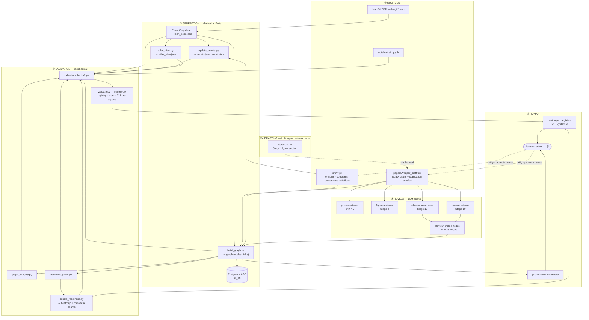
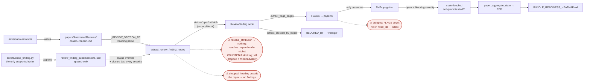

# QA / QI infrastructure — the quality layer's interior

> **Answers:** Which derived artifact has which writer and staleness key? How does a review finding become a gate? Where does a human actually decide?
>
> *(TODO-D8: this line is the required-content contract. `README.md`'s ownership
> table assigns this question to this document; `architecture_inventory_fresh`
> asserts the two agree verbatim, so the assignment cannot drift silently.)*

**Living document.** Start at [`README.md`](README.md).

This opens up the subsystems the [`END_TO_END_MAP`](END_TO_END_MAP.md) spine references but
does not enter: which derived artifact has which writer and staleness key, how a review
finding becomes a gate verdict (and where it silently doesn't), where a human actually
decides, and the claim-lineage detector.

**It states no counts.** Every census figure — checks, gates, hooks, agents, node and edge
types, registries, bundles — lives in [`SURFACE_INVENTORY.md`](SURFACE_INVENTORY.md), which
is derived and gated. This document names *mechanisms*; magnitudes are looked up.

> **What is NOT here, and where it went.** Per [`README.md`](README.md)'s ownership split:
> per-gate semantics and what actually blocks are in
> [`VALIDATION_GATE_TOPOLOGY.md`](VALIDATION_GATE_TOPOLOGY.md); the systemic-pattern ledger
> and the obligations a check inherits are in
> [`CHECK_AUTHORING_GUIDE.md`](CHECK_AUTHORING_GUIDE.md); how the suite is built is in
> [`VALIDATION_ARCHITECTURE.md`](VALIDATION_ARCHITECTURE.md). Those documents own their
> tables; this one does not duplicate them.

---

## 1. The five planes



**The system is well-designed in its architecture and substantially broken in its wiring.**
That sentence is the thesis of this whole directory, and every section below is an instance.

⚠️ **`paper-drafter` is the only agent that PRODUCES manuscript prose**, but it does not write
the file: it returns a section and the lead places it. That keeps plane ① author-written by a
single serializing writer, which matters because a bundle is one monolithic `paper_draft.tex` —
parallel drafters holding `Write` would clobber it and holding `Edit` would race. It therefore
holds neither.

The provenance consequence stands regardless of who types: **nothing downstream records that an
agent produced the prose.** No check, no reviewer and no graph node carries authorship, so the
drafter's obligations have to be internal to it; there is no layer beneath it to catch what it
gets wrong.

The one that matters is **prior art**. A drafted section that cites must be written against the
cited work itself, read in full for that portion — not an abstract, not a summary, not the
`CITATION_REGISTRY` entry. Misquoted or misinterpreted prior art is the failure class that
survives every layer below, because each layer verifies that a source *exists and resolves*,
never that the prose represents it faithfully: Invariant 11 asserts a cached primary source is
present, `claims-reviewer` FAILs a DOI that resolves to the wrong paper, Stage 13 makes citation
findings BLOCKER. None of them can read the paper and judge fidelity. Briefs carry the source
path; drafted claims carry their location (table, equation, figure) so the layers below have
something checkable to land on.

Sections are **disjoint per agent**. The lead owns the outline, the argument's spine, and
integration — the properties no per-section agent can see.

⚠️ **`prose-reviewer` deliberately does not reach plane ④'s finding pipeline.** It runs earliest
of the four — `BUNDLE_LIFT_PROCEDURE.md` §7.5, before Stage 9 — and returns a restructuring
instruction rather than a finding list, so it mints no `ReviewFinding` node and gates nothing.
That is the design: a manuscript that does not carry a reader is rewritten, not ticketed. Its
machine-decidable floor is enforced separately, by checks, and holds whether or not the agent
ran.

---

## 1.5 The execution and enforcement layers — what the review planes do NOT cover

The planes above describe agents that **judge** artifacts. Two other agent classes act on the
project, and a hook layer constrains all of them. Neither was reachable from this directory
before, which is why a designer reading only the validation documents concluded that surfaces
they cover were uncovered.

### Execution agents

**`lean-worker`** proves one independent Lean sub-chain inside a pre-built parallel worktree
slot. The lead assigns a slot; the worker gets that slot's own build-isolated `lean-lsp`
(`mcp__skeft_wtN__*`, each slot carrying its own `.lake`), so workers run concurrently with no
coordination. It drives proofs MCP-first rather than through write→`lake build` cycles, holds
kernel-purity as its bar, and commits on the slot branch for the lead to merge. It is bound by
the negative frontier (ADR-007): settled-dead forks must not be re-derived, and a fresh-context
worker is the likeliest re-deriver. **Its operational detail lives in the plugin's own
progressive disclosure** — `skills/goal-dev/references/parallel-worktrees.md` for the fan-out
flow and `skills/goal-dev/SKILL.md` for the proof loop — not here. The control plane it runs on
is ADR-008's shared slot supervisor.

**`research-scout`** is Tier-1 of the research ladder: read-only web reconnaissance for one
focused, already-sanitized question, when the local `Lit-Search/` corpus (Tier 0) has nothing.
It returns a structured, cited report and does not decide, edit, or commit — the lead vets the
report and files it. **Its capability boundary is the point, not an incidental restriction:** it
holds web tools and nothing that can mutate the repository, so a poisoned page cannot turn it
into an editor, and it treats fetched content as data rather than instructions.

### The enforcement layer — hooks, not conventions

Agent obligations that matter are enforced by `PreToolUse` hooks in the plugin, **not** by prompt
discipline. A reader of the agent prompts alone will mistake enforced boundaries for advisory
ones. All fail closed.

| guard | constrains | why it exists |
|---|---|---|
| `harness_web_egress_guard.py` | `WebSearch` / `WebFetch` | denies any query or URL carrying a denylisted local path or identifier, and any fetch outside the scholarly whitelist. The denylist is split: a committed sample plus an **untracked local** copy the operator installs with their own identifiers. |
| `harness_worker_shell_guard.py` | `Bash`, for worker subagents only | a dispatched worker may not run builds, cache mutations, or integration commands; the lead owns those. Keyed on the subagent, so the lead session is unaffected. |
| `harness_question_guard.py` | `AskUserQuestion` | redirects a blocking question raised inside an autonomous loop to the `coach` agent, which resolves it against the standing pre-decisions. The operator is deliberately out of the loop; a question that diligence would have answered is deferral, not deference. |

#### The egress whitelist — where it is, and the two places it is not

`harness_web_egress_guard.py` is **unconditional** (unlike the loop-durability hooks, it is not
gated on a session marker) and denies on any internal error. `WebSearch` is a search engine and
is **not** domain-gated; only the denylist applies to it.

Its whitelist has two forms. `_WHITELIST` holds registrable hostnames, matched exactly or as a
subdomain (`endswith("." + entry)`), so `export.arxiv.org` passes while `arxiv.org.evil.com`
does not. `_PATH_WHITELIST` holds `(host, path_prefix)` pairs matched on the normalized path at
a `/` boundary, so a single code-hosting repository is reachable without granting the whole
host. **Never promote a code-hosting host to a bare `_WHITELIST` entry** — it serves arbitrary
user-controlled content, a far broader grant than a prior-art check needs.

⚠️ **`_WHITELIST` is the ONLY whitelist. Nothing else may enumerate domains.**

`agents/research-scout.md` carries none, deliberately — an earlier revision embedded a list that
drifted from the guard, and the agent now states that it does not hold the whitelist and must not
reason from a remembered one. In the recorded failure that drift both refused a sanctioned fetch
and downgraded primary evidence to orientation-grade. A fetch that returns content was
sanctioned; the agent judges the **source**, not the domain.

`.claude/settings.local.json` carries **no `WebFetch(domain:…)` entries — and no bare `WebFetch`
grant either.** Both are wrong, for opposite reasons, and the second is the dangerous one.

Three layers act on a fetch, and only one of them is always present:

| layer | present when | effect |
|---|---|---|
| the harness **auto classifier** | always | judges each call on its merits |
| `permissions.allow` | `.claude/settings.local.json` exists for that checkout | pre-approves, **bypassing the classifier** |
| this guard | the plugin is enabled for that checkout | denies off-whitelist; fail-closed |

`enabledPlugins` lives in `.claude/settings.local.json`, which is per-machine and uncommitted, so
**the guard is opt-in per checkout, not ambient**. A blanket `WebFetch` grant would therefore trade an
always-on judgment layer for a conditionally-loaded one — strictly worse wherever the plugin is
not enabled. Domain-scoped entries are the milder error: under an auto-approving mode the
classifier already permits benign scholarly reads, so they enable nothing the classifier would
not, while duplicating a list that drifts below the guard's and cannot deny anything (the block
is `allow`-only). Delete them; add nothing in their place.

⚠️ **A permission grant is not capability.** Measured 2026-08-15: one domain sat in
`permissions.allow` and not in `_WHITELIST`. Granting it never made it reachable — the guard
denied it, verified by fetching it — so the grant had never once worked. If a domain is wanted,
it goes in `_WHITELIST`; nowhere else confers access.

**Citation quality is not enforced here.** Fetching a code host for prior art is legitimate;
*citing* it as a source is a different question, owned by the citation checks and the claims and
adversarial reviewers. Filtering the fetch layer to police what may be cited is a category error,
and is how the settings subset came to exist and then drift unnoticed.

**Adding an entry — use [`scripts/egress_policy.py`](../../scripts/egress_policy.py), not an
editor.** Widening egress is a five-step sequence in which every step has a silent failure mode
this project has already hit, so it is a command rather than a remembered ritual:

```bash
uv run python scripts/egress_policy.py add <domain> --for "<what needs it>" --date <YYYY-MM-DD>
git commit …                     # the cache is keyed by the committed HEAD SHA
uv run python scripts/egress_policy.py sync
# then RESTART Claude Code — the operator's call, never automated
```

`add` refuses a host already covered (matching is subdomain-aware, so it catches parent
entries), refuses anything that is not a bare registrable host, refuses a bare entry for a
**code host** and directs you to `--path`, and requires `--date` because an undated grant cannot
be audited. It then **imports the edited guard and asserts the domain resolves** before running
the egress tests — a write that lands in a comment fails there rather than at the next fetch.

`sync` discovers the install records from Claude Code's own installed-plugins record rather than
assuming a fixed number: this plugin has one record **per launch point**, and `claude plugin
update` only touches the record for the current cwd. It refuses to run while the guard has uncommitted changes, since
the cache is keyed by the committed SHA and an unsynced edit would be silently skipped.

Three properties of the runtime that make the last step non-negotiable:

- **A restart is required, and only a restart.** Hooks bind at session start. Measured
  2026-08-15: `/reload-skills` reloaded the skills and left the `PreToolUse` chain untouched.
- **A refresh is not a restart.** `claude plugin update` moves the cache; the running session
  keeps serving the hook it loaded. Both are needed, in that order.
- **The deny message is a version probe.** It names this document. A denial that instead names
  the retired `dev-loops` egress spec — a document that never existed and whose pointer was
  removed on 2026-08-15 — proves the *running* hook predates that retirement, whatever the
  installed-plugins record reports. Config state and runtime state are separate questions, and
  only the deny text answers the second.

What a claim may then rest on is
[ADR-014](../adrs/ADR-014-source-acquisition-and-citation-fidelity.md): a fetch that lands a
publisher **abstract** has not obtained the source.

⚠️ **The plugin uses progressive disclosure, and the governing detail is often one layer down.**
A skill's `SKILL.md` is an entry point; its `references/` carry the operating detail, and reading
only the entry point yields a systematically shallow picture — the same failure this section
exists to prevent one level up. When assessing what the agent layer already covers, read the
referenced files, not only the roster and the frontmatter.

---

## 2. Artifact generation — writers, triggers, staleness keys

Every derived artifact, its sole writer, and how staleness is detected. **The staleness key
is the load-bearing column:** content-hash and content-compare are sound; mtime is weaker;
*none* means drift is undetectable.

| artifact | writer | staleness key | auto-synced? |
|---|---|---|---|
| `lean/lean_deps.json` | `extract_lean_deps.py` | **content hash** of every `.lean` under `SKEFTHawking/` **plus the root aggregate `lean/SKEFTHawking.lean`** | yes |
| `docs/counts.json` / `.tex` | `update_counts.py` | **hybrid** — **value compare** on the five glob figures, mtime vs sources for `pytest_cases` (see below) | yes |
| `papers/*/tables/*.tex` | `render_paper_tables.py` | mtime | yes |
| `docs/MODULE_CENSUS.md` | `module_census.py` | **content compare** (`render(collect())`) | yes |
| `lean/atlas_view.json` | `atlas_view.py` | **content compare** (rebuilds) | yes |
| `docs/ATLAS_HEATMAP.md` | `atlas_heatmap.py` | **content compare** | yes |
| `lean/SKEFTHawking/KernelNoGos.lean` | `gen_kernel_nogos_module.py` | **content compare** | yes |
| `docs/architecture/SURFACE_INVENTORY.md` | `architecture_inventory.py` | **content compare**, gated by `architecture_inventory_fresh` | no — deliberately |
| `papers/claim_clusters.json` | `cluster_detect.py` | mtime | via check only |
| `docs/PERMANENT_TRACKED_HYPOTHESES.md` | `render_tracked_hypotheses.py` | content compare, **hard-fail, never auto-written** | no |
| `papers/cluster_bundle_index.json` | `bundle_clusters.py` | **none** | **no** |
| `docs/BUNDLE_READINESS_HEATMAP.md` | `bundle_readiness.py` | **none** | **no** |
| `docs/QI_REGISTER.md` | `qi_register.py` | **none** — *re-parses its own Closed Items* | **no** |
| PG + AGE `sk_eft` | `build_graph.write_graph_to_pg` | **none** (full delete + rewrite) | opt-in only |
| `figures/provenance_graph.json` | `build_graph --out` | **none** | **no** |

⚠️ **`counts.json`'s key is a hybrid because an mtime-max is blind in one direction, and it
shipped that way.** Deleting a file leaves every surviving file's mtime untouched, so the
maximum does not move and the artifact reports fresh while publishing a count one too high —
measured 2026-08-13: `test_files: 194` against a live 193 for three commits, green throughout.
The five glob-derived figures (`python_modules`, `test_files`, `notebooks`, `papers`, `figures`)
are now **recomputed and compared** through `update_counts.count_python_cheap`, imported rather
than re-implemented so the check and the writer cannot disagree. `pytest_cases` keeps the mtime
proxy because it costs a pytest collection, and it needs no more: a deleted file moves
`test_files`, an edited one moves its own mtime.

**The generalisable rule for this table: an mtime is a proxy for "did the answer change", and it
only works in one direction. Where the answer is cheap to recompute, recompute it** — which is
why the rows above split into *mtime* and *content compare* at all, and why this row is now both.

### 2.1 The module census — one derived answer, with no hand-written half

`docs/MODULE_CENSUS.md` answers *what is this module, script or notebook* — the question this
directory deliberately does not own (see
[`README.md`](README.md#what-is-deliberately-not-here)). It is **generated in whole** by
`scripts/module_census.py`. To change a description, change it at the source.

⚠️ **The decider differs by language, and none of the three is a regex over the whole file.**
Python uses `ast.get_docstring`; shell has no AST, so the analogue is the **leading comment
block only** (contiguous `#` after an optional shebang), bounded so an explanatory note in the
body cannot pass as a description; a notebook is described by its **first cell, and only if that
cell is markdown** — a notebook that opens with code and explains itself later is not
self-describing at the point a reader opens it. Shell joined at D5 and notebooks at D3
(2026-08-13); this paragraph said *"Python module … read via `ast.get_docstring`"* until then.

**It replaced a pair of hand-maintained files (ADR-013), and the reason generalises.** The
Inventory pair was half generated and half hand-written in the same file, and *a half-generated
document inherits the credibility of its generated half*: the Index's AUTOGEN table was fresh
while the prose beside it was two months stale — a theorem count roughly half the generated one,
and a sentence asserting this repo has no `CLAUDE.md`. Every gate was green, because every gate
looked only inside the markers.

Three of the four legs that guarded the Index have no counterpart here, and that is the point:
the census declares no size ceiling (it is generated whole), carries no narrative (so no
hand-written count can drift), and has no `AUTOGEN` markers (so no unclosed marker can mask the
lines after it). The hazards are designed out rather than guarded. The one leg with a
counterpart is stronger: the Index's freshness leg was **advisory**, the census's is **blocking**.

What the census does carry is a ratchet on the population it cannot describe — modules with no
docstring, down-only. **That leg reads SOURCE, not the rendered artifact**: a leg keyed on the
artifact would be satisfied by the very regeneration that introduced the regression, since the
artifact always agrees with itself.


## 3. The review pipeline — how a finding becomes a gate



**Silent-drop points**, ranked by observed damage:

1. A finding that resolves to no bundle reaches no bundle's ratchet.
   ⚠️ **THE PREDICATE HERE READ `neither inferred_paper nor inferred_bundle` UNTIL
   2026-08-15, AND THAT WAS THE ATTRIBUTION CHANNEL, NOT A DESCRIPTION OF IT.** Those two
   keys came from two regexes over text — a literal `paper<digit>` in the heading, body or
   filename, and the filename stem matched against the bundle roster — and the review
   document's frontmatter was opened for nothing. A document *declaring* `paper:
   note_rt_ch_bounds` or `bundle_target: D11` was parsed by neither, so the convention
   every recent review writes had no reader anywhere in `scripts/`, and eleven open
   blocking findings whose own documents named a mappable target reached no bundle. Nine
   bundles rendered YELLOW while carrying open blockers.
   `bundle_readiness.resolve_attribution` is now the one resolver and reads the
   declaration first — declared mapping key, then declared bundle code, then filename
   stem, then unique-prefix normalisation (`build_graph.resolve_unique_prefix`, shared
   with `extract_flags_edges` rather than re-implemented beside it), then the old
   inference. **Exactly-one match or nothing**, so a typo cannot invent a bundle.
   ⚠️ **At a blocking severity it is no longer silent.** ADR-012 P5 counts that population
   against `UNATTRIBUTED_OPEN_BLOCKING_CEILING`, a second leg of
   `bundle_stage13_claim_consistent`, so growth in the unattributed blocking set fails a check
   instead of vanishing between the per-bundle ceilings. Two things did **not** change: the
   attribution gap itself — the finding still reaches no *bundle* — and the `minor`/`advisory`
   population, which carries neither key and is counted by nothing. What changed is that being
   unattributable stopped being a way out of the ratchet **for the severities that block**.
2. `_emit` is a **no-op when the FLAGS target is absent** from `node_ids` — no log. This
   produced a bundle false-green.
3. Ambiguous paper-key prefix → all edges skipped (info-level log only).
4. `papers/AutomatedReviews/*/*.md` is a **one-level glob**; a review filed deeper is
   invisible.
5. A finding heading outside `_REVIEW_SECTION_RE` mints **no** nodes — a whole round of
   blockers reads exactly like a clean round. Partially guarded, post-hoc, by
   `review_docs_mint_findings`.

**`FixPropagation` is the only evaluator that reads FLAGS.** Every other gate is blind to
review findings.

**A `BLOCKED_BY` that names nothing is COUNTED, at a ceiling of zero.** The routing edge added
by ADR-012 P4 does not silently drop an unresolvable target, an unknown release scheme, or a
known scheme with an empty value (`run:`); `review_severity_declared` fails on any of them.
Dropping one would render a blocked finding as dispatchable — work handed to an agent that
cannot possibly finish it — which is the same failure shape as drop point (2).

⚠️ **It is a check, not an exception, and that was a deliberate reversal.** `_blocked_by_edges`
first *raised*. The raise propagated out of both edge-assembly sites and so out of
`build_graph_json()`, so one hand-typed id in reviewer markdown would have taken down the graph,
the atlas, `graph_integrity`, gate extraction and the dashboard together — including the checks
that would diagnose it — and these values are typed by LLM reviewers, from the same population
that produced the dangling ledger records. Loud detection, bounded blast radius: the ceiling is
**zero**, not a ratcheted baseline, because this population starts empty and every entry in it
is new.

**The ledger has a writer.** `docs/review_finding_supersessions.json` is the only channel that
can close a finding, and until ADR-012 P6 every record in it was hand-typed;
`scripts/close_finding.py` is now the supported writer. It mints ids with the extractor's own
`mint_finding_id` — a second minter would reproduce, by construction, the orphaned-record class
that motivated it — it refuses rather than appends when a record already exists with a different
status, because the reader is **last-wins and does not say so**, and it refuses a same-status
record that does not meet the closure bar, because "already fixed" over a record that closes
nothing reports success while the finding stays open.

⚠️ **Hand edits remain possible and are only partly caught.** `ledger_ids_resolve` sees a
record whose `finding_id` matches no minted node, in the `review:` scheme, above its ratchet —
and now also a record with no `finding_id` at all. A hand edit carrying a *valid* id and a
fabricated status passes it. The three real mis-keys were caught by a reviewer READING them,
which is not yet a test.

### The dialect question — narrow, and the live risk is a NEW form

`_REVIEW_SECTION_RE` accepts a **shape**, not a list: a 3-to-5-level heading, an optional
keyword prefix, an identifier of up to three dot-parts with an optional letter block and letter
suffixes, and a separator restricted to a spaced em/en dash or a colon. `build_graph.py` carries
the pattern and the on-disk forms that drove each widening; **read it there rather than
re-enumerating the forms here** — a list of accepted forms beside a regex is the
hand-maintained-list failure this map documents elsewhere. It was widened after a round in
which every form on disk minted **zero** findings, making real reviews invisible.

**So the live risk is a NEW form, not the existing corpus.** A review written in a heading
style outside the accepted set mints nothing, silently — drop point (5) above. Review output
landing in the directory is still not *sufficient* to become a finding.

**Bundle-level Stage-13 reports reach the gates.** They are the largest single source of
`ReviewFinding` nodes in the graph, and `review_docs_mint_findings` passes across every
document carrying an unresolved severity-labelled heading. A document whose severities appear
only inside PASS/RESOLVED notes carries no open findings and is deliberately **skipped**, not
failed.

### Re-measure a filed finding before you fix it

**A finding's count, consumer and effort estimate are claims, not measurements** — including
findings this project filed itself. An entry written from a sample and never summed reads
exactly like one written from a full count.

The VERIFIES resolver is the worked example. Two rules gate it, each closing a direction the
resolver could fail in: a ref rooted at a **module alias** is a Python module, never a Lean
declaration (without this it fabricated Lean-targeted edges, resolving the *tail* of a Python
name against Lean short names — `np.all` → `FaultTolerance.Pauli.all`); and a **dotted** ref
resolves only as a full Lean name, never by its tail (without this it dropped test nodes,
keying ids on `module::function` with the class omitted).

**Its consumer is `last_modified.py`'s VERIFIES propagation**, where a bad edge stamps an
unrelated test file's mtime onto Lean nodes. No readiness gate consumes it — the gates read
`formula:` targets only.

⚠️ **A measurement is scoped by a predicate, and fixing what that predicate keyed on voids
it.** Re-derive the number, the consumer and the blast radius against the current tree before
acting on any of them.

---

## 4. Human decision points

Where a human actually decides. Several are structurally enforced as human-only
(`disable-model-invocation: true`, or a tier clamp an agent cannot lift).

| decision | surface | human-only enforcement |
|---|---|---|
| Arm a `/goal` loop | `/skeft-qa:goal-prompt` | **structural** |
| Promote System-2 finding → `human-reviewed` | `/skeft-qa:debrief` | **structural** (`_clamp_tier` caps every other writer at `agent-reviewed`) |
| Close / misfile a System-2 finding | `/debrief` | **structural** — `## Misfiled` reachable only here |
| Integrate a process win into the harness | `/debrief` | per-win sign-off; *"self-improving, never self-mutating"* |
| Graduate a finding → standing pre-decision | `/debrief` → `PRE_DECISIONS.md` | **structural** |
| Sign off a structural-prevention proposal | `/debrief` | never auto-applied |
| Close a QI item (System-1) | `QI_REGISTER.md` block move | Invariant #13 preserves Closed Items verbatim |
| Approve a new project-local `axiom` | Invariant #15 + `AXIOM_METADATA` | policy + `axiom_closure_allowlist` |
| Toggle the AskUserQuestion guard | `/skeft-qa:goal-guard` | **structural** |
| Verify a parameter for submission | provenance dashboard | Invariant #8 |
| Declare a bundle's apex theorems | `papers/<bundle>/bundle_metadata.json` | ADR-010 §D5a — full per-bundle context review, one at a time |

**Inside a `/goal` loop the human is deliberately absent**: the AskUserQuestion guard denies,
logs to `blocked_questions.jsonl`, and redirects to the `coach` agent. The question reaches a
human only asynchronously via harvest → System-2 register → `/debrief`.

---

## 5. Claim lineage — the Class-1 detector

**Chain-of-backing** resolves every claims-reviewer sentence link against the live graph.
`scripts/chain_canonicalize.py --report` is its instrument.

`theorem-absent` means **a manuscript sentence names a Lean theorem that does not exist**.
The population splits into genuine cases and artifacts, and the artifact half falls in four
individually-fixable classes: kernel axioms that have no graph node though the
claims-reviewer spec instructs agents to emit them; `module:` prefix double-mangling;
by-design inductive-constructor filtering; and mis-tagged link kinds.

Two genuine failure shapes are severe enough to name:

- **A discharged axiom is still cited.** `gapped_interface_axiom` was retired; the project's
  axiom count is zero.
- **A name that is not a declaration is still cited.** `gap_solution_bounded` sits in
  `TetradGapEquation.lean` inside a comment block, under the note *"This theorem is FALSE as
  originally stated"* — so it is not merely false, it is not a declaration at all. One
  citation is a documented waiver: I1 cites it deliberately as history.

⚠️ **Search for these names in their LaTeX-escaped form.** A draft writes
`gapped\_interface\_axiom`, so a scan for the raw identifier reports zero manuscript hits and
is wrong: the name is in 14 drafts, and `gap\_solution\_bounded` is in I1's.

Read in the drafts, the two names split cleanly:

- **Most manuscript mentions are accurate history.** D2, D4, D5, F, L2, `paper8` and
  `paper21` all state the conversion — *"formerly `axiom gapped_interface_axiom`, converted to
  a tracked `Prop` on 2026-05-19"* — and I1 describes `gap_solution_bounded` as a
  commented-out stub. Naming a retired thing as retired is correct, not drift.
- **No draft states either as live.** Every one of the 25 mentions carries a historical
  qualifier — *"formerly"*, *"since retired into the tracked Prop `TPFConjecture`"*,
  *"was refactored"*. `validate.py --check axiom_count_prose_consistency` scans all 64 drafts
  against `docs/counts.json` (`lean.axioms = 0`) and reports zero stale claims.

⚠️ **Splitting these sentences on `.` gives the wrong answer**, because the qualifier usually
follows a dotted Lean module filename — the split truncates at that dot, before the qualifier,
and a present-tense claim appears where none exists. Cite `axiom_count_prose_consistency`'s verdict rather than
re-deriving one.

So the manuscript prose is sound, and the defect is confined to the **chain links**: a
fictitious audit trail, gated by the check above.

`--report` emits a breakdown by **resolution class** — `resolved` / `suggested` / `invalid` /
`unresolvable`, each split into named sub-kinds with example links. `--paper <dir>` limits the
run to one paper directory. It does **not** rank bundles, and it does not by itself surface
bundles with no chain-of-backing or bundles for which Stage 10 never ran; those are answered
by inspecting which directories carry a `claims_review.json` at all.

**Target existence is now gated; the rest of the report still is not.**
`validate.py --check chain_backing_targets_resolve` calls
`chain_canonicalize.canonicalize_link` over `_iter_links` and fails when the unresolvable count
exceeds its ratchet, so the standing population is reported by paper every run and can only
shrink.

⚠️ **The check owns no resolver, deliberately.** `canonicalize_link` is the project's single
resolver for chain links; a check carrying its own would be a second resolver beside a working
one, and it would disagree — an earlier draft did exactly that and reported a third more
unresolvable links than the real resolver, because it could not resolve module targets, short
names or constant aliases. `tests/test_d5_reviews.py` asserts by AST that no resolution helper
is defined here. **If resolution is wrong, fix `chain_canonicalize`; both consumers improve.**

⚠️ **The ratchet is a do-not-grow guard, not a defect count.** `canonicalize_link` skips
ambiguous short names — `zero` resolves to 12 candidates, `A` to 9, `F` to 8 — and counts them
`theorem-absent`, so some fraction of the population is a name-resolution artifact rather than a
missing theorem. Shrinking the count means either fixing a citation or disambiguating a name;
both are improvements.

The rest of `--report`'s output — resolution classes, suggested retargets — still gates on
nothing. The instrument produces the right answer and is connected to nothing that can stop a
submission: the systemic pattern
([`CHECK_AUTHORING_GUIDE`](CHECK_AUTHORING_GUIDE.md)), inside the subsystem built to detect
exactly that pattern in the papers.

---

## 6. The standing lesson

⚠️ **A filed finding's blast radius is a claim, not a measurement.** A finding carries a
count, a consumer, a function name and an effort estimate, and each of those is an assertion
in its own right — an entry written from a sample rather than a sum reads exactly like one
that was counted.

**Re-measure the scope before fixing, even when you wrote the finding yourself.** A fix is
only as good as the partition it rests on, and a partition inherited from prose is not a
partition. Re-derive the count, the consumer and the blast radius against the current tree
before acting on any of them.

**Out of scope, verified non-overlapping.** The shared Lean slot control plane
(`scripts/lean_slots/*`, `.codex/*`, the generated Claude MCP block, ADR-008) has zero references
to `validate.py`, `register_check`, `gate_precheck`, `bundle_readiness` or `build_graph`. Since
ADR-008 Phase 4 it serves **both** clients, so "Codex control plane" is no longer its name.

Its host-resource requirements are **declared data, not prose**: `host_limits` in the versioned
inventory, keyed by `platform.system()` and asserted by `doctor` with a remedy derived from the
declared minimum. Because this repository is public the check fails only for a knob the running
kernel exposes and under-provisions — an undeclared platform or an unexposed knob passes, and
`LEAN_SLOT_SKIP_HOST_LIMITS` opts a host out without a repository diff (ADR-008 S-M).

⚠️ **It has its own check family.** `slotctl doctor` checks (`config.repo`, `config.claude`,
`build_epoch`, `wtN.endpoint`, …) are **not** `validate.py` checks: they are not registered, not in
`_CANONICAL_ORDER`, and `validate.py --list` contains none of them. Their one registration site
beyond the definition is the doctor-shape assertion in `tests/test_lean_slots.py`. The
`architecture-change` skill's `registration_sites.py` keys on a check *name* as a proxy for
"a `validate.py` check" and so reports seven owed sites for a doctor check, all of them false
positives — assert which family the check belongs to before working its list.
