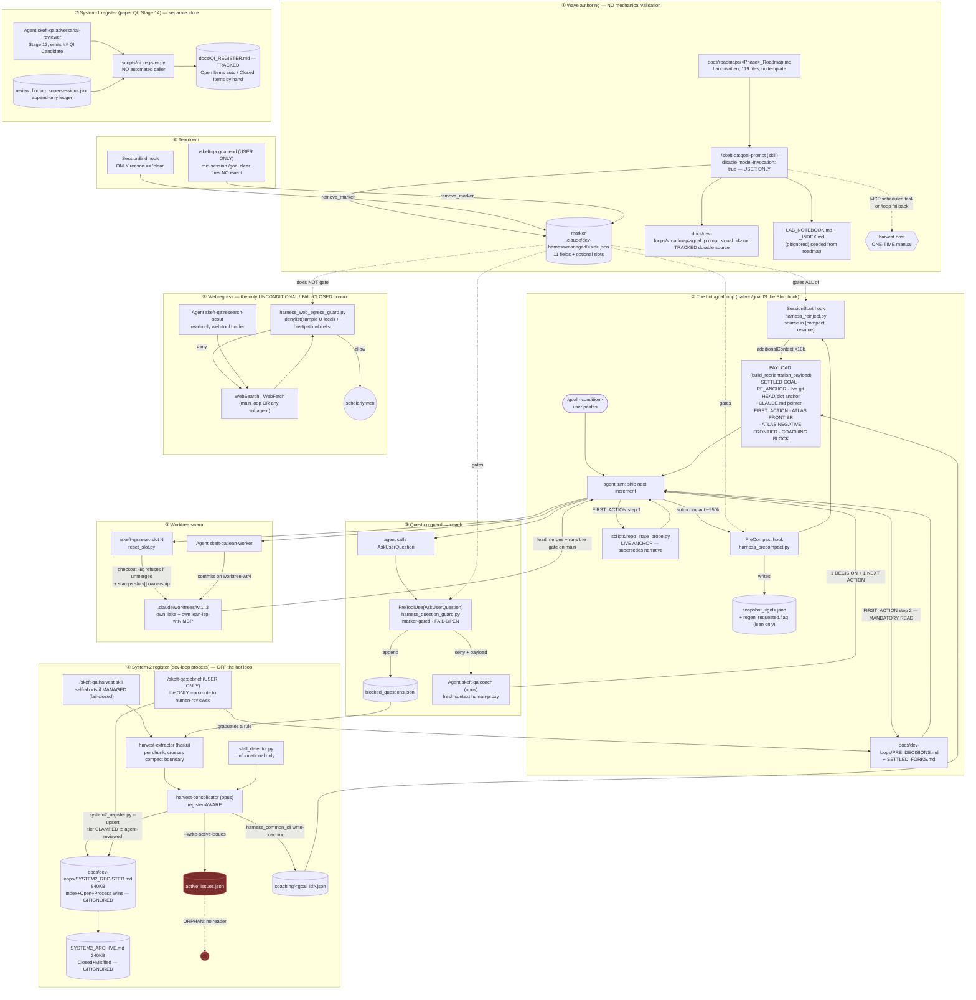

# PLANE — Development Loop / Harness

**Scope:** roadmap→wave creation, the managed `/goal` loop (hooks), pre-decisions + question guard + coach,
the two registers + harvest, web-egress guard, worktree swarm.
**Repo:** `SK_EFT_Hawking` @ branch `infra/adr-009-validation-modularization`, HEAD `2c845d4cf3c2`.
**Method:** docs-first (Phase 1 = intended design from governing docs), then implementation verification (Phase 2).
**Date:** 2026-08-06. Read-only survey; this file is the only artifact written.

Every claim below is marked **[V]** verified (I read/ran it) or **[I]** inferred. Intent claims cite `doc:line`.

---

## 0. Three-sentence shape

The dev-loop plane is a **default-inert, marker-gated wrapper around Anthropic's native `/goal`**: a
user-only `goal-prompt` skill arms a per-session marker, after which four Claude Code hooks
(SessionStart / PreCompact / SessionEnd / PreToolUse) re-ground the loop after each compaction, stage
durable artifacts across the compaction boundary, and intercept blocking questions — all fail-open, so
a harness bug never strands the loop. Around that hot loop sit two asynchronous, human-governed
learning stores (System-2 dev-process register, fed by an off-loop harvest and promoted only by
`/debrief`; System-1 paper-QI register, generated by `qi_register.py`) plus a set of standing
pre-decisions the loop must *read* (no longer injected) and a fail-**closed** web-egress guard that is
the one unconditional control in the plane. Work itself is organized by hand-authored
`docs/roadmaps/*.md` files and executed solo or fanned out to three persistent Lean worktree slots —
and **the roadmap/wave layer is the plane's only wholly unmechanized seam: nothing validates that a
roadmap exists, is current, or that its acceptance criteria were met.**

---

## 1. The plane as it actually is

---

## 2. INTENDED vs IMPLEMENTED

Legend — **CONFORMS** = code does what the doc says · **DEFERRED** = diverges, but the divergence is
written down (cite) · **UNDOCUMENTED DRIFT** = diverges with no doc acknowledging it.

| # | Mechanism | Intent (doc:line) | Implementation (file:line) | Status |
|---|---|---|---|---|
| 1 | Three hooks, default-inert + fail-open, marker-gated | `docs/dev-loops/HARNESS_GUIDE.md:16`, `:121-122` | `harness_common.py:168-184` (`read_marker` → None on subagent/no-marker/unresolved); `harness_reinject.py:101-104`; `harness_question_guard.py:51,63-64`; `harness_precompact.py:93-98`; `harness_session_end.py:23-29` | **CONFORMS** — but the guide says "three hooks" while `hooks.json` declares **five** hook entries across four events (PreCompact added, egress added). `hooks.json:2` describes v4.3 correctly; `HARNESS_GUIDE.md:16` was not updated. See #2. |
| 2 | Hook inventory | `HARNESS_GUIDE.md:16-20` lists SessionStart / PreToolUse(AskUserQuestion) / SessionEnd | `hooks/hooks.json:4-64` declares **PreCompact, SessionStart, SessionEnd, PreToolUse(AskUserQuestion), PreToolUse(WebSearch\|WebFetch)** | **UNDOCUMENTED DRIFT** (minor). `HARNESS_GUIDE.md:126` *does* describe the PreCompact behaviour in the invariants section, so the omission is only in the §1 headline count; the egress hook is entirely absent from the guide. |
| 3 | Prose lab-notebook FRONTIER must NOT be injected | `HARNESS_GUIDE.md:18` ("retired helper, intentionally uncalled… wiring it back in is a regression") | `harness_common.py:283-297` `_frontier_for` defined, **zero callers** (verified by grep). Test `tests/test_harness_core.py` guards it; 156/156 plugin tests pass. | **CONFORMS** — deliberate, tested, documented. Model case. |
| 4 | Pre-decisions are READ, not injected; grow unbounded | `PRE_DECISIONS.md:11-14`; `HARNESS_GUIDE.md:18` | `harness_common.py:398-414` `_read_predecisions_core` exists but has **zero production callers** (only `tests/test_harness_core.py:72`); the read is mandated by prose at `harness_common.py:439-441` (`FIRST_ACTION` step 2) | **CONFORMS** — but note the enforcement is *prose only*. Nothing verifies the loop actually read the file. |
| 5 | Positive state recomputed live, never remembered | `HARNESS_GUIDE.md:125`; `LIVE_ANCHOR_REDESIGN_SPEC.md` (Move 1) | `harness_common.py:431-447` `FIRST_ACTION`; `scripts/repo_state_probe.py:1-22` docstring; `harness_common.py:569-605` `live_head_anchor` (git-only skip-resilience anchor) | **CONFORMS** |
| 6 | A hook MUST NOT write a git-tracked path | `HARNESS_GUIDE.md:126` (QI invariant, 2026-06-24) | `harness_precompact.py:102-128` writes only under `harness_dir(root)` = `.claude/dev-harness/` (gitignored per `.gitignore:100`, verified via `git check-ignore`); `harness_question_guard.py:35-38` same | **CONFORMS** |
| 7 | Payload stays under the 10,000-char `additionalContext` limit end-to-end | `harness_common.py:203-219` | `PAYLOAD_MAX_CHARS = 10000 − 950`; goal + RE_ANCHOR always full; atlas blocks and coaching block each gated by a length check at `:651`, `:660`, `:673` | **CONFORMS**. ⚠ The `/goal` condition is capped at ≤4k *by prose only* (`goal-prompt/SKILL.md:144`) — the code does **not** truncate it, so an over-4k condition silently blows the budget. See Concern C6. |
| 8 | `active_issues.json` feeds the SessionStart re-inject and the AskUserQuestion redirect | `skills/harvest/SKILL.md:74` ("the view Plan 1's re-injection / AskUserQuestion redirect read"); `harness_reinject.py:48` ("so the active-issues view stays fresh"); `HARNESS_GUIDE.md:161` lists it as live state | `harness_common.py:237-265` `_read_active_issues` has **zero callers**; `build_reorientation_payload` (`:608-675`) never references it | **UNDOCUMENTED DRIFT.** The retirement *is* documented once (`HARNESS_GUIDE.md:18` "replaced the old blind active-issues/wins/heuristics injection") — but three other live surfaces still assert it is read, including the harvest skill the consolidator follows. The harvest still spends a step writing a file nobody reads. |
| 9 | PD-1 rung E = "`/skeft-qa:trace`" forensic arc-trace | `PRE_DECISIONS.md:42`, `:128` | **No such command/skill exists.** `commands/` holds only `frontier, goal-end, goal-guard, notebook, orient, reset-slot`; `skills/` holds `debrief, goal-dev, goal-prompt, harvest, sync, wave-close`. Grep for `skeft-qa:trace` across the repo returns **only those two PRE_DECISIONS lines**. | **UNDOCUMENTED DRIFT — highest-value catch.** The coach (`agents/coach.md:26`) is told to route stalls to "PD-1 rung … E (forensic arc-trace)", and PD-1 is the *mandatory-read Core*. A loop or coach that follows rung E gets `command not found`. |
| 10 | Web egress fail-closed, denylist split committed-sample ∪ untracked-local | `SK_EFT_Hawking/CLAUDE.md` §"Research ladder & web-egress security"; `hooks.json:2` | `harness_web_egress_guard.py:107-130` (sample ∪ local, `FileNotFoundError` → continue); `:203-212` main fails closed; `hooks.json:57` printf-deny second layer | **CONFORMS.** Verified the local file is gitignored (`.gitignore:134`) and **not tracked** (`git ls-files` errors). Absent-local behaviour = baseline absolute-path regexes still apply (`research_egress_denylist.sample.txt:15-19`) — i.e. degrades to *weaker but non-zero*, never open. |
| 11 | Egress guard spec doc | `harness_web_egress_guard.py:18` and the **user-facing deny message** at `:190` both cite `docs/dev-loops/RESEARCH_LADDER_AND_WEB_EGRESS.md` | That file **does not exist in this repo** — it lives only in a downstream consumer outside this repository. The in-repo spec pointer is `SK_EFT_Hawking/CLAUDE.md` → `Lit-Search/README.md` (exists). | **UNDOCUMENTED DRIFT.** No leak (the path string is generic), but every egress denial hands the agent a dead pointer. |
| 12 | The running plugin is a **cache copy**; you must refresh after editing | `HARNESS_GUIDE.md:101-115` (explicit, with the two-install-record warning) | Served cache = `~/.claude/plugins/cache/skeft-local/skeft-qa/57c1067d9d23` (both install records; `.in_use` marker present). HEAD = `2c845d4cf3c2`. `diff -rq` shows **4 files differ**, incl. `scripts/harness_web_egress_guard.py`. | **DEFERRED-by-design, but LIVE-DRIFTED NOW.** The model is documented; the *current* state is drifted: commits `a41f8573` (isa-afp.org + `_PATH_WHITELIST` for prover repos) and `23096ccb` are branch-only and **not in the served guard**. So a WebFetch to `github.com/leanprover-community/mathlib4` is denied today despite the committed source allowing it. **No mechanical detector exists** for this (grep for `installed_plugins`/`plugins/cache` in `scripts/` + the plugin returns nothing). |
| 13 | Roadmap → wave authorization; something validates a roadmap | `docs/WAVE_EXECUTION_PIPELINE.md` is "the law: 14 stages, no skipping" (`SK_EFT_Hawking/CLAUDE.md` when-to-read table) | The 14 stages (`WAVE_EXECUTION_PIPELINE.md:9-31`) begin at **Stage 1 CONSTANTS**. There is **no Stage 0**, no roadmap template, no authoring doc, and **0 of 65 `validate.py` checks read `docs/roadmaps/`** (verified: `validate.py --list` → 65; `grep -rni roadmap scripts/validate.py scripts/validation/` → 1 hit, a docstring at `scripts/validation/checks/freshness.py:797`). | **UNDOCUMENTED DRIFT / structural gap.** Not a code defect — a *missing* mechanism the docs imply exists. The one roadmap consumer in code is `notebook_lib.py:175-229` (`_checklist_from_roadmap`), which **fails open** (`:200-205`): a nonexistent `roadmap_path` is silently `None`. |
| 14 | Wave close writes `docs/dev-loops/<roadmap>/<wave>_close.md`; "never edit … roadmaps here" | `skills/wave-close/SKILL.md:44-46` | **Zero** `*_close.md` files under `docs/` (verified `find docs -name "*_close.md"` → empty). Closes are instead written *into the roadmap* (`docs/roadmaps/Phase6EE_Roadmap.md:37`, `:228`), which the same skill forbids. | **UNDOCUMENTED DRIFT.** The prescribed artifact has never been produced; practice diverged and the skill was not updated. |
| 15 | System-2 register is **sharded**: active = Index+Open+Process Wins; archive = Closed+Misfiled | `HARNESS_GUIDE.md:22`, `:75`; `SK_EFT_Hawking/CLAUDE.md` §Process health | Verified section offsets: `SYSTEM2_REGISTER.md` = `## Index`@293, `## Open`@33022, `## Process Wins`@536588 (840 KB); `SYSTEM2_ARCHIVE.md` = `## Index`@175, `## Closed`@12699, `## Misfiled`@215511 (240 KB). 148 findings. | **CONFORMS** structurally. Size is a separate concern (C7). |
| 16 | Harvest never self-promotes to `human-reviewed`; `/debrief` is the only promoter | `skills/debrief/SKILL.md:47-52`; `HARNESS_GUIDE.md:68-69` | `scripts/system2_register.py:55-66` `_clamp_tier(tier, allow_human)`; `--promote` flag at `:458` | **CONFORMS** — structurally enforced, not prose-enforced. Good design. |
| 17 | Harvest self-aborts inside a `/goal` session, fail-closed | `HARNESS_GUIDE.md:68`; `skills/harvest/SKILL.md:29-31` | `harness_common.py:772-791` `any_managed_marker_in_workspace` returns **True** on unresolved workspace or any scan error | **CONFORMS** (genuinely fail-closed, the correct polarity for this one). |
| 18 | Stage 14 QI register: auto-regen + manually-curated Closed block, never wiped | `WAVE_EXECUTION_PIPELINE.md:687` (Invariant 13), `:618-651` | `scripts/qi_register.py:44-70` `load_closed_qi_ids` preserves the `## Closed Items` block by `### qi-*` heading | **CONFORMS** as a tool. But **no automated caller** exists (grep: only docs, the dashboard `/api/qi`, and one e2e test). `docs/QI_REGISTER.md` mtime 2026-06-30 vs a repo advancing daily. Independently filed by the prior audit `docs/audits/2026-08-05-pr-review-3/H2-plugin-and-seams.md:289-293,424` — I re-measured and confirm. |
| 19 | Marker teardown: SessionEnd on `/clear`; `/goal-end` for mid-session `/goal clear` | `HARNESS_GUIDE.md:20`, `:64` | `harness_session_end.py:27-29` (only `reason == "clear"`); `harness_goal_end.py:15-28` | **CONFORMS.** Correct conservatism (a `--resume`-restorable goal keeps its marker). |
| 20 | Slot ownership is exclusive per goal; reset refuses on unmerged commits | `HARNESS_GUIDE.md:147-154`; `goal-prompt/SKILL.md:131-136` | `reset_slot.py:200-214` (refuses on non-empty `base..HEAD` **and** on `git log` rc≠0 — the silently-defeated-guard fix); `:59-115` ownership guard + exclusive transfer; `--force` escape at `:190` | **CONFORMS** — notably well-hardened. |
| 21 | Question guard denies, logs, and redirects to the coach | `HARNESS_GUIDE.md:19`; `agents/coach.md:3` | `harness_question_guard.py:22-27` `_REDIRECT`; `:30-40` `_log_blocked_question`; `:56-61` deny + payload | **CONFORMS** |
| 22 | Coach reads "Core PD-0..PD-4" | `agents/coach.md:17` | `PRE_DECISIONS.md` Core is PD-0, PD-1, PD-2, PD-3, **PD-5** (`:59`, operator-set 2026-07-29), PD-4 | **UNDOCUMENTED DRIFT** (cosmetic — the coach also reads "+ Full", so PD-5 is in scope; but the enumerated range is now wrong and PD-5 is out-of-order in the file). |

---

## 3. Numbered walkthroughs

### 3.1 A wave comes into existence

1. A human (or an agent with a human) hand-writes `docs/roadmaps/<PhaseID>_Roadmap.md`. Naming is
   convention only: `Phase1`…`Phase7a`, letter series `Phase5a…z`, double-letter `Phase6AA…Phase6GA`,
   plus topic names (`D10_Discharge_Roadmap.md`). 119 files. **[V]**
2. Shape is imitated from neighbours; there is **no template and no authoring doc**. The shared
   convergent skeleton (Phase-5/6 era) is: title → status/close banner → `## Wave N` sections carrying
   **Goal / Why / Bricks / Done (AC = the `/goal` condition)** → sequencing → Phase Definition of Done
   → Open UNKNOWNs (e.g. `docs/roadmaps/Phase6EE_Roadmap.md:296,308,359,363,370`). Older Phase 1–4
   files use an unrelated "Directions + numbered sections" shape. **[V]**
3. `docs/WAVE_EXECUTION_PIPELINE.md` — "the law" — starts at Stage 1 and **never mentions authoring or
   authorizing a wave**. Its only roadmap obligation is Invariant 15 (`:691`): a new axiom needs "a
   discharge plan in the wave roadmap". **[V]**
4. Nothing validates the result. Zero of 65 `validate.py` checks read `docs/roadmaps/`. The only code
   that reads a roadmap is `notebook_lib.py:175-229`, which lifts ≤10 GFM checkbox rows into the
   notebook INDEX checklist and returns `None` on any read failure (`:200-205`). **[V]**
5. The roadmap enters the machine only as the marker's `roadmap_path` string
   (`goal-prompt/SKILL.md:101,122`). Nothing asserts that path resolves, that the named wave exists in
   it, or that its AC boxes were ticked before close. **[V]**

### 3.2 Arming and running a `/goal` loop

1. User invokes `/skeft-qa:goal-prompt <objective>`. The skill is `disable-model-invocation: true`
   (`goal-prompt/SKILL.md:5`) — deliberate: an agent cannot self-start a goal. **[V]**
2. Pre-send `!cmd` injections resolve the repo root via `harness_common_cli.py repo-root`
   (`SKILL.md:70`), the transcript path via `jsonl-path ${CLAUDE_SESSION_ID}` (`:79`), a pre-commit
   install check (`:86`), `goal_id = date +%Y%m%dT%H%M%S` (`:91`), `arm_sha` (`:137`), `armed_ts`
   (`:142`). Each has a documented STOP-on-sentinel path if `disableSkillShellExecution` is set
   (`:58-66`). **[V]**
3. The transcript path is *deterministic, not guessed*: `harness_common.py:91-122` returns an existing
   `~/.claude/projects/*/<sid>.jsonl` if present, else reconstructs `<cwd-slug>/<sid>.jsonl`; returns
   `""` for an empty sid so the skill STOPs rather than arming a mis-pointed marker. **[V]**
4. Notebook scaffolded idempotently: `notebook_lib.py new <home> --roadmap <roadmap_path>`
   (`SKILL.md:107-114`). Marker `notebook_path` points at the **INDEX**, not the log. **[V]**
5. Two writes: the **tracked** durable `docs/dev-loops/<roadmap>/goal_prompt_<goal_id>.md`
   (`SKILL.md:115-119`) and the **gitignored** marker
   `.claude/dev-harness/managed/${CLAUDE_SESSION_ID}.json` (`:120-142`, 11 fields + optional `slots`).
   `mode` (`lean|general`, default `general`) is the only behavioural switch. **[V]**
6. Harvest-host facilitation (`SKILL.md:154-174`): idempotent Desktop scheduled task
   `taskId = skeft-harvest-<repo>`, or a printed `/loop <interval> /skeft-qa:harvest` CLI fallback.
   Explicitly **not** auto-spawned. **[V]**
7. Atlas critical-path emitted both fronts (`SKILL.md:176-190`) + a prose **plan-currency check**
   (`:183-187`) — the closest thing to roadmap validation, and it is an instruction to a model. **[V]**
8. Final step prints **PASS/FAIL** that the marker exists at `${CLAUDE_SESSION_ID}`
   (`SKILL.md:203-209`) — the fail-loud guard against a silent no-op harness. **[V]**
9. User pastes `/goal <condition>`. Native `/goal` is the Stop hook; **the harness ships none**
   (`HARNESS_GUIDE.md:124`). **[V]**

### 3.3 What fires on each event

**PreCompact** — `hooks.json:6-16`, `timeout 30`, wrapped `2>/dev/null || true`.
1. `harness_precompact.py:92-98`: marker- and subagent-gated; unresolved root → inert. **[V]**
2. Job 1 (`:112-119`): tail-reads the last 512 KB of the transcript (`_TAIL_BYTES`), picks the **last**
   assistant text block >40 chars (`:66-86`), caps at 6000 chars, atomically writes
   `.claude/dev-harness/snapshot_<goal_id>.json` with `{ts, transcript_hwm, head_sha, last_message}`. **[V]**
3. Job 2 (`:121-128`): **only when `mode == "lean"`**, writes `regen_requested.flag`. The hook
   deliberately does **not** run `lake build` (capability-bounded, `:5-10`). **[V]**
4. Emits **nothing** to context (`:130`). **[V]**

**SessionStart** — `hooks.json:19-29`, `timeout 15`.
1. `harness_reinject.py:101`: returns immediately unless `source ∈ {compact, resume}`. `startup`/`clear`
   are intentionally inert. **[V]**
2. `read_marker` (`:103`) — inert if none. **[V]**
3. `build_reorientation_payload(m, root)` (`harness_common.py:608-675`) assembles, in order:
   **SETTLED GOAL** (marker `goal`, always full) → **RE_ANCHOR** (`:417-429`, incl. a **LIVENESS**
   check "a marker can outlive its goal … run /goal-end and STOP") → **live HEAD anchor** (`:569-605`,
   git-only, prefixed by a `_live_slot_pointer` line when the marker owns slots, `:511-566`) →
   "Re-read CLAUDE.md" → **FIRST_ACTION** (`:431-447`) → **ATLAS FRONTIER** (droppable, `:647-652`) →
   **ATLAS NEGATIVE FRONTIER** (droppable, `:656-661`) → **COACHING BLOCK** (droppable, `:665-674`). **[V]**
4. `compose_directive` (`harness_reinject.py:82-96`) prepends the one-line GO-signal frame. **[V]**
5. Appends `drift_note` if the harvest is overdue >2× its recorded cadence (`:35-52`) and
   `notebook_note` for over-budget/missing-DECISIONS warnings, with the FRONTIER-staleness warning
   filtered out by exact match (`:55-79`). **[V]**
6. `emit_context("SessionStart", ctx)` (`harness_common.py:187-200`). **[V]**

**SessionEnd** — `hooks.json:32-42`. Acts **only** on `reason == "clear"`
(`harness_session_end.py:27-29`), then `remove_marker` (marker + watermark,
`harness_common.py:133-148`). **[V]**

**PreToolUse** — two matchers, `hooks.json:45-63`. See §3.4 and §3.6.

### 3.4 The loop tries to ask a question — step by step

1. Agent calls `AskUserQuestion`. Matcher `AskUserQuestion` fires
   `harness_question_guard.py`. **[V]**
2. `hc.repo_root(ev["cwd"])` resolved **once** and reused for marker, log, and payload — deliberately
   via `import harness_common as hc` so the resolver is one patchable reference (`:9-13`, `:48-49`). **[V]**
3. `read_marker` → `None` for a subagent, an unmanaged session, or an unresolved repo → **exit 0 =
   allow** (`:51`). Same if `marker["question_guard"]` is falsy (flipped by `/skeft-qa:goal-guard off`
   → `goal_guard_toggle.py:17-29`, atomic write). **[V]**
4. Otherwise: append `{ts, session_id, questions}` to `blocked_questions.jsonl` (`:30-40`, best-effort,
   never blocks the redirect). **[V]**
5. Emit `permissionDecision: "deny"` with `permissionDecisionReason = _REDIRECT` (`:22-27`) and
   `additionalContext = build_reorientation_payload(...)` (`:56-61`). The redirect text names the
   escape hatch explicitly: *dispatch `Agent(subagent_type="skeft-qa:coach")`; if unavailable, apply
   the pre-decisions yourself and continue*. **[V]**
6. Any exception → `return 0` = **allow** (`:63-64`). Fail-open by design (`HARNESS_GUIDE.md:122`). **[V]**
7. The **coach** (`agents/coach.md`, `model: opus`, tools `Read, Grep, Glob, Bash` — no write tools):
   reads the question (dispatch prompt, else the last `blocked_questions.jsonl` entry, `:15-16`),
   `PRE_DECISIONS.md`, and the loop state; runs the **settled-dead re-derivation check first**
   (`:44-51`, atlas `obstructions` + `SETTLED_FORKS.md`); then decides in order PD-0 → covered
   pre-decision → process-gap (best call + graduation candidate) → genuine external-value call
   (`:22-35`); the one "confident yes" mid-stall is the mechanical **bank-or-grind** check against
   `atlas_view.json` `dependent_theorems` (`:53-71`). Returns exactly **one DECISION + one NEXT ACTION**
   (`:73-77`). **[V]**
8. ⚠ Step 7's rung-E route (`agents/coach.md:26` → PD-1 rung E) points at `/skeft-qa:trace`,
   **which does not exist** (see §2 row 9).

### 3.5 The two registers + harvest

**System-2 (dev-loop process) — gitignored, local, auto-written.**
1. Host: a Desktop scheduled task or a second-terminal `/loop`, **never** the goal session
   (`HARNESS_GUIDE.md:75-81`). **[V]**
2. `/skeft-qa:harvest` step 0 (`skills/harvest/SKILL.md:29-31`): `is-managed ${CLAUDE_SESSION_ID}` →
   STOP if `MANAGED` or unresolved. Backed by `harness_common.py:772-791`, **fail-closed**. **[V]**
3. Step 0b (`:33-42`): `harvest_reaper.py` logs this firing's `claude` PID and SIGTERMs prior
   *self-logged*, idle (`stat` S ∧ %cpu<1), >30 min-old, still-`claude` PIDs (`harvest_reaper.py:72-87`).
   Topology-independent — the launcher never self-logs, so it can never be reaped. **[V]**
4. Step 1-2 (`:44-64`): `gc` dead markers (`harness_common.py:750-769`), then a **byte-offset**
   incremental transcript read from the per-session watermark (`:684-716`, monotonic + atomic). Chunks
   are sliced to straddle each `compact_boundary` so the extractor can compute the pre-vs-post-compact
   delta (`SKILL.md:56-60`). The guard's `blocked_questions.jsonl` span is read alongside (`:61-64`). **[V]**
5. Step 3: `harvest-extractor` (`model: haiku`) per chunk. Step 4: `harvest-consolidator`
   (`model: opus`), **register-aware**, writes via `system2_register.py --upsert` — tier
   **deterministically clamped** to `agent-reviewed` (`system2_register.py:55-66`) plus a deterministic
   public leak-scrub (`_should_drop`, `:203`). Then `--write-active-issues` and
   `harness_common_cli.py write-coaching <goal_id>` (`:61-69` → `write_coaching_block`,
   `harness_common.py:492-508`). `stall_detector.py:61-131` supplies the convergence signal + matched
   PD-1 rung; explicitly **informational only, never a Stop signal, never a hook** (`:5`). **[V]**
6. Step 5/5b: watermark advanced **last**, only after successful writes; blocked-question log
   truncated/watermarked so it does not re-ingest (`SKILL.md:75-86`). **[V]**
7. Promotion: `/skeft-qa:debrief`, `disable-model-invocation: true` (`skills/debrief/SKILL.md:4`).
   `--promote` is the **only** path to `human-reviewed` (`:47-50`); a promoted **process win** triggers
   an integration lifecycle (edit the harness → then close), because wins are never injected (`:31-37`).
   Graduating a rule into `PRE_DECISIONS.md` is debrief's exclusive call (`PRE_DECISIONS.md:7-8`). **[V]**

**System-1 (paper QI, Stage 14) — tracked.**
1. Stage 13 `adversarial-reviewer` emits `## QI Candidate` sections
   (`WAVE_EXECUTION_PIPELINE.md:598`). **[V]**
2. `scripts/qi_register.py` clusters `ReviewFinding` graph nodes → `docs/QI_REGISTER.md`, preserving
   the hand-curated `## Closed Items` block (`:44-70`). Advisory; never blocks (`:618-631`). **[V]**
3. Two closure pathways (`WAVE_EXECUTION_PIPELINE.md:639-645`): **per-finding supersession** via the
   append-only `docs/review_finding_supersessions.json` ledger, or **structural prevention** recorded
   by hand-moving the block with an `evidence_on_close` field. **[V]**
4. **No automated caller.** Regeneration is a human/agent decision. **[V]**

The two stores never touch: System-1 = paper-production process; System-2 = dev-loop/harness process
(`SK_EFT_Hawking/CLAUDE.md` §Process health). Correct separation, consistent tiering.

### 3.6 Web-egress guard

1. Matcher `WebSearch|WebFetch`, **unconditional** — not marker-gated, fires for the main loop and
   every subagent (`hooks.json:50-56`; `harness_web_egress_guard.py:9-11`). **[V]**
2. `_load_patterns` (`:99-130`) reads `research_egress_denylist.sample.txt` (committed baseline)
   **∪** `research_egress_denylist.txt` (untracked local). `FileNotFoundError` on the local file →
   `continue`: the baseline still applies. **[V]**
3. Row syntax: `/regex/` or a case-insensitive literal; `# --- label ---` sets the reported category
   (`:117-129`). The committed sample's operator/firewall rows are **commented out** by design
   (`research_egress_denylist.sample.txt:21-35`) so they are inert until copied.
4. The **entire `tool_input` JSON** is scanned (`:175`), not just the URL — so a denylisted string in a
   `prompt` field is caught too. **[V]**
5. `WebFetch` additionally requires `_host_allowed` (exact host or true subdomain, `:133-140`) **or**
   `_path_allowed` (`:143-162`, `posixpath.normpath` + casefold, so `/owner/repo/../../elsewhere`
   cannot escape). **[V]**
6. **Fail-closed twice:** any exception in `main` → deny (`:203-209`); if the script cannot even
   launch, the `hooks.json:57` `printf` fallback denies. **[V]**
7. Absent local denylist ⇒ absolute-path regexes only (`/Users/`, `/home/`, `/private/var/`,
   `/var/folders/`) — operator identity and firewall identifiers are **not** blocked. Installed here
   via `install_egress_denylist.sh` and populated (`research_egress_denylist.txt:5-14`). **[V]**
8. `research-scout` (`agents/research-scout.md`) is the sanctioned Tier-1 web holder: read-only tools,
   returns a structured cited report. Its egress still goes through the guard (step 1). **[V]**

### 3.7 Worktree swarm

1. Slots `.claude/worktrees/wt1..3` are **persistent** and pre-exist the session, because inline
   `mcpServers` in subagent frontmatter do not surface via the Agent tool — only inherited `.mcp.json`
   servers do, and those attach at session start (`HARNESS_GUIDE.md:139-145`). One-time setup:
   `scripts/setup_lean_worktree_slots.sh`; each slot gets a COW-cloned `.lake`. **[V-doc]**
2. Allocation: `/skeft-qa:reset-slot N` → `reset_slot.py`. Order of guards: slot exists (`:177`) →
   **ownership guard** (refuse if another goal's marker lists slot N; `--force` escapes, `:181-196`) →
   **unmerged-commits guard** (refuse on non-empty `base..HEAD` *and* on `git log` rc≠0, `:200-214`) →
   `git checkout -B worktree-wtN <base>` where `base` is the **resolved** primary-worktree branch, not
   a hardcoded `main` (`:35-40`, `:217`). **[V]**
3. `_stamp_ownership` (`:85-115`) adds N to this session's marker `slots` and **removes it from every
   other marker** (exclusive transfer). Silently skips when the session is not a managed goal. **[V]**
4. `_reclone_lake_if_stale` (`:118-157`) re-clones `lean/.lake` only when main's HEAD SHA differs from
   `.claude/dev-harness/slot_lake/wtN.sha`; APFS `cp -c` with a plain `cp -R` fallback. **[V]**
5. Dispatch: `Agent(subagent_type="skeft-qa:lean-worker", prompt="SLOT N=2, path=…, use
   mcp__lean-lsp-wt2__*")`. Worker proves MCP-first in its own build-isolated LSP, commits on
   `worktree-wtN`. **[V-doc]** `HARNESS_GUIDE.md:147-154`.
6. **Merge is the lead's, and so are all builds.** `goal-prompt/SKILL.md:30-36`: only the lead runs
   `lake build` / `validate.py`, on main, after merging — slot `.lake` isolation prevents corruption,
   not CPU contention (a ~15 s pre-commit hook measured stretching past 10 min under three concurrent
   slot builds). Slot stays for the next task. **[V]**

---

## 4. Full inventory — hooks, scripts, agents, commands, skills

### 4.1 Hooks (`.claude/plugins/skeft-qa/hooks/hooks.json`)

| Hook (event/matcher) | Script | Gate | Effect | Failure polarity | Verified |
|---|---|---|---|---|---|
| `PreCompact` (`:6-16`, t/o 30) | `harness_precompact.py` | marker + not-subagent + `goal_id` + (Job 2) `mode==lean` | writes `snapshot_<gid>.json`; stages `regen_requested.flag`. **No context injection** | **fail-open** (`\|\| true`; every write in try/except) | **[V]** |
| `SessionStart` (`:19-29`, t/o 15) | `harness_reinject.py` | `source ∈ {compact,resume}` + marker | emits the re-orientation payload as `additionalContext` (<10k) | **fail-open** | **[V]** |
| `SessionEnd` (`:32-42`, t/o 10) | `harness_session_end.py` | `reason == "clear"` + not-subagent | `remove_marker` (marker + watermark) | **fail-open** (`except: pass`, `:35-36`) | **[V]** |
| `PreToolUse:AskUserQuestion` (`:47-49`, t/o 15) | `harness_question_guard.py` | marker + `question_guard` + not-subagent | deny + redirect-to-coach + payload; append to `blocked_questions.jsonl` | **fail-open** (`:63-64`) | **[V]** |
| `PreToolUse:WebSearch\|WebFetch` (`:52-62`, t/o 15) | `harness_web_egress_guard.py` | **none — unconditional** | deny on denylist match or non-whitelisted host/path | **FAIL-CLOSED** ×2 (`:203-209` + `hooks.json:57` printf) | **[V]** |

### 4.2 Scripts (`.claude/plugins/skeft-qa/scripts/`)

| Script | Invoked by | Effect | Notes |
|---|---|---|---|
| `harness_common.py` | every hook + CLI + tests | repo/marker/watermark resolution, payload assembly, atlas digests | 792 lines; the plane's single point of truth. `REPO_DIR_NAME="SK_EFT_Hawking"` (`:39`) is the leak-safety constant |
| `harness_common_cli.py` | skills via Bash | 11 subcommands (`repo-root`, `jsonl-path`, `is-managed`, `gc`, watermarks, harvest-state, `atlas-frontier`, `atlas-antifrontier`, `write-coaching`) | fail-open by design (`:73-76`); ⚠ resolves repo from **cwd** |
| `harness_reinject.py` | SessionStart hook | see 4.1 | |
| `harness_precompact.py` | PreCompact hook | see 4.1 | |
| `harness_session_end.py` | SessionEnd hook | see 4.1 | |
| `harness_question_guard.py` | PreToolUse hook | see 4.1 | |
| `harness_web_egress_guard.py` | PreToolUse hook | see 4.1 | **served cache copy is stale — see C1** |
| `harness_goal_end.py` | `/skeft-qa:goal-end` command | `remove_marker` for a supplied sid | user-only |
| `goal_guard_toggle.py` | `/skeft-qa:goal-guard` command | atomic flip of `marker["question_guard"]` | user-only; agent must not disarm its own guard |
| `reset_slot.py` | `/skeft-qa:reset-slot` command | guarded slot reset + `.lake` re-clone + ownership stamp | model-invocable |
| `notebook_lib.py` | `/skeft-qa:notebook`, `goal-prompt`, `harness_reinject.notebook_note` | notebook lifecycle (new/sync/shard/roll/check) | 29.7 KB, unit-tested |
| `stall_detector.py` | harvest consolidator | pure `compute_stall_signal` → stall bool + matched PD-1 rung | **informational only**, never a hook (`:5`) |
| `harvest_reaper.py` | harvest step 0b | SIGTERM leaked idle self-logged prior harvest firings | 5 conjunctive safety conditions (`:72-87`) |
| `install_egress_denylist.sh` | operator, one-time | copies sample → local if absent | idempotent |
| `research_egress_denylist.sample.txt` | egress guard | committed baseline (absolute-path regexes) | operator/firewall rows commented out |
| `research_egress_denylist.txt` | egress guard | untracked local literals | **[V]** gitignored (`.gitignore:134`) and untracked |
| **repo-side** `scripts/repo_state_probe.py` | the *agent*, as FIRST_ACTION | the LIVE ANCHOR (git + atlas, unbounded, in-context) | not a hook — deliberately agent-run |
| **repo-side** `scripts/system2_register.py` | harvest consolidator, `/debrief` | System-2 register CRUD, tier clamp, leak-scrub, active-issues, GAP-A proposals | tier clamp is the structural anti-self-promotion control |
| **repo-side** `scripts/qi_register.py` | **nothing automated** | regenerates `docs/QI_REGISTER.md` | see C4 |

### 4.3 Agents (`.claude/plugins/skeft-qa/agents/`)

| Agent | Model | Tools | Role in this plane |
|---|---|---|---|
| `coach` | `opus` | Read, Grep, Glob, Bash | in-time human-proxy on a blocked question |
| `harvest-extractor` | `haiku` | Read, Bash | per-chunk process-signal extraction incl. compact delta |
| `harvest-consolidator` | `opus` | Bash, Read | register-aware filing/combining + coaching-block authoring |
| `lean-worker` | `inherit` | all | proves one sub-chain in slot `wtN` |
| `research-scout` | `inherit` | WebSearch, WebFetch, Read, Grep | Tier-1 sandboxed web recon |
| `adversarial-reviewer` | `opus` | Read, Glob, Grep, Bash, WebFetch | Stage 13; feeds System-1 QI |
| `claims-reviewer` / `figure-reviewer` | `inherit` | Read, Glob, Grep, Bash | Stage 13 (publication plane) |

### 4.4 Commands & skills

| Name | Kind | Model-invocable? | Effect |
|---|---|---|---|
| `goal-prompt` | skill | **no** (`SKILL.md:5`) | arm the loop: marker + goal file + notebook + harvest host + PASS/FAIL |
| `goal-dev` | skill | yes | in-loop dev reference (MCP loop, kernel purity, fan-out, friction catalog) |
| `debrief` | skill | **no** (`SKILL.md:4`) | the only `--promote` to `human-reviewed`; graduates pre-decisions |
| `harvest` | skill | yes (but self-aborts in a `/goal`) | off-loop System-2 harvest |
| `sync` | skill | yes | mechanical Stage-12 sync |
| `wave-close` | skill | yes | gate prereqs → adversarial review → write `<wave>_close.md` (**never produced — C5**) |
| `goal-end` | command | **no** | explicit disarm |
| `goal-guard <on\|off>` | command | **no** | toggle the AskUserQuestion guard |
| `reset-slot <N>` | command | yes | guarded slot reset |
| `notebook <op>` | command | yes | notebook lifecycle |
| `orient` | command | yes | ≤200-word compass |
| `frontier` | command | yes | atlas positive + negative frontier |
| **`trace`** | — | — | **DOES NOT EXIST but is cited as PD-1 rung E — C2** |

---

## 5. Concerns, ranked

### 5.1 Undocumented drift (nobody wrote this down)

**C1 — CRITICAL: the running egress guard is not the committed egress guard, and nothing detects it.**
Served cache `~/.claude/plugins/cache/skeft-local/skeft-qa/57c1067d9d23` (both install records, `.in_use`
present) vs HEAD `2c845d4cf3c2`. `diff -rq` → 4 files differ; `scripts/harness_web_egress_guard.py` in the
cache lacks `isa-afp.org`, the whole `_PATH_WHITELIST` (14 prover-repo entries), `_host_matches`, and
`_path_allowed`. **Consequence today:** a WebFetch to `github.com/leanprover-community/mathlib4` — an
explicitly user-authorized prior-art source (`harness_web_egress_guard.py:74-94`) — is **denied**, and the
denial reads as policy rather than staleness. *Refutation attempted:* I checked whether CC re-resolves the
cache from current HEAD (it does not — `installed_plugins.json` pins the path, and only `57c1067d9d23`
carries `.in_use`); and whether the missing commits are on `main` (they are **not** — `a41f8573` and
`23096ccb` are branch-only on `infra/adr-009-…`, so the drift is *expected* for a branch-local edit). The
cache model is documented (`HARNESS_GUIDE.md:101-115`); **the absence of any drift detector is not**. Grep
for `installed_plugins` / `plugins/cache` across `scripts/` and the plugin returns nothing. Cheapest fix:
a `validate.py` check comparing `.claude/plugins/skeft-qa/**` against the `installPath` recorded in
`~/.claude/plugins/installed_plugins.json`.

**C2 — HIGH: `/skeft-qa:trace` is cited in the mandatory-read Core and does not exist.**
`PRE_DECISIONS.md:42` (PD-1 Core, the always-on keystone the FIRST_ACTION mandates reading) and `:128`
(PD-1 rung E, expanded) both name `/skeft-qa:trace`. `agents/coach.md:26` routes stalls to "the matching
PD-1 rung (A / B / C / D / E)". Grep across the whole repo for `skeft-qa:trace` returns **only those two
lines**. So the single escalation route intended for a *long* no-advance stall — and the one
`stall_detector.py:113` selects when `streak >= 2*k` — dead-ends. *Refutation attempted:* searched
`.claude/commands/`, `.claude/agents/`, `.claude/skills/` (all empty), the workspace-root `.claude/`, and
every other plugin (only `skeft-qa` is installed). Not found anywhere. Either build `trace` or rewrite
rung E to the mechanism that actually exists.

**C3 — HIGH: `active_issues.json` is written every harvest and read by nobody.**
`harness_common.py:237-265` `_read_active_issues` has zero callers; `build_reorientation_payload`
(`:608-675`) never references it. Yet `skills/harvest/SKILL.md:74` instructs the consolidator that it is
"the view Plan 1's re-injection / AskUserQuestion redirect read", `harness_reinject.py:48` tells the
operator to restart the host "so the active-issues view stays fresh", `skills/debrief/SKILL.md:60-61`
refreshes it "so closures take effect immediately", and `HARNESS_GUIDE.md:161` lists it as live state. The
retirement is acknowledged **once** (`HARNESS_GUIDE.md:18`) and contradicted in four places. On-disk
evidence: `active_issues.json` mtime 2026-07-27, 1663 bytes. Either re-wire it or delete the write step and
the four claims.

**C4 — MEDIUM: Stage 14 (System-1 QI) has a generator with no trigger.**
`qi_register.py` conforms to Invariant 13 as a *tool* (`:44-70`), but nothing calls it: not `validate.py`
(65 checks, none named `qi_*`), not the pre-commit hook, not `wave-close/SKILL.md`. `docs/QI_REGISTER.md`
mtime **2026-06-30**. The prior audit `docs/audits/2026-08-05-pr-review-3/H2-plugin-and-seams.md:289-293,424`
filed this as "orphaned"; I re-measured and confirm both the absence of a caller and the mtime. Stage 14 is
advisory by design (`WAVE_EXECUTION_PIPELINE.md:631`), so this is a *silent decay* risk, not a correctness
risk — but "advisory" was never meant to mean "never runs".

**C5 — MEDIUM: the wave-close artifact has never been produced, and practice contradicts the skill.**
`skills/wave-close/SKILL.md:44-46` prescribes `docs/dev-loops/<roadmap>/<wave>_close.md` and forbids
editing roadmaps. `find docs -name "*_close.md"` → **zero results**. Closes are in fact written into the
roadmap (`docs/roadmaps/Phase6EE_Roadmap.md:37`, `:228`, `:5-32`). Either the skill or the practice is
wrong; nothing arbitrates, and no check would notice.

**C6 — MEDIUM: the ≤4k `/goal` condition cap is prose-only, and it is the one un-droppable payload item.**
`goal-prompt/SKILL.md:144` says "≤ 4,000 chars"; `harness_common.py:631-632` appends `marker["goal"]` in
full with **no length check**, and the comment at `:216-217` explicitly says it "overrides every other
budget item". A 9k condition therefore pushes the emitted `additionalContext` past the 10,000-char platform
limit — at which point (per `:203-207`) CC writes the payload to a file and hands the model a *pointer*,
recreating exactly the failure the durability fix exists to prevent. The budget is enforced for the two
droppable atlas blocks and the coaching block but not for the one item that can actually blow it.

**C7 — LOW/MEDIUM: `harvest_web_egress_guard` and the harvest skill both cite a doc that exists only in
the private repo.** `harness_web_egress_guard.py:18` and, more importantly, the **agent-visible deny
message** at `:190` cite `docs/dev-loops/RESEARCH_LADDER_AND_WEB_EGRESS.md`. That file exists at
a location outside this repository, but not here; the in-repo pointer is `Lit-Search/README.md`
(`SK_EFT_Hawking/CLAUDE.md` §Research ladder). No leak (generic path), but every denial teaches the agent a
dead path.

**C8 — LOW: `HARNESS_GUIDE.md:16` says "three CC hooks"; there are five entries across four events.**
The PreCompact behaviour *is* documented at `:126`; the egress hook is not documented in the guide at all.

**C9 — LOW: `agents/coach.md:17` says "Core PD-0..PD-4"; PD-5 exists** (`PRE_DECISIONS.md:59`, operator-set
2026-07-29, and it is the *strongest* rule in Core — "BLOCKER/MAJOR/IMPORTANT are never deferred"). The
coach also reads "+ Full" so PD-5 is in scope, but the enumeration is wrong and PD-5 sits out of order
between PD-3 and PD-4 in the file.

### 5.2 Deferred / deliberate debt (written down — do NOT report as rot)

**D1 — Retired-but-kept helpers.** `_frontier_for` (`harness_common.py:283`), `_read_predecisions_core`
(`:398`), `DECISION_HEURISTICS` (`:270`) are uncalled **on purpose**, documented at `HARNESS_GUIDE.md:18`
and in their own docstrings, and protected by
`tests/test_harness_core.py::test_payload_never_injects_prose_frontier`. Re-wiring `_frontier_for` is
explicitly a regression. This is the *right* pattern and should not be "cleaned up".

**D2 — Harvest sees the orchestrator transcript only.** `skills/harvest/SKILL.md:11-19` names this as a
KNOWN GAP (TODO "b", tracked in the register): subagent transcripts are not harvested, so a worker burning
tokens in a loop is invisible. Extractor findings must be framed ORCHESTRATOR-OBSERVED. Documented,
scoped, planned.

**D3 — No hook can steer the compaction summary.** `harness_precompact.py:5-10` records the
capability-bounding (verified via `claude-code-guide`, finding 1.6) and the resulting design: stage files,
never push content through post-compact context. Deliberate.

**D4 — Harvest host is a one-time manual step.** `goal-prompt/SKILL.md:170-172` states plainly that a skill
cannot silently spawn a standing background process. Deliberate.

**D5 — `disable-model-invocation` on `goal-prompt`, `debrief`, `goal-end`, `goal-guard`.** Each carries an
inline rationale comment (`goal-prompt/SKILL.md:8-14`; `debrief/SKILL.md:8-12`; `commands/goal-guard.md:7-10`).
An agent must not start its own goal, promote its own findings, or disarm its own guard. Deliberate and
correct.

**D6 — `harness_common_cli.py` resolves the repo from cwd and fails open** (`:73-76`). Known: the user's
standing note `feedback_harness_cli_cwd_fails_open` records it. Callers must run from `$REPO` and read back
every write.

### 5.3 Live-state observations (not defects, but the plane is currently cold)

- **No live markers.** `.claude/dev-harness/managed/` contains only two `*.json.cleared-2026061{8,20}`
  files. Every marker-gated hook is therefore **inert right now**. Side note: `gc_dead_markers`
  (`harness_common.py:758`) globs `*.json`, so `.json.cleared-*` litter is never collected. **[V]**
- **The harvest host is dead.** `harvest_state.json` → `last_run_ts` = 2026-07-27 20:32, cadence 4 h →
  **~9.9 days overdue** (>2× cadence). `HARNESS_GUIDE.md:80` says restart it. The drift warning cannot
  surface because no marker exists to trigger a re-inject. **[V]**
- **`blocked_questions.jsonl` is 4211 bytes, mtime 2026-07-30** — questions blocked *after* the last
  harvest were never ingested and step 5b's GC never ran. **[V]**
- **`regen_requested.flag` is stale** (`head_sha 49b16acb`, `goal_id 20260730T032457`). It is cleared only
  by the agent running the exact `rm -f` the probe prints (`scripts/repo_state_probe.py:450`); nothing
  else clears it, so the next Lean loop pays a needless boundary regen. Fail-open, low impact. **[V]**
- **Plugin test suite is green:** `uv run --no-sync python -m pytest .claude/plugins/skeft-qa/tests -q` →
  **156 passed in 5.94s**. **[V]**

---

## 6. What I could not determine

1. **Whether the SessionStart payload is actually *acted on*.** Everything after `emit_context` is prose
   directive — the FIRST_ACTION probe run and the `PRE_DECISIONS.md` read are mandated, not verified. There
   is no artifact (no log, no marker field) recording that a post-compaction turn ran the probe. Determining
   compliance would require reading real transcripts, which is the harvest's job, not a static survey's.
2. **Whether the worktree slots are currently provisioned as documented.** `.claude/worktrees/` holds more
   than `wt1..3` (`mlx-hikappa`, `rv3`, `rv4`, `rv5` appeared in greps). I did not enumerate or inspect slot
   state, because doing so requires `git -C` calls into each worktree that could touch index files, and the
   brief is read-only. `scripts/setup_lean_worktree_slots.sh` was not executed or read line-by-line.
3. **Whether `harvest-extractor` / `harvest-consolidator` behave as their skills describe.** Both are LLM
   agents; their prompts were read, their *outputs* were not sampled. The last consolidator run predates the
   current branch by 10 days.
4. **The exact provenance of the two `.json.cleared-*` marker files.** `remove_marker` uses `unlink`, so
   these were renamed by hand or by a tool I did not find.
5. **Whether the `docs/dev-loops/proposals/` GAP-A pipeline has ever produced a shipped gate.** The
   directory has 15 entries; `system2_register.py:429 propose_gate` writes them and `/debrief` step 5
   triages them, but I did not trace any proposal to a landed `validate.py` check.
6. **Whether `LIVE_ANCHOR_REDESIGN_SPEC.md` (39 KB) is fully implemented.** I verified the load-bearing
   moves it is cited for (Move 1 = no prose frontier; Move 3 = PreCompact staging; §B = `mode` gating) but
   did not walk the whole spec against the code.
