# PLANE — Knowledge graph / atlas / dashboard

**Scope.** The KG plane of the cradle-to-grave map: `build_graph.py` → storage → the atlas
views → the dashboard → every other consumer. Sibling planes (dev-loop harness, Lean
formalization, publication pipeline) are covered elsewhere.

**Branch:** `infra/adr-009-validation-modularization`. **Date:** 2026-08-06.

**Method.** Design documents were read first, in full, and the intended schema written down
*before* any implementation file was opened — `temporary/working-docs/sentence_kg_schema_delta.md`,
`docs/roadmaps/Phase5v_Roadmap.md`, `docs/roadmaps/Phase5x_Roadmap.md`, `docs/KNOWLEDGE_GRAPH.md`,
`docs/adrs/ADR-005-derived-proof-atlas.md`, `docs/adrs/ADR-007-kernel-nogo-ledger-and-negative-frontier.md`,
`docs/architecture/QA_QI_INFRASTRUCTURE_MAP.md`, `docs/DASHBOARD.md`. Implementation was then
checked against that record. Every claim below is marked **VERIFIED** (implementation read, or a
measurement run) or **INFERRED**.

**Measurements** are from two read-only builds of the live graph on this branch
(`build_graph.build_graph_json()`, never `sync_pg=True`, never `--write`):
**47,341 nodes / 14,084 edges**, 23 node types and 19 edge types materialised.

**Relationship to the sibling audits.** `docs/audits/2026-08-06-qa-holistic/ASSESSMENT.md` (same
day) independently covers several defects on this plane — CRIT-1/CRIT-2 (`PRODUCES`/`SUPPORTS`),
DEF-5 (the two edge paths), DUP-2/DUP-5 (verdict rule + gate roster), DEF-16/DEF-17 (closure
overlay). Those are **cited, not re-derived**. What this document adds is the systematic
**per-node-type / per-edge-type intended-vs-implemented ledger** that no existing document holds,
plus four findings that appear to be novel (G-1, G-2, G-3, G-5 below).

---

## 1. The plane as it actually is

```mermaid
flowchart TB
    subgraph SRC["SOURCES"]
        LEANSRC["lean/SKEFTHawking/**.lean"]
        PYREG["src/core/{constants,provenance,formulas,citations,visualizations}.py"]
        TEX["papers/*/paper_draft.tex — 64 drafts"]
        CRJ["papers/&lt;dir&gt;/claims_review.json — 46 v2"]
        PSJ["papers/&lt;dir&gt;/prose_state.json — 1 file"]
        ALJ["papers/&lt;dir&gt;/audit_log.jsonl — 20 files / 239 lines"]
        REV["papers/AutomatedReviews/*/*.md"]
        CCJ["papers/claim_clusters.json — 7 clusters"]
        BMD["papers/&lt;bundle&gt;/bundle_metadata.json — apex_theorems"]
        VLOG["docs/verification_log.jsonl — ABSENT"]
    end

    subgraph EXT["EXTRACTION"]
        ED["ExtractDeps.lean → lean/lean_deps.json"]
        BG["build_graph.extract_all_nodes :2894<br/>20 node extractors"]
        BGE["build_graph.extract_all_edges :3957<br/>21 edge extractors"]
        BGE2["extract_all_edges_without_gates :2790<br/>17 — recursion break for gates"]
        RG["readiness_gates.evaluate_all_gates :829<br/>11 gates x 64 papers = 704"]
    end

    subgraph OVL["OVERLAYS — annotation, not materialisation"]
        OA["_overlay_atlas :4288<br/>meta.atlas_kind/status/frontier_impact"]
        OC["_overlay_closure :4209<br/>meta.homed_by/closure_*"]
        VS["verification_state.apply_to_graph :457<br/>meta.last_modified_explicit — NO-OP, log absent"]
        LM["last_modified.annotate_last_modified :122<br/>meta.last_modified — ALL 47341 = EPOCH_ZERO"]
    end

    subgraph STORE["STORAGE"]
        JSONMEM[["in-memory nodes + links + meta<br/>THE canonical form"]]
        PGAGE[("Postgres 5433 + AGE 'sk_eft'<br/>opt-in --sync-pg; UNVERIFIED here")]
        PGJ["figures/provenance_graph.json<br/>STALE since 2026-04-03"]
    end

    subgraph VIEWS["DERIVED VIEWS"]
        AV["atlas_view.build_atlas :184<br/>→ lean/atlas_view.json 7.7 MB"]
        AH["atlas_heatmap.render :26<br/>→ docs/ATLAS_HEATMAP.md"]
        EWA["export_web_atlas :256<br/>→ build/web_export/*.json"]
    end

    subgraph CONS["CONSUMERS"]
        DASH["provenance_dashboard :8050<br/>11 tabs, mtime-fingerprint cache :204"]
        GI["graph_integrity.run_integrity_checks :38"]
        VAL["validation/checks/graph_atlas.py<br/>4 checks"]
        BR["bundle_readiness.py → heatmap"]
        CC["chain_canonicalize.py --report"]
        QI["qi_register.py"]
        FRONT["skeft-qa harness /frontier<br/>reads atlas_view.json"]
    end

    LEANSRC --> ED --> BG
    PYREG --> BG
    TEX --> BG
    CRJ & PSJ & ALJ --> BG
    REV --> BG
    CCJ --> BG
    BMD --> BGE
    VLOG -.->|absent| VS

    BG --> BGE
    BG --> BGE2 --> RG --> BG
    BGE --> JSONMEM
    BG --> OA & OC
    OA & OC --> VS --> LM --> JSONMEM

    JSONMEM -->|"opt-in"| PGAGE
    JSONMEM -->|"--out, manual"| PGJ
    ED --> AV --> AH
    AV --> EWA

    JSONMEM --> DASH & GI & BR & QI
    GI --> VAL
    AV --> VAL & FRONT
    ED --> CC

    classDef dead fill:#fdecea,stroke:#c0392b,color:#7b241c
    classDef part fill:#fef9e7,stroke:#b7950b
    class VLOG,PGJ dead
    class VS,LM,PGAGE part
```

Red = present in the design, inert or stale in fact. Amber = runs but produces no signal, or
unverified in this session.

---

## 2. SCHEMA — INTENDED vs IMPLEMENTED

This is the centrepiece. "Declared" cites the document line that specifies the element;
"Produced" cites the extractor or says NOT IMPLEMENTED; "Live" is the measured count from the
read-only build; "Status" is CONFORMS / DEFERRED (with the deferring line) / **DRIFT**.

### 2.1 Node types

`SHAPE_MAP` (`scripts/build_graph.py:48-82`) declares **26** types. Its own header comment at
`:45` still says *"22 after Phase 5v Wave 2a"* — already filed as DOC-5 in the qa-holistic
assessment (`ASSESSMENT.md:711`). `docs/KNOWLEDGE_GRAPH.md:54` says 26 and is correct.

| Node type | Declared | Produced | Live | Consumed by | Status |
|---|---|---|---|---|---|
| Paper | KG:60 | `extract_paper_nodes:858` | 64 | readiness_gates, dashboard, closure overlay | CONFORMS |
| PaperClaim | KG:61 | `extract_paper_claim_nodes:1019` | 343 | Gates 4/5/6/8, graph_integrity | CONFORMS |
| Formula | KG:62 | `extract_formula_nodes:458` | 403 | Gate 4, dashboard Formulas tab | CONFORMS |
| Parameter | KG:63 | `extract_parameter_nodes:277` | 206 | Gate 3, dashboard Parameters tab | CONFORMS |
| PrimarySource | KG:64 | `extract_primary_source_nodes:809` | 652 | Gate 1, Citations tab | CONFORMS |
| Figure | KG:65 | `extract_figure_nodes:1094` | 173 | dashboard | CONFORMS |
| AristotleRun | KG:66 | `extract_aristotle_run_nodes:780` | 43 | dashboard | CONFORMS |
| LeanTheorem / LeanDef / LeanStructure / LeanInductive / LeanInstance | KG:69-73 | `extract_lean_declaration_nodes:574` | 22942 / 8286 / 479 / 98 / 939 | atlas overlay, closure overlay, KG tab | CONFORMS |
| **LeanAxiom** | KG:67 | `extract_lean_declaration_nodes:574` | **0** | Proof-Architecture tab axiom panel; `DEPENDS_ON_AXIOM` | CONFORMS — 0 project axioms is the *stated posture* (CLAUDE.md; ADR-002). Not a defect; but every downstream axiom surface is therefore vacuous. |
| Hypothesis | KG:68 | `extract_hypothesis_nodes:713` | 48 | Gate 6, atlas `unknowns` | CONFORMS |
| LeanModule | KG:100-104 | `extract_module_nodes:2845` | 2036 | BACKED_BY module fallback `:2632`, closure overlay | CONFORMS |
| ProseClaim | 5v:290 / KG:81 | `extract_prose_claim_nodes:1222` | 465 | Gate 7 NarrativeGrounding | CONFORMS (node); its only edge is dead — see `SUPPORTS` |
| PythonTest | 5v:291 / KG:82 | `extract_python_test_nodes:1443` | 5037 | Gate 4 via VERIFIES | CONFORMS |
| ReviewFinding | 5v:292 / KG:83 | `extract_review_finding_nodes:1724` | 1561 | Gate 11 via FLAGS, `qi_register`, `bundle_readiness` | CONFORMS |
| ProductionRun | 5v:293 / KG:84 | `extract_production_run_nodes:2010` | 18 | Gate 8 — **via a dead edge** | CONFORMS (node) / see `PRODUCES` |
| PlaceholderMarker | 5v:294 / KG:85 | `extract_placeholder_marker_nodes:2198` | 707 | Gate 5 LeanProofSubstance | CONFORMS |
| **Contradiction** | 5v:295 / KG:86 | **stub** `extract_contradiction_nodes:2297` returns `[]` | **0** | Gate 2 via `CONTRADICTS` | DEFERRED→DRIFT — 5v:295 assigns it "Wave 2f"; Wave 2f (5v:222) shipped `ProseClaim` instead and never came back. No line defers it. Now disclosed as a live defect at `graph_atlas.py:531-533`. |
| CountMetric | 5v:296 / KG:87 | `extract_count_metric_nodes:2307` | 14 | Gate 9 via REPORTS | CONFORMS |
| ReadinessGate | 5v:297 / KG:88 | `extract_readiness_gate_nodes:2730` | 704 | dashboard Readiness tab, `readiness_submission_gate`, `bundle_readiness` | CONFORMS |
| **Sentence** | delta §2.1 :38-105 / KG:94 | `extract_sentence_nodes:2443` | 2116 | dashboard Paper Provenance v2, `graph_integrity:212` | **DRIFT ×2** — (a) no `verification` field emitted at all (G-1); (b) 19 bundle dirs invisible (G-2) |
| **AuditEvent** | delta §5.1 :318-371 / KG:95 | `extract_audit_event_nodes:2519` | **0** | `graph_integrity:234` audit checks; DASHBOARD.md:102 | **DRIFT** — 20 `audit_log.jsonl` files, 239 lines, **1** carries a top-level `id`; the extractor drops the rest at `:2528-2530` (G-3) |
| ClaimCluster | delta §4.2 :255-280 / KG:96 | `extract_claim_cluster_nodes:2543` | 7 | dashboard cluster banner, `graph_integrity:258` | CONFORMS |

**Unemitted of the 26:** `LeanAxiom` (correctly — zero project axioms), `Contradiction` (stub),
`AuditEvent` (shape mismatch). VERIFIED by measurement.

### 2.2 Edge types

`docs/KNOWLEDGE_GRAPH.md:129` declares **25**. The AST-derived emitted set is **21 extractors /
19 live types**. `docs/KNOWLEDGE_GRAPH.md:312` still says *"13 node types + 11 edge types"* — a
third, stale count inside the same file.

| Edge type | Declared | Produced | Live | Consumed by | Status |
|---|---|---|---|---|---|
| CLAIMS | KG:135 | `extract_claims_edges:2939` | 343 | Gates 4/5/6/8 (`readiness_gates.py:325,415,479,587`) | CONFORMS |
| GROUNDED_IN | KG:136 | `extract_grounded_in_edges:2975` | 514 | Gates 4/5/6 | CONFORMS |
| VERIFIED_BY | KG:137 | `extract_verified_by_edges:3005` | 533 | Gates 5/6 | CONFORMS |
| PROVED_BY | KG:138 | `extract_proved_by_edges:3051` | 304 | dashboard | CONFORMS |
| USED_BY | KG:139 | `extract_used_by_edges:3078` | 684 | `last_modified` propagation | CONFORMS |
| SOURCED_FROM | KG:140 | `extract_sourced_from_edges:3126` | 120 | `graph_integrity` missing-provenance | CONFORMS |
| DEPENDS_ON | KG:141 | `extract_depends_on_edges:3160` | 65 | Gate 3 (`readiness_gates.py:240`) | CONFORMS |
| CITES | KG:142 | `extract_cites_edges:3209` | 731 | `last_modified` | CONFORMS |
| HAS_FIGURE | KG:143 | `extract_has_figure_edges:3251` | 98 | dashboard | CONFORMS |
| IMPORTS | KG:144 | `extract_imports_edges:3901` | 88 | `last_modified` | CONFORMS |
| **DEPENDS_ON_AXIOM** | KG:145 | `extract_depends_on_axiom_edges:3379` | **0** | Proof-Architecture blast radius; `last_modified` | CONFORMS (0 LeanAxiom nodes ⇒ 0 edges). Consequence: the axiom command panel and every axiom blast-radius surface render empty by construction. |
| ASSUMES | KG:146 | `extract_hypothesis_nodes:713` (edge half) | 66 | Gate 6 (`readiness_gates.py:482`) | CONFORMS |
| VERIFIES | KG:152 | `extract_verifies_edges:3789` | 1782 | Gate 4 (`readiness_gates.py:341`); `last_modified` | CONFORMS |
| FLAGS | KG:153 | `extract_flags_edges:3660` | 4739 | Gate 11 only (`readiness_gates.py:759`) | CONFORMS |
| REPORTS | KG:156 | `extract_reports_edges:3557` | 14 | Gates 2 + 9 (`readiness_gates.py:204,210,643`) | CONFORMS |
| CITES_SOURCE | KG:160 | `extract_cites_source_edges:3430` | 884 | Gate 1; `last_modified` | CONFORMS |
| CITES_THEOREM | KG:161 | `extract_cites_theorem_edges:3472` | 921 | Gate 5 | CONFORMS |
| USES | 5v:598 | `extract_uses_edges:3321` | **0 by default** | `/api/graph/uses_edges` (dashboard :2245); `sync_graph_to_pg` | CONFORMS — deliberately gated on `SK_EFT_INCLUDE_USES` (`build_graph.py:3339`), declared at 5v:598. Note the atlas's `frontier_impact` reads `name_deps_project` **directly** (`atlas_view.py:203`), so the frontier is unaffected by the gate. |
| BACKED_BY | delta §3.1 :145-177 / KG:167 | `extract_backed_by_edges:2586` | 2144 | dashboard chain inspector; `graph_integrity:212`; `last_modified` | **DRIFT** — `link_state` only ever takes 2 of its 5 declared values (G-1) |
| MEMBER_OF | delta §4.3 :284-293 / KG:169 | `extract_member_of_edges:2700` | 10 | dashboard cluster banner | CONFORMS structurally; 7 of the 17 cluster members are bundle sentences that do not resolve (G-2 fallout) |
| **LOGGED_BY** | delta §5.3 :382-388 / KG:168 | `extract_logged_by_edges:2677` | **0** | `graph_integrity:234`; DASHBOARD.md:102 | **DRIFT** — downstream of G-3 |
| **PRODUCES** | 5v:311 / KG:155 | **NOT IMPLEMENTED** | 0 | Gate 8 ProductionRunHealth (`readiness_gates.py:590`) | **Was DEFERRED, now DRIFT.** 5v:220 defers it to "Wave 4"; Wave 4 (5v:363-419) shipped and did not emit it; 5x's own closeout logs it as an unclosed user-action item. Re-classified as a **live defect** at `graph_atlas.py:519-528` (2026-08-06) and CRIT-1 in ASSESSMENT.md:180. |
| **SUPPORTS** | 5v:313 / KG:157 | **NOT IMPLEMENTED** | 0 | Gate 7 NarrativeGrounding (`readiness_gates.py:533`) | **Was DEFERRED, now DRIFT.** 5v:442 anticipates it "once SUPPORTS/CONTRADICTS edges are emitted" — that is a *UI* deferral (Wave 5b), not an emitter deferral; no line defers the emitter. Live defect per `graph_atlas.py:537` and CRIT-2 in ASSESSMENT.md:227. |
| **CONTRADICTS** | 5v:314 / KG:158 | **NOT IMPLEMENTED** | 0 | Gate 2 (`readiness_gates.py:196-197`) | **DRIFT.** Same 5v:442 sentence; same reading. Live defect per `graph_atlas.py:539`. |
| **SUPERSEDES** | 5v:310 / KG:154; delta §7 :457-463 extends it Sentence→Sentence | **NOT IMPLEMENTED** | 0 | nothing — Gate 11 reads `FLAGS`, and supersession is carried out-of-graph by `docs/review_finding_supersessions.json` (`build_graph.py:1700 _load_supersession_ledger`) | **DRIFT (benign).** The capability exists; it just is not an edge. KG:154 and 5v:310 both still describe it as one. |
| **IMPACTED_BY** | 5v:315 / KG:159 | **NOT IMPLEMENTED** | 0 | nothing | **DEFERRED, correctly.** `Phase5v_Roadmap.md:408-410` (Wave 4b) explicitly defers it with a reason (whole-graph rebuild re-evaluates every gate, so invalidation is implicit) and a re-entry condition. Healthy debt. |
| **SAME_CLAIM_AS** | delta §11 :551 | **deliberately not added** | 0 | — | CONFORMS — the design explicitly rejects it in favour of `ClaimCluster` (delta §4.1 :246-251). |
| **CLAIMS_APEX** | ADR-010 / `PUBLICATION_INTAKE_SHAPE.md` | `extract_claims_apex_edges:4172` | **44** | `bundle_apex_resolves` check; `_overlay_closure` | **DRIFT (undocumented addition).** Emitted and live, but absent from `docs/KNOWLEDGE_GRAPH.md`'s edge tables (`:131-169`), which still total 25. The KG doc is the declared authority for the taxonomy and does not know this type exists. |
| **IMPLIES** | ADR-005 D-A (`ADR-005:36`: *"plus a new `IMPLIES` edge type, computed in `build_graph`'s JSON `{nodes,links}` view"*) | **NOT IMPLEMENTED as a graph edge.** `atlas_view.py:252` emits `{"type": "ASSUMED_BY"}` into `atlas["edges"]`; `_overlay_atlas:4288-4326` reads only `atlas["nodes"]` and `atlas["unknowns"]` and **discards `atlas["edges"]` entirely** | 0 in the graph | `atlas_heatmap.py:40` and `atlas_view.py:396` print `summary["implies_edges"]` — a count of edges that exist only inside `atlas_view.json` | **DRIFT.** Two divergences at once: the type is renamed (`IMPLIES`→`ASSUMED_BY`) and it never reaches the graph the ADR says it lands in. The heatmap's *"N IMPLIES edges"* line reports a quantity no graph consumer can query. |
| **DECLARES** | `build_graph.py:80`, `:2851`, `graph_integrity.py:82` all describe *"the lazy DECLARES edge layer"* as the module→declaration membership layer | **NOT IMPLEMENTED anywhere** — three comments, zero code. Repo-wide grep for `DECLARES` returns only those three comments plus an unrelated prose use in `bundle_closure.py:3` | 0 | `graph_integrity.py:82` uses its supposed existence to **justify exempting LeanModule nodes from the orphan check** | **DRIFT (load-bearing).** An integrity exemption is granted on the strength of a layer that does not exist. 2,036 LeanModule nodes are exempted from orphan detection because their membership "lives in" a layer nobody wrote. |

### 2.3 Node/edge *properties* declared by the schema delta

| Property | Declared | Implemented | Status |
|---|---|---|---|
| `Sentence.verification` ∈ {unclaimed, agent_proposed, human_verified, human_interpretive, human_needs_fix, needs_recheck, tombstoned} | delta §2.1 :50-53; §3.4 :215-238 gives `compute_sentence_verification` | **NO.** `extract_sentence_nodes:2486-2492` emits `{id,type,name,label,meta}` — no `verification`, no `detail`. `compute_sentence_verification` exists nowhere in the repo. **Measured: 2116/2116 Sentence nodes have `verification: null`.** | **DRIFT (G-1a)** |
| `BACKED_BY.meta.link_state` ∈ {resolved, llm_verified_only, human_verified, stale, missing_target}, *derived at build time* | delta §3.3 :186-211 | **PARTIAL.** `build_graph.py:2667` hardcodes `'resolved'` with the comment *"enriched post-hoc by last_modified pass"* — **that enrichment does not exist**: `annotate_last_modified:122-182` never touches edges. The reference implementation `last_modified.compute_link_state:224` has **zero callers** (grep across `scripts/` + `src/`). **Measured: 1927 `resolved` / 217 `missing_target` / 0 of the other three.** | **DRIFT (G-1b)** |
| `meta.last_modified` on every artifact node, via dependency walk | delta §6 :395-453; KG:106 | **INERT.** See G-5. **Measured: 47,341 / 47,341 nodes = `1970-01-01T00:00:00Z`.** | **DRIFT (G-5)** |
| `meta.atlas_kind / atlas_status / frontier_impact / atlas_tier / atlas_eliminability / atlas_is_apex` | ADR-005 D-A/D-H | `_overlay_atlas:4314-4324`. **Measured: 22,990 nodes annotated.** | CONFORMS |
| `meta.homed_by / home_count / apex_* / closure_*` | `PUBLICATION_INTAKE_SHAPE.md` | `_overlay_closure:4247-4279`. **Measured: 1,216 nodes annotated.** Three declared keys missing (DEF-16, ASSESSMENT.md:549); `homed_by` sorted on modules, unsorted on Lean nodes (DEF-17). | mostly CONFORMS |
| `AuditEvent.meta.actor` matching `user:<id>` \| `agent:<name>:<ts>` | delta §5.1 :330-340 | Checked by `graph_integrity.py:237` (`audit_event_malformed_actor`) — but over a population of 0. | vacuous |

### 2.4 `graph_integrity` extensions declared by delta §8 (`:467-478`)

| Check | Implemented | Status |
|---|---|---|
| `sentence_chain_completeness` | `graph_integrity.py:212-220` | CONFORMS |
| `sentence_id_collision_check` | `graph_integrity.py:315` | CONFORMS |
| `audit_event_immutability` (LOGGED_BY presence half) | `graph_integrity.py:234` | implemented, **vacuous** (0 AuditEvents) |
| `actor_field_well_formed` | `graph_integrity.py:237` | implemented, **vacuous** |
| `claim_cluster_consistency` | `graph_integrity.py:258` | CONFORMS |
| `sentence_human_state_consistency` | **NOT IMPLEMENTED** — no such check | DRIFT (undeclared gap) |
| **`last_modified_monotonicity`** | **NOT IMPLEMENTED** — repo-wide grep for `monotonic` in this sense returns only `time.monotonic()` timers | DRIFT. Had it existed, G-5 would have been caught the day it appeared: a value that never changes trivially satisfies "never decreases", so even this check would have passed — which is the §7 pattern again, and worth stating. |

---

## 3. Walkthrough — build → storage → each consumer

1. **`extract_lean_deps.load_lean_deps()`** returns `lean/lean_deps.json` (~71 MB), re-extracting
   only on a `.lean` content-hash change (`sync_manifest.py:32 _lean_deps_stale`). **VERIFIED.**

2. **`build_graph.build_graph_json(sync_pg=False)`** (`:4329`) resets the ambiguity log and the
   Lean-resolution cache (`:4340-4344`), then runs the pipeline below. **VERIFIED.**

3. **`extract_all_nodes()`** (`:2894`) calls **20** node extractors in order. **VERIFIED.**

4. Inside step 3, **`extract_readiness_gate_nodes()`** (`:2730`) rebuilds a *second, smaller*
   graph to break the gate↔graph recursion: **15** node extractors (`:2754-2771`) +
   `extract_all_edges_without_gates` (`:2790`, **17** edge extractors), runs
   `readiness_gates.evaluate_all_gates` (`:829`) over it, and returns 704 gate nodes.
   The pre-gate view is missing `LeanModule`, `Sentence`, `AuditEvent`, `ClaimCluster` nodes and
   `CLAIMS_APEX` / `BACKED_BY` / `LOGGED_BY` / `MEMBER_OF` edges — the docstring at `:2791` claims
   only `IMPACTED_BY` is omitted. **VERIFIED**; filed as DEF-5 (ASSESSMENT.md:334).
   *Why two edge paths:* recursion-breaking only. There is no other reason, and the divergence is
   an accident of the two lists being hand-maintained.

5. **`extract_all_edges(node_ids)`** (`:3957`) runs **21** edge extractors over the full node set.
   Every extractor takes `node_ids` and silently drops an edge whose endpoint is absent — the
   `_emit` no-op noted in QA_QI_INFRASTRUCTURE_MAP §3. **VERIFIED.**

6. **`_overlay_atlas(nodes)`** (`:4288`) calls `atlas_view.build_atlas(atlas_view.load_lean_deps_file())`
   — a **second full read of the 71 MB file** — and stamps `meta.atlas_*` on 22,990 nodes.
   Annotation only; adds no node and no edge, by design (ADR-005 D-A). **VERIFIED.**

7. **`_overlay_closure(nodes)`** (`:4209`) calls `bundle_closure.load_records()` — a **third**
   full read (documented at `:4226-4229`, measured there at 10.2 s → 10.9 s) — and stamps
   `meta.homed_by / home_count / closure_*` on 1,216 nodes. Also annotation-only: materialising
   the ~10 k closure-membership links is explicitly rejected at `:4213-4216`. **VERIFIED.**

8. **`verification_state.apply_to_graph(_graph_view)`** (`build_graph.py:4360`; impl
   `verification_state.py:457`) stamps `meta.last_modified_explicit` from
   `docs/verification_log.jsonl`. **That file does not exist on this branch** (`ls` → no such
   file). The call is a no-op. **VERIFIED.**

9. **`last_modified.annotate_last_modified(_graph_view)`** (`build_graph.py:4369`) walks the 10
   `PROPAGATION_EDGE_TYPES` (`last_modified.py:45-56`) and stamps `meta.last_modified` on every
   node. **Every one of the 47,341 gets `1970-01-01T00:00:00Z`** — see G-5. **VERIFIED (measured).**

10. **Return** `{nodes, links, meta}` (`:4373-4382`). This in-memory dict is the canonical graph.
    **VERIFIED.**

11. **Storage — Postgres/AGE.** `write_graph_to_pg(graph)` (`:4062`) runs only when
    `sync_pg=True`, which no library caller passes: `build_graph.main:4412` passes the `--sync-pg`
    flag; `sync_graph_to_pg.py:77` builds with `sync_pg=False` then calls `write_graph_to_pg`
    itself; the dashboard builds with `sync_pg=False` (`provenance_dashboard.py:302`) and
    schedules the write on a debounced background thread (`_schedule_pg_sync:241`). Connection
    string is hardcoded at `:4080-4083` (`localhost:5433 / sk_eft_provenance / sk_eft:sk_eft_local`);
    `_create_age_labels:4031` creates vertex/edge labels type-agnostically, so a new type needs no
    migration. Every failure path logs a warning and returns. **The AGE path is UNVERIFIED in this
    session — Postgres was not contacted and may not be running.** Read of the code: VERIFIED;
    behaviour against a live DB: not established.

12. **Storage — JSON snapshot.** `build_graph.py --json --out figures/provenance_graph.json`.
    The file exists and is **585 KB dated 2026-04-03** — four months stale against a 47 k-node
    graph. Nothing regenerates it; it is not in `sync_manifest.EDGES`. **VERIFIED.**

13. **Consumer — `graph_integrity.py`.** Imports `extract_all_nodes` / `extract_all_edges`
    directly (`:31`, called `:45,:47`) and assembles its own `{nodes, links}` at `:52`, then
    applies the same two-step verification+freshness pass. Emits orphans, conflicts, ungrounded
    claims, broken chains, plus the five delta-§8 sentence/audit/cluster checks (`:306-318`).
    Surfaced as `validate.py --check graph_integrity` (`validation/checks/graph_atlas.py:38`).
    **It also opens its own Postgres connection** (`:276`) and sets `pg_sync_status` from
    `MATCH (n) RETURN count(n)` vs `len(nodes)` (`:284-291`) — the only read-side DB consumer.
    ⚠️ Because it bypasses `build_graph_json`, it **skips `_overlay_atlas` and `_overlay_closure`**:
    the graph it validates is not the graph the dashboard renders. **VERIFIED.**

14. **Consumer — `validation/checks/graph_atlas.py`.** Four checks: `graph_integrity` (`:38`),
    `atlas_integrity` (`:344`), `atlas_hypothesis_discipline` (`:475`, INFO-only), and
    `gate_edge_types_are_emitted` (`:544`). The last is the plane's own drift ratchet: it
    AST-derives the gate-consumed edge set from `readiness_gates.py` and the emitted set from
    `build_graph.py` and fails on any *new* dead type, with three disclosed
    (`GATE_EDGE_TYPES_WITHOUT_EMITTERS:535-541`). Both populations are derived, not hand-listed —
    this is the correct shape and the reason `CONTRADICTS` was found at all. **VERIFIED.**

15. **Consumer — `readiness_gates.py`.** 11 gates (`GATES:814-826`) over `Paper` nodes; consumes
    11 edge types (`idx.outgoing/incoming` literals at `:196,197,204,210,240,325,327,341,415,417,
    419,479,480,481,482,533,587,590,643,759`), three of which nothing emits. **VERIFIED.**

16. **Consumer — `bundle_readiness.py`.** `:305-307` builds the graph a second time and re-runs
    `evaluate_all_gates` for the bundle heatmap; `:114` separately imports
    `extract_review_finding_nodes`. **VERIFIED.**

17. **Consumer — the dashboard.** §5 below.

18. **Derived view — `atlas_view.py`.** Reads `lean/lean_deps.json` directly (`:348
    load_lean_deps_file`, never triggers extraction), classifies every `kind == "theorem"` record
    into TRUE/OBSTRUCTION/UNKNOWN (`classify_theorem:151`), builds the positive `frontier` from
    `HYPOTHESIS_REGISTRY` (`:230-264`) and the negative `obstructions` array from
    `KERNEL_NOGO_REGISTRY` ∪ naming-classified nodes (`:280-325`, ADR-007 N-D). Written to
    `lean/atlas_view.json` only under `--write`. **VERIFIED.**

19. **Derived view — `atlas_heatmap.py`.** `render(atlas)` (`:26`) → `docs/ATLAS_HEATMAP.md`.
    **VERIFIED.**

20. **Derived view — `export_web_atlas.py`.** `load_atlas:43` reads the **stored**
    `lean/atlas_view.json` (not a live `build_atlas`), plus `docs/counts.json` and
    `lean/lean_deps.json`; writes `build/web_export/{site_atlas,velocity,counts_summary,manifest}.json`
    with a 300 KB budget guard (`:298`). This is the only atlas consumer bound to the *stored*
    snapshot rather than a live rebuild. **VERIFIED.**

---

## 4. Derived artifacts on this plane

| Artifact | Writer | Trigger | Staleness key | Consumers |
|---|---|---|---|---|
| `lean/lean_deps.json` (~71 MB) | `extract_lean_deps.py` | `sync.py`, `validate`, any `load_lean_deps()` | **content hash** of `**/*.lean` → `.hash` (`sync_manifest.py:32`) | `build_graph`, `atlas_view`, `chain_canonicalize`, `update_counts` |
| in-memory `{nodes, links, meta}` | `build_graph.build_graph_json:4329` | every caller, every time | none — never persisted | dashboard cache, `graph_integrity`, `readiness_gates`, `bundle_readiness`, `sync_graph_to_pg` |
| `lean/atlas_view.json` (7.7 MB, tracked) | `atlas_view.py --write` | `/sync`, manual | **content compare** vs a fresh `build_atlas` (`sync_manifest.py:75 _atlas_view_stale`) | `export_web_atlas.py:43`; `skeft-qa` harness frontier/antifrontier |
| `docs/ATLAS_HEATMAP.md` | `atlas_heatmap.py --write` | `/sync`, manual | **content compare** (`sync_manifest.py:93`) | humans; SessionStart digest |
| `build/web_export/*.json` | `export_web_atlas.py:256` | manual only | **none** | external site |
| `figures/provenance_graph.json` | `build_graph.py --out` | manual only | **none** | **no code reader at all** — STALE since 2026-04-03 |
| PG + AGE graph `sk_eft` | `build_graph.write_graph_to_pg:4062` | `--sync-pg`; `sync_graph_to_pg.py`; dashboard background thread | **none** (full delete + rewrite) | `/api/graph/cypher` (dashboard `:1666`) only |
| `papers/claim_clusters.json` | `cluster_detect.py` | `validate --check claim_clusters_fresh` | mtime | `extract_claim_cluster_nodes:2543`, `extract_member_of_edges:2700`, dashboard |
| `papers/cluster_bundle_index.json` | `bundle_clusters.py:45` | manual | **none** | `datastar_bundles.py:29`, `bundle_consistency` check. **Dated 2026-05-06**; `claim_clusters.json` regenerated 2026-08-06 — the index is three months behind its input. |
| `papers/<paper>/prose_state.json` | `sentence_state.py` (sole writer, delta §9.2) | dashboard verify button / CLI | n/a | `extract_sentence_nodes:2458`, dashboard. **Exactly 1 file exists** (`papers/D11/`). |
| `papers/<paper>/audit_log.jsonl` | `sentence_state.py` (sole writer) | same | n/a | `extract_audit_event_nodes:2519`. 20 files / 239 lines, **1 line consumable**. |
| `docs/verification_log.jsonl` | `verification_state.py` (sole writer) | `/verify`, `/api/verification/event` | n/a | `apply_to_graph:457`. **DOES NOT EXIST.** |

---

## 5. Dashboard tab inventory

`scripts/provenance_dashboard.py` — 5,543 lines, Flask + Datastar, 11 tabs
(`templates/dashboard.html:292-332`), 27 routes.

**Cache.** `get_cached_graph:271` keyed on `_graph_fingerprint:204` — `(path, st_mtime_ns)` over
13 named files plus globs of `papers/paper*_*/paper_draft.tex` and `lean/SKEFTHawking/*.lean`.
Two gaps: the paper glob is `paper*_*` so **a bundle draft edit does not invalidate the cache**,
and one of the 13 (`docs/verification_log.jsonl`) does not exist. Rebuild happens **inside** the
lock (`:296-303`, documented) so requests serialise on a ~15 s rebuild.

| Tab | Reads | Re-implements |
|---|---|---|
| Parameters | `PARAMETER_PROVENANCE` + `EXPERIMENTS/ATOMS/POLARITON_PLATFORMS` directly (`load_parameters:316`) — **not the graph** | Parameter readiness: `:584-634` prefix-matches provenance keys against `meta['platforms']`, where Gate 3 uses graph `DEPENDS_ON` edges. Two answers, no cross-check (DUP-6, ASSESSMENT.md:53). |
| Formulas | `src/core/formulas.py` directly | — |
| Proof Architecture (`lean`) | `load_proof_architecture()` over `lean_deps.json` + `AXIOM_METADATA` + `HYPOTHESIS_REGISTRY` | Its axiom command panel is empty by construction (0 project axioms). |
| Citations | `CITATION_REGISTRY` directly | — |
| Knowledge Graph | `get_cached_graph()` → `/api/graph:1438`, `/trace:1531`, `/impact:1578`, `/integrity:1629`, `/cypher:1666`, `/uses_edges:2245` | `/uses_edges` transiently flips `SK_EFT_INCLUDE_USES` (`:1780-1792`) and rebuilds the USES subset — a second, differently-configured build. The only tab that can reach Postgres (`/cypher`). |
| Paper Readiness | `ReadinessGate` nodes from the cache (`_readiness_build_data:5155`) | **Its own gate roster** `GATE_DEFS:5140` (4th copy — DUP-5) **and its own verdict rule** `_classify_paper:5194` + `_paper_gate_list:5202`, which *synthesises a missing gate as `open`* — the other two implementations never do (DUP-2). Divergence proven in ASSESSMENT.md:49. |
| Process Health (`qi`) | `qi_register.cluster_findings` over `ReviewFinding` nodes (`/api/qi:5118`) | — |
| Research Status (`chains`) | `MODULE_CHAIN_MAP` + cached graph (`/api/chain/*:2045-2244`) | Its own chain verdict heuristic (`:1872-1878` and again `:2101-2109` — two copies inside the same file). |
| Bundles | `datastar_bundles.load_bundles_summary` → `PAPER_DRAFT_MAPPING.md` + `cluster_bundle_index.json` + `submission_state.json` | Bypasses the graph entirely for bundle state. |
| Paper Provenance v2 | **Not the graph.** `_pp_load_claims_review:2479`, `_pp_load_prose_state:2521`, `_pp_load_audit_log:2542`, `_pp_load_claim_clusters:2573` — reads the four JSON artifacts directly | **The whole Wave-10 derivation layer.** `_pp_compute_sentence_stale:2772` duplicates `last_modified.sentence_is_stale:185`; `_pp_parse_ts:2747` duplicates `last_modified._parse_iso_dt:70`; `_pp_sentence_chain_link_states:2662` duplicates `last_modified.compute_link_state:224`; `_pp_sentence_palette_key:2731` is the only implementation of delta §3.4's `compute_sentence_verification`. **All three library functions have zero callers.** This tab is the only place the sentence layer works — and it works *around* the graph, not through it. |
| Paper Contributions | **retired** — 302 to `?tab=paper` (`index:1071-1076`, Wave 10g) | — |

---

## 5b. Every consumer of the graph, and what each assumes

Access paths are exhaustive as of this branch. The canonical handle is the **in-memory dict**;
note the key is `links`, never `edges`.

| Consumer | Access path | Assumes about shape | `sync_pg=True`? |
|---|---|---|---|
| `provenance_dashboard.py` | `get_cached_graph:271` → `build_graph_json(sync_pg=False)` `:302`; PG write on a debounced thread `_schedule_pg_sync:241` | node types `PaperClaim`, the six Lean kinds, `ReadinessGate`; edges `CITES_SOURCE:501`, `CITES_THEOREM:503`, `DEPENDS_ON_AXIOM:748`, traversal set `{PROVED_BY,USES,USED_BY,DEPENDS_ON_AXIOM,IMPORTS,GROUNDED_IN}:2130`; `meta.{paper,module,chain_ids,is_milestone,gate,priority,state,link_state}` | no (config-gated background write) |
| `sync_graph_to_pg.py` | `build_graph_json(sync_pg=False):77` then `write_graph_to_pg:102` | `n['type']`, `e['type']`, `graph['meta']`; verifies with a Cypher count `:118-127` | no |
| `graph_integrity.py` | `extract_all_nodes` / `extract_all_edges` `:31,45,47` — **bypasses `build_graph_json`** | 7 node types, 7 edge types; `meta.{paper,tier,eliminability,tombstone,sentence_type,agent_verdict,actor,human_state,last_modified}` | no — but reads PG directly `:276-291` |
| `readiness_gates.py` | receives a graph dict (from `build_graph:2777` and `bundle_readiness:307`) | `graph['links']:105`; 5 node types; 11 edge types (3 dead); `meta.{human_verified_date,formulas,paper,interesting,tags,status,severity}` | no |
| `last_modified.py` | mutates in place from `build_graph:4369`; CLI can read a `--out` JSON | `graph['links']`; the 10 `PROPAGATION_EDGE_TYPES` | no |
| `bundle_readiness.py` | `extract_review_finding_nodes:114`; `build_graph_json():307` | `meta.{inferred_paper,inferred_bundle}`; `GateResult.{state,priority,paper,gate}` | no |
| `qi_register.py` | `extract_review_finding_nodes:38` | ReviewFinding severity/status only | no |
| `validation/checks/bundles_readiness.py` | `build_graph_json()` `:417`, `:641` | `ReadinessGate` + `meta.{paper,state}` | no |
| `validation/checks/graph_atlas.py` | `build_graph_json():93`; `atlas_view.build_atlas()` `:357`, `:491`; AST-walks both source files `:565-566` | `_g.get("edges") or _g.get("links"):95` — **the `edges` branch is dead**, `build_graph_json` never emits that key; `FLAGS` edges; atlas `n['fqn']/['atlas_kind']`, `u['dependent_theorems']` | no |
| `validation/checks/reviews.py` | `extract_review_finding_nodes` `:102,:471`; `_SEVERITY_DECL_MAP:368` | ReviewFinding shape + severity vocabulary | no |
| `chain_canonicalize.py` | `bg.extract_all_nodes():205` — **nodes only, no edges** | `formula:` id prefix; `bg._resolve_lean_short`, `_LEAN_SHORT_INDEX`, `_module_id_for_ref` | no |
| `architecture_inventory.py` | `build_graph.SHAPE_MAP:102` + AST walk `:93` | derives node/edge populations; cross-checks against `readiness_gates.py` `:100-101` | no |
| `datastar_bundles.py` (Bundles tab) | indirect via `bundle_readiness:81` | same ReviewFinding meta; plus `cluster_bundle_index.json:29` | no |
| `.claude/plugins/skeft-qa/agents/adversarial-reviewer.md:120` | **shells out**: `build_graph.py --json \| jq '.nodes[] \| select(.type=="PlaceholderMarker")'` | node `type`, `.name`; prose instruction to follow `GROUNDED_IN`→`VERIFIED_BY` | no |
| Tests | `tests/test_build_graph.py:524` | — | **yes — the only `sync_pg=True` call site in the repo**, PG-skipping |

**`lean/atlas_view.json` (the stored file) is read by:** `export_web_atlas.py:44`,
`repo_state_probe.py:167` (prefers the gitignored `.claude/dev-harness/atlas_view.boundary.json`
when fresher), `.claude/plugins/skeft-qa/scripts/harness_common.py:310` (`frontier_from_atlas`)
and `:362` (`antifrontier_from_atlas` — the ADR-007 negative frontier), and
`stall_detector.py:147`. **In-process `build_atlas()` instead:** `build_graph.py:4300`,
`atlas_heatmap.py:96`, `sync_manifest.py:87,103`, `graph_atlas.py:357,491`, `atlas_view.py:391`.
So the harness/SessionStart digest reads the *snapshot* while validate reads a *live* rebuild —
reconciled only by `sync_manifest`'s content-compare.

**`docs/ATLAS_HEATMAP.md` has no programmatic consumer** — only the two staleness guards
(`sync_manifest.py:100-103`, `pre-commit-sync.sh:50`). **`figures/provenance_graph.json` has zero
code references anywhere** (already flagged dead in
`docs/architecture/.working-docs/tangential-items.md:92`). **`meta.homed_by` has no production
reader** — only `tests/test_bundle_closure.py:280-288`.

**Everything that touches Postgres** hardcodes
`host=localhost port=5433 dbname=sk_eft_provenance user=sk_eft password=sk_eft_local`, graph
`sk_eft`, with no env indirection: `build_graph.write_graph_to_pg:4080`,
`graph_integrity.py:276`, `provenance_dashboard` `/api/graph/cypher:1666`, and
`tests/test_build_graph.py:505-548`.

---

## 6. Concerns, ranked

### Undocumented drift (rot)

**G-5 — CRITICAL. The freshness-propagation layer is completely inert: all 47,341 nodes carry
`last_modified = 1970-01-01T00:00:00Z`.**
Measured on this branch. The design (delta §6 `:395-453`) names four direct timestamp inputs, and
**all four are empty**:
- `meta.file_mtime` — repo-wide grep finds only *reads* (`last_modified.py:111`, `:248`). **No
  extractor ever writes it.**
- `meta.human_verified_date` — `build_graph.py:287` and `:327` read it from `PARAMETER_PROVENANCE`
  and convert it to a status string and a bool, but **never store the date**.
- `meta.cache_hash_changed_at` — written nowhere.
- `meta.last_modified_explicit` — written only by `verification_state.apply_to_graph:482`, from
  `docs/verification_log.jsonl`, **which does not exist**.

With every direct value at epoch, the upstream `max` is also epoch, so the dependency walk is a
no-op regardless of edge direction. Consequences: `sentence_is_stale` can never fire;
`compute_link_state`'s `stale` branch (`:248`, keyed on `file_mtime`) can never fire; the
cross-tab change-bus has nothing to bus. `Phase5v_Roadmap.md:823` calls this capability *"the
highest-value capability … it kills the 'fixes ship without re-runs, dashboard now lies' failure
mode"*. It is not running. **Refutation attempted:** I checked whether the dashboard supplies the
timestamps out-of-band — it does not; `_pp_compute_stale_findings:2415` compares
`claims_review.review_date` against `verification_state` events, i.e. against the same absent log.
I checked whether `annotate_last_modified` is called with a pre-annotated graph — `graph_integrity.py`
runs the identical two-step, from the same empty inputs.

**G-2 — CRITICAL. The sentence layer is blind to all 19 publication bundles — 1,316 of 3,432 v2
sentences (38%) never become graph nodes.**
`build_graph._iter_paper_dirs:2386` filters `d.name.startswith('paper')`. The publication targets
are named `D1…D12, E1, E2, F, I1…I3, L1…L3` (+ `note_rt_ch_bounds`). Measured: 46 v2
`claims_review.json` files — 27 in `paper*` dirs (2,116 sentences, all extracted) and 19 outside
(1,316 sentences, **zero** extracted; measured `sentence_bundle_dirs == []`). Two neighbours on
the same data disagree: `cluster_detect.py:115` uses a bare `iterdir()` and *does* see bundles —
it produced clusters whose members are `sentence:D11:…`, `sentence:D12:…`, `sentence:I1:…`,
`sentence:L1:…`, `sentence:L3:…`, which then fail to resolve in `extract_member_of_edges:2716`
(17 cluster members → **10** MEMBER_OF edges; the 7 dropped are exactly the bundle ones). The
dashboard's `_pp_list_papers:48` also uses a bare `iterdir()` and *does* show bundles. So the
bundles are reviewable in the UI and clusterable by the detector but invisible to the graph, to
`graph_integrity`'s sentence checks, and to anything built on `BACKED_BY`. **Refutation attempted:**
no roadmap or ADR line defers bundle sentence extraction; the only related note (`5v:212`) is the
*paper-node* extractor, which was explicitly widened away from the `paper*_*` glob in 2026-07
(`build_graph.py:136-146`, "R-06") — `_iter_paper_dirs` was left behind by that same remediation.
This is the identical failure class as the `tables_fresh` glob already filed at
`docs/audits/2026-08-05-pr-review-2/…/R1:317-321`.

**G-3 — HIGH. `AuditEvent` and `LOGGED_BY` are structurally zero: the files exist, the shape does
not match.** 20 `audit_log.jsonl` files hold 239 lines; **1** has a top-level `id`.
`extract_audit_event_nodes:2528-2530` requires `ev.get('id')` and drops the rest silently (no log
line — violating design principle 4, "silent failures become loud", `5v:32`). The lines that are
there are *claims-reviewer run summaries* (`agent_run_id`, `by_verdict`, `blockers_open`), not the
delta §5.1 `{id, type, label, meta:{timestamp, actor, target_id, action, prior_state, new_state}}`
shape. Downstream: `graph_integrity.py:234,237` audit checks are vacuous;
`docs/DASHBOARD.md:102` describes the drawer as showing "`AuditEvent` log (`LOGGED_BY` edges)"
when the tab in fact reads the JSONL directly (`_pp_load_audit_log:2542`) — so the *feature*
works and only the *graph* is empty, but no integrity check can see the difference.

**G-1 — HIGH. Two `Sentence`/`BACKED_BY` schema fields are declared and not derived.**
(a) `verification` — delta §2.1 `:50-53` and the reference `compute_sentence_verification`
(§3.4 `:215-238`) — **not implemented**; measured 2116/2116 `null`. The only implementation of that
logic is `provenance_dashboard._pp_sentence_palette_key:2731`.
(b) `link_state` — delta §3.3 `:186-211` derives 5 values at build time; `build_graph.py:2667`
hardcodes `'resolved'` and defers to a *"last_modified pass"* that never touches edges
(`annotate_last_modified:122-182` mutates nodes only). `last_modified.compute_link_state:224` — the
faithful implementation — has zero callers. Measured: 1927 `resolved` / 217 `missing_target` / 0
`stale` / 0 `llm_verified_only` / 0 `human_verified`. A parameter verified by a human and a
parameter verified by an LLM are indistinguishable on the chain, which is precisely what §3.3
exists to distinguish.

**G-4 — MEDIUM. `DECLARES` is cited as an existing layer in an integrity *exemption*.**
`graph_integrity.py:82` exempts LeanModule nodes from orphan detection because *"its declaration
membership lives in the lazy DECLARES edge layer"*; `build_graph.py:80` and `:2851` say the same.
Repo-wide grep: **zero** implementation. 2,036 nodes are exempted on a promise. (In fairness
LeanModule nodes *are* legitimately standalone substrate — the exemption is defensible, but the
stated reason is not the real one, so the day someone writes `DECLARES` the exemption's rationale
silently inverts.)

**G-6 — MEDIUM. `CLAIMS_APEX` is live and undocumented; `IMPLIES` is documented and not live.**
`extract_claims_apex_edges:4172` emits 44 edges of a type absent from `docs/KNOWLEDGE_GRAPH.md`'s
tables (`:131-169`), which still total 25. Conversely ADR-005 D-A (`:36`) specifies an `IMPLIES`
edge type "computed in `build_graph`'s JSON `{nodes,links}` view"; the implementation renames it
`ASSUMED_BY` inside `atlas_view.py:252` and `_overlay_atlas:4288` never reads `atlas["edges"]`, so
it reaches no graph. `atlas_heatmap.py:40` still prints *"N IMPLIES edges"*.

**G-7 — MEDIUM. Three stale counts inside `docs/KNOWLEDGE_GRAPH.md` alone**: `:54` "26 node
types" (correct), `:129` "25 edge types" (26 with `CLAIMS_APEX`; 19 live), `:312` "13 node types +
11 edge types" (the Phase-1 numbers, never updated). Plus `build_graph.py:45` "22" against
`len(SHAPE_MAP) == 26` (already DOC-5).

**G-10 — MEDIUM. `graph_integrity` validates a different graph from the one everything else sees,
under a comment asserting it does not.** It assembles `{nodes, links}` from the raw extractors
(`:45-52`) instead of calling `build_graph_json`. Its own comment at `:50-51` says the view is
applied *"so the integrity check sees the same `{nodes, links}` view that `build_graph_json`
produces for downstream consumers"* — but it replicates only the verification + `last_modified`
steps (`:53-60`), not `_overlay_atlas` or `_overlay_closure`, so no node it checks carries
`meta.atlas_kind` or `meta.homed_by`. Its `last_modified` check (`:263-269`) tests **presence, not
value** — currently satisfied only because the value is a constant (G-5); a check on the value
would have caught G-5 on day one. `chain_canonicalize.py:205` takes the same nodes-only shortcut.
Any future integrity check written against an overlay key would silently measure `None`.

**G-8 — LOW/MEDIUM. `figures/provenance_graph.json` is a four-month-stale snapshot with no
regenerator, no staleness key, and — verified by repo-wide search — no code reader at all**
(`ls -l` → 2026-04-03, 585 KB; already flagged dead at
`docs/architecture/.working-docs/tangential-items.md:92`). Four documents still point at it
(`docs/KNOWLEDGE_GRAPH.md:268,317`, `README.md:393`, QA_QI map `:190`). Either wire it into
`sync_manifest.EDGES` or delete it and the doc references; as it stands it is a trap for anyone
who opens it expecting the graph. Same shape, lower stakes: `docs/ATLAS_HEATMAP.md` is *fresh* but
has no programmatic consumer either — it is a human surface, which is fine, but the two should not
be confused when someone reasons about "the atlas outputs".

**G-9 — LOW. `papers/cluster_bundle_index.json` (2026-05-06) is three months behind
`papers/claim_clusters.json` (2026-08-06), its input**, and has **no staleness key at all**
(QA_QI map §2). The Bundles tab renders cross-bundle cluster membership from it.

### Documented, dated, deliberate deferrals (healthy debt — do NOT treat as rot)

- **`IMPACTED_BY`** — deferred at `Phase5v_Roadmap.md:408-410` with a stated reason (whole-graph
  rebuild re-evaluates all gates, so invalidation is implicit) and a re-entry condition (PG
  source-of-truth / incremental evaluation). This is the model of a good deferral. **VERIFIED.**
- **`SAME_CLAIM_AS`** — deliberately never added; the design argues the case at delta §4.1
  `:246-251` and records the decision at §11 `:551` and §12.1 `:565`. **VERIFIED.**
- **`USES` gated off by default** — declared at `Phase5v_Roadmap.md:598` for payload size, with an
  on-demand endpoint (`/api/graph/uses_edges`) as the escape hatch. **VERIFIED.**
- **PG+AGE as an optional mirror** — ADR-005 D-A (`:36`, `:21`) makes JSON-first and DB-free an
  explicit decision. The dashboard's `SK_EFT_GRAPH_SOURCE=pg` routing of `/trace` / `/impact` /
  `/chain/*/subgraph` remains deferred at `Phase5v_Roadmap.md:686` with a stated cost/benefit.
  **VERIFIED (doc); the AGE path itself unverified — see §7.**
- **`_overlay_closure` / `_overlay_atlas` as annotation rather than materialisation** — argued at
  `build_graph.py:4213-4216` and ADR-005 D-A. Deliberate, and correct. **VERIFIED.**

### The reclassified middle

**`PRODUCES` / `SUPPORTS` / `CONTRADICTS` were deferrals and have become drift.** The calibration
case in the commission holds *as a reading of the roadmap* and I confirm both citations:
`Phase5v_Roadmap.md:220` does defer `PRODUCES` ("PRODUCES edges deferred to Wave 4 where
run-to-claim mapping is curated") and `:442` does anticipate `SUPPORTS`/`CONTRADICTS`. But three
things have happened since:
1. **Wave 4 shipped** (`:363-419`) and did not emit `PRODUCES`. The deferral's target passed.
2. `:442` is a **Wave 5b UI** item ("SUPPORTS/CONTRADICTS green/red dashed edges") — it defers the
   *rendering*, conditional on emission. No line ever defers the *emitter*.
3. `Phase5x_Roadmap.md` closeout logs the consequence as an open user-action item: *"the graph
   currently has no `PRODUCES` edges from a `ProductionRun` to paper 17's claim nodes"* — i.e. the
   project has already observed the gate failing to do its job in the field.

The current code agrees: `validation/checks/graph_atlas.py:519-528` (written 2026-08-06) states
*"Both current entries are LIVE DEFECTS"* and measures the blast radius — 18 ProductionRun nodes
with zero outgoing edges, 9 `interesting` ProseClaims across 7 papers with zero outgoing edges,
"one dead edge type produces a false blocker and a silent pass at the same time". So the honest
classification is **originally deferred, now expired and re-filed as a defect** — and the plane
already carries a derived ratchet (`gate_edge_types_are_emitted:544`) that will catch the next one
automatically. That ratchet is the single healthiest thing on this plane.

---

## 7. What I could not determine

1. **The Postgres/AGE path is UNVERIFIED.** I did not contact the database (read-only survey; the
   container may not be running). Everything in §3 step 11 is from reading `write_graph_to_pg:4062`,
   `_create_age_labels:4031`, `sync_graph_to_pg.py`, and `/api/graph/cypher:1666`. Whether the AGE
   graph currently holds 47,341 vertices, a months-old snapshot, or nothing, I cannot say. There is
   **no staleness key** for it (full delete + rewrite). The repo *can* answer this — `graph_integrity.py:284-291`
   runs `MATCH (n) RETURN count(n)` and sets `pg_sync_status = ok | divergent` — so
   `uv run python scripts/graph_integrity.py --json` with the container up is the one-command
   resolution, and I did not run it.
2. **Whether `_iter_paper_dirs`'s `paper*` filter was ever a deliberate scoping decision.** I found
   no deferral line and the R-06 remediation (`build_graph.py:136-146`) widened the *neighbouring*
   glob for the same reason, which reads as an oversight — but absence of a deferral note is not
   proof of one, and the commit history was not examined.
3. **Whether the 217 `missing_target` BACKED_BY edges are the same population as
   `chain_canonicalize.py --report`'s 121 `theorem-absent` + 112 `invalid-target`** (QA_QI map §8).
   The numbers are close and the mechanisms related, but I did not join the two sets, and the
   canonicalizer builds its index from the source files rather than the graph
   (`chain_canonicalize.py:197-203`), so they may be measuring different things.
4. **Runtime behaviour of the dashboard.** I read `provenance_dashboard.py` selectively
   (routes, cache, readiness, paper-provenance helpers) — 5,543 lines were not read in full, and
   the server was not started. The tab table in §5 is VERIFIED against the handlers named in it and
   INFERRED for anything beyond.
5. **`export_web_atlas.py`'s downstream.** It writes `build/web_export/`; I did not establish who
   or what publishes that directory.
