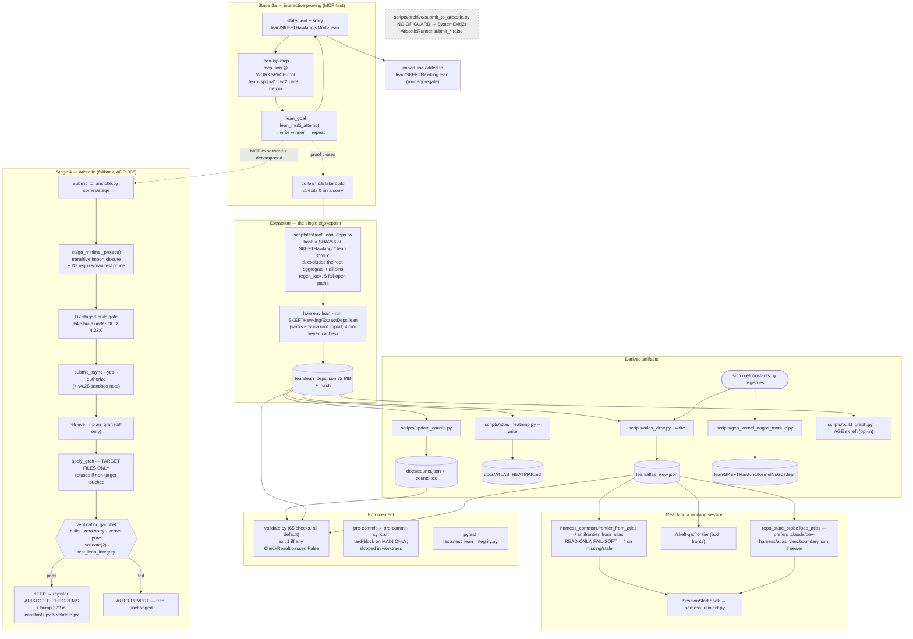

# PLANE — Lean formalization

**Scope:** statement → kernel-verified, counted, graph-visible declaration.
**Repo:** `SK_EFT_Hawking` @ branch `infra/adr-009-validation-modularization`, HEAD `2c845d4c` (working tree dirty: 6 modified, 3 untracked — see §6).
**Method:** governing docs read first (`WAVE_EXECUTION_PIPELINE.md`, both `CLAUDE.md`, ADR-002/004/005/006/007, `mathlib_bump_playbook.md`), *then* implementation verified. Every claim below is tagged **VERIFIED** (I read the code/ran the measurement) or **INFERRED**. Lean structural facts come from `lean/lean_deps.json` / `lean/atlas_view.json` / `docs/counts.json`, never from grep over `.lean`.

**Live measurements (2026-08-06):**

| | |
|---|---|
| declarations in `lean_deps.json` | 40,668 (`docs/counts.json:lean.total_declarations`) |
| theorems | 26,355 total = 26,260 kernel-substantive + 26 placeholder + 69 tracked-vacuity debt |
| `sorryAx` in any axiom closure | **0** (`lean.sorry_declarations`) |
| declared project `axiom`s | **0** (`lean.axioms`); `AXIOM_METADATA` holds 10 allow-list keys |
| `native_decide` decl-closure | 546 (= ceiling `NATIVE_DECIDE_DECL_CLOSURE_CEILING`, zero headroom) |
| atlas nodes / frontier / obstructions | 26,355 / 37 open / 423 (45 registered) |
| apexes | 1 — `hyp:H_PMNSAnglesFromExactSubstrate` |
| `validate.py` checks registered | 65, **all run by default** |

---

## 1. The plane as it actually is



**Three sentences.** A statement is proved MCP-first against a 5-server `lean-lsp` fleet pinned to one Mathlib/PhysLib/REPL/toolchain set, with Aristotle as a now-genuinely-safe fallback (minimal-closure staging, target-file-only graft, auto-reverting gauntlet); `lake build` then feeds a single extraction chokepoint (`ExtractDeps.lean` → `lean_deps.json`) from which *everything* downstream is derived — counts, the atlas, the graph, and a generated Lean-side no-go fence — so drift is structurally impossible **below** that node. The trust surface is ten registries in `constants.py` plus `SORRY_GAPS`, policed by 65 `validate.py` checks that are mostly hard-fail, and the substrate genuinely measures clean (0 sorry, 0 project axioms, 26,260 kernel-substantive theorems). The residual risk is therefore not in the registries but **above** the chokepoint — a staleness key that omits the very file deciding what gets extracted (C0) and the pins (C8) — plus three places where the enforced predicate is narrower than the invariant it is documented to enforce (C1, C2, C3).

---

## 2. TRUST SURFACE — INTENDED vs ENFORCED

Posture legend: **HARD** = `CheckResult.passed=False` → `validate.py` exit 1 on a default run. **STRICT** = WARN by default, FAIL only under `--strict`. **RATCHET** = hard-fails only above a pinned baseline. **ADVISORY** = never gates. **FAIL-OPEN** = returns `passed=True, measured=False` when it cannot measure.

`Detail.warning` is cosmetic only — the exit code binds solely to `CheckResult.passed` (`scripts/validation/_registry.py:55,73`; `scripts/validate.py:777,829`). **VERIFIED.**

### 2.1 Pipeline invariants

| Invariant | Requirement (doc:line) | Enforcing check (file:line) | Posture | Status |
|---|---|---|---|---|
| **#4 zero sorry** | `docs/WAVE_EXECUTION_PIPELINE.md:663` "Every Lean theorem has a proof (zero sorry)" | `scripts/validation/checks/lean_substrate.py:600` `lean_zero_sorry` — reads `counts.json:lean.sorry_declarations`; `passed = n_decl == 0` (`:678`) | **HARD** (but see below) | **CONFORMS** (measured 0) |
| ↳ *the older paths* | same | `axiom_closure_allowlist` (`lean_toolchain.py:440`) detects `sorryAx` but is `passed=not strict` (`:558`); `lake build` **exits 0 on a sorry** (measured, documented `lean_substrate.py:632-635`); `check_lean_build` only tests `returncode==0` (`lean_toolchain.py:397`) | STRICT / none | **CONFORMS since 2026-08-05** — the prompt's calibration example describes the *pre-`lean_zero_sorry`* state; `lean_zero_sorry` (commit `2c845d4c`) closed it |
| ↳ *residual* | — | `lean_zero_sorry` reads a **derived** file. `counts.json` absent → `passed=True, measured=False` (`lean_substrate.py:653-657`); unparseable → same (`:661-665`). Its freshness is owned by `counts_fresh` (`freshness.py:173`), which is one of 4 checks **skipped under `--ci`** (`_config.py:92-106`) | FAIL-OPEN | **DRIFT (minor)** — see C6 |
| **#4 content-grounding (R1)** | `WAVE_EXECUTION_PIPELINE.md:663` — a `Lean:` ref must resolve to a real, **non-placeholder** decl | `scripts/validation/checks/lean_statements.py:287` `formula_grounding`; `ok = not (placeholder_grounded or dangling or thin_grounded or kind_violations)` (`:403`) | **HARD** | **CONFORMS** (ADR-004 says dangling was advisory; ADR-004:3 records escalation to hard-fail, commit `c5f55fb1`. Docstring at `lean_statements.py:293` still says "ADVISORY" — stale prose, code is correct) |
| **#9 placeholders non-load-bearing** | `WAVE_EXECUTION_PIPELINE.md:673` — (a) registry complete: `PLACEHOLDER_TOTAL_COUNT == counts.json theorems_placeholder`; (b) never cited as verified | (b) `lean_substrate.py:173` `placeholder_not_cited`, `passed=not any_fail` (`:233`); also `disclosure_consistency` (`lean_substrate.py:271`) | **HARD** for (b) | (b) **CONFORMS** |
| ↳ **(a) registry completeness** | same line | **Nothing.** `PLACEHOLDER_TOTAL_COUNT` (`src/core/constants.py:2454`) has **zero consumers** in `scripts/` or `src/`. The only assertion is `tests/test_substrate_integrity_gates.py:60`: `assert PLACEHOLDER_TOTAL_COUNT == len(PLACEHOLDER_THEOREMS) == 26` — the first equality is a **tautology** (`:2454` defines it as that `len`) and the second is a hardcoded literal; **neither reads `counts.json`** | **UNENFORCED** | **DRIFT** — see C2 |
| **#10 no heartbeat overrides in proof bodies** | `WAVE_EXECUTION_PIPELINE.md:675` "No `set_option maxHeartbeats` or `synthInstance.maxHeartbeats` in any theorem, lemma, example, or def whose body is produced by tactics" | `scripts/validation/checks/lean_toolchain.py:599` `elaboration_knob_watchlist`; `passed = not over` where `over = len(violations) > MAXHEARTBEATS_PROOF_BODY_CEILING` (`:701,720`), ceiling **= 22** (`:592`) | **RATCHET at 22** | **DRIFT → now DEFERRED.** 22 live violations are grandfathered. The in-code comment (`:621-638`) states the invariant had **no enforcement anywhere** until 2026-08-05 *and* that a green test (`15edc340`) asserted the gap was deliberate. Two stated narrowings remain: tactic-bodied `def` is **not** covered (`:686-690`), and file-level `set_option` blocks are excluded |
| **#15 axiom sign-off** | `WAVE_EXECUTION_PIPELINE.md:691,693` — no new project axiom without user sign-off; every axiom in `AXIOM_METADATA` with `eliminability`/`discharge_wave`/`discharge_estimate_loc` | `lean_toolchain.py:440` `axiom_closure_allowlist`: `passed = not strict` on a non-allow-listed axiom (`:558`); runs `AxiomAudit.lean` against the **live built environment** | **STRICT** + **six** FAIL-OPEN branches (`lake` absent `:475`, `AxiomAudit.lean` absent `:481`, 600 s timeout `:499`, exception `:502`, non-zero exit `:506`, unparseable JSON `:512` — all `passed=True, measured=False`); also **memoized** (`:428`, 145 s, the suite's most expensive) so a repeat run can replay a cached PASS — `--strict` bypasses the memo (`_memo.py:293`) | **DEFERRED** — posture documented in-docstring (`:465-467`) and in ADR-004:48 (R4 defers elimination policy to ADR-002). Backstopped **HARD** by `atlas_integrity`'s undisclosed-project-axiom leg (`graph_atlas.py:384`, `native_decide` excluded) and by the D2 gauntlet at the graft boundary. Population bound: see §6.6 |
| **#16 tracked hypotheses ledgered** | `WAVE_EXECUTION_PIPELINE.md:695` — every consumed tracked-hypothesis Prop in `HYPOTHESIS_REGISTRY` or `TRACKED_HYPOTHESIS_NON_LOAD_BEARING` | `lean_substrate.py:490` `tracked_hypothesis_ledger`, `passed = not gap` (`:548`); doc view by `lean_substrate.py:554` `tracked_hypotheses_fresh`, `passed=False` on drift (`:594`) | **HARD** | **CONFORMS.** Scope narrowing (Prop-valued **struct fields** not auto-enumerated) is *documented and deferred* at `WAVE_EXECUTION_PIPELINE.md:695` + ADR-004:47. Docstring at `lean_substrate.py:496` still says "advisory until the backlog is cleared" — **stale prose**, code is hard |
| **#17 kernel no-gos backed** | `WAVE_EXECUTION_PIPELINE.md:697` — every provably-false settled no-go has a live, kernel-pure, non-vacuous backing theorem in `KERNEL_NOGO_REGISTRY` | `scripts/validation/checks/lean_statements.py:528` `nogo_substrate_integrity`; `hard=True` at `:595` (unbacked entry), `:607` (theorem absent from `lean_deps.json`), `:613` (not kernel-pure), `:621` (vacuous type); `passed = not hard` (`:648`) | **HARD** (+ ADVISORY leg for refutable-but-unencoded forks, `:641-646`) | **CONFORMS.** Registry grew 3 (ADR-007:3 seed) → **45**. Scope held to provably-false (ADR-007:45 N-B) |

### 2.2 Registries

| Registry | Definition | Entries | What registers it | Enforcing check | Posture | Status |
|---|---|---|---|---|---|---|
| `AXIOM_METADATA` | `src/core/constants.py:1484` | 10 | hand, at axiom-ship time w/ user sign-off | `axiom_closure_allowlist` (`lean_toolchain.py:440,487`); `atlas_integrity` (`graph_atlas.py:384`) | STRICT / **HARD** | DEFERRED (see #15) |
| `HYPOTHESIS_REGISTRY` | `constants.py:2853` | 48 | hand, at hypothesis-consumption time | `tracked_hypothesis_ledger` (`lean_substrate.py:490`), `tracked_hypotheses_fresh` (`:554`), `atlas_integrity` (`graph_atlas.py:392,453`) | **HARD** | CONFORMS |
| `TRACKED_HYPOTHESIS_NON_LOAD_BEARING` | `constants.py:2850` | **0** (empty) | hand | `tracked_hypothesis_ledger` (`lean_substrate.py:500,536`) | HARD | CONFORMS (escape hatch unused) |
| `PLACEHOLDER_THEOREMS` | `constants.py:2218` | 26 | hand | `placeholder_not_cited` (`lean_substrate.py:173`); `PLACEHOLDER_LEAN_NAMES` feeds `proxy_body_audit` (`:385`) + `vacuous_statement_audit` (`lean_statements.py:454`) | **HARD** | CONFORMS for citation; **DRIFT** for completeness (C2) |
| `KERNEL_NOGO_REGISTRY` | `constants.py:4052` | 45 | hand, "encode-on-settle" (ADR-007:48 N-E) | `nogo_substrate_integrity` (`lean_statements.py:528`) — sole consumer | **HARD** | CONFORMS |
| `MODELING_ASSUMPTION_THEOREMS` | `constants.py:2596` | 21 | hand, as the R2 disclosure whitelist | `proxy_body_audit` (`lean_substrate.py:387,404,438`), `disclosure_consistency` (`:281`), `vacuous_statement_audit` (`lean_statements.py:456,468`) | **HARD** | CONFORMS |
| `ARISTOTLE_THEOREMS` | `constants.py:980` | 322 | hand at Stage 4e; **append-only** (ADR-006:101) | `theorems` (`lean_toolchain.py:178,218`), `formulas` (`lean_substrate.py:59,95`), `prose_theorem_reference_coverage` (`prose_lean_refs.py:352`) | HARD (ratcheted) | CONFORMS |
| `ARISTOTLE_PROVED_COUNT` | `constants.py:1371`, `assert == 322` at `:1372` | 322 | Stage 4e dual-bump (ADR-006:111) | **no check consumes it** — only the import-time `assert`. The old `theorems` comparison was a tautology and was removed (`lean_toolchain.py:189`) | import-time assert only | DEFERRED (documented) |
| `VACUOUS_STATEMENT_BASELINE` | `constants.py:2555` | 48 | one-time grandfather ratchet (ADR-004:94) | `vacuous_statement_audit` (`lean_statements.py:460,490`), `proxy_body_audit` (`lean_substrate.py:391,431`) | **HARD** on *new*, ADVISORY on baseline | DEFERRED — the "Vacuous Statement Sweep" `/goal` is ADR-004:94's named discharge |
| `NATIVE_DECIDE_DECL_CLOSURE_CEILING` | `constants.py:2504` = **546** | scalar | ADR-004 R4 | `native_decide_regression` (`lean_toolchain.py:90`); `passed=False` if `cur > CEIL` (`:147,160`); missing substrate = FAIL (`:122-126`) | **HARD**, zero headroom | CONFORMS |
| `SORRY_GAPS` | `src/core/aristotle_interface.py:71` | 329, **0 unfilled** | Stage 3b registration | `tests/test_lean_integrity.py:204` asserts `unfilled == []` and `len >= 45` | test-only | **DRIFT** — see C4 |

### 2.3 Aristotle (ADR-006) — spec vs code

| Decision | Spec (doc:line) | Implementation | Verdict |
|---|---|---|---|
| D1 minimal-closure staging | ADR-006:50 | `src/core/aristotle_submit.py:361` `stage_minimal_project`; closure via `transitive_import_closure` (`:150`), a **text `import`-line walk** (`_IMPORT_RE`, `:87`), *not* the atlas graph ADR-006:93 recommends | CONFORMS in effect; **minor divergence** from D-G reuse |
| D2 verify-then-graft | ADR-006:56-62 | `plan_graft` (`:623`) diff-only; `apply_graft` (`:653`) **raises** if `other_files_changed`; `graft_and_verify` (`:756`) keeps on pass, `revert_graft` on fail (`:775`) | **CONFORMS** — auto-revert verified at `:775-777` |
| D2 gauntlet order | ADR-006:56-62: build → axiom audit → validate → tests | `run_verification_gauntlet` (`:692`): (1) `lake build SKEFTHawking` + `declaration uses 'sorry'` scan (`:702-708`), (2) `lake build SKEFTHawking.ExtractDeps` (`:714`), (3) per-target kernel purity from `_load_lean_deps()` (`:719-722`), (4) `validate.py --check axiom_closure_allowlist --check native_decide_regression` (`:725-730`), (5) `pytest tests/test_lean_integrity.py` (`:734-737`) | **DRIFT** — step 2 does not do what its comment claims; see C1 |
| D3 archive disabled, not deleted | ADR-006:67-71 | `scripts/archive/submit_to_aristotle.py:61-75` — no-op guard **above all imports**, `raise SystemExit(2)`; `src/core/aristotle_interface.py:1886` `raise RuntimeError` guards `submit_and_wait`/`submit_targeted`/`submit_priority_batch` (`:1935,2014,2041`); data layer stays importable | **CONFORMS — verified disabled** |
| D5 authorization + dedup | ADR-006:80 | `--yes-i-authorize` enforced at `scripts/submit_to_aristotle.py:95-98` (`SystemExit(2)`); `find_duplicate_submission` (`aristotle_submit.py:484`) read at `:84` and in `submit_async` | CONFORMS |
| D7 staged pre-clean + build gate | ADR-006:140-146 | `_prunable_require_names` (`:282`) closure-aware; `_staged_manifest` (`:319`) derived from the real manifest; gate `verify_staged_build` (`:417`) wired at `scripts/submit_to_aristotle.py:99-109`, overridable by `--skip-build-gate` | CONFORMS |
| Amendment B v4.28 note | ADR-006:178 | `_v428_sandbox_note` (`:520`) + `_with_v428_note` (`:530`), idempotent via `_V428_MARKER` (`:81`); source stays 4.32.0 | CONFORMS |
| Toolchain skew | ADR-006:191 says Aristotle 4.28.0 vs our 4.29.1 | We are now on **4.32.0** (`lean/lean-toolchain`); `lakefile.toml` comment records the skew widened "from one minor version to four" | Docs current at `lakefile.toml`; ADR-006 body is historical |

### 2.4 The pin set (one matched set)

| Dep | Rev | Location |
|---|---|---|
| mathlib4 | `81a5d257c8e410db227a6665ed08f64fea08e997` (v4.32.0 tag) | `lean/lakefile.toml:30` |
| repl | `v4.32.0` | `lean/lakefile.toml:41` |
| PhysLib (`name = "Physlib"`) | `c48433678e8fb6306ebcd48453300c8e16058a62` | `lean/lakefile.toml:65` |
| toolchain | `leanprover/lean4:v4.32.0` | `lean/lean-toolchain:1` |

The coupling rule is stated at `lean/lakefile.toml:26` and `SK_EFT_Hawking/CLAUDE.md:197`. **VERIFIED.**
Enforcement: none that compares the pins to each other. `paper_toolchain_pin_drift` is advisory and paper-side only; `validation/_memo.py:235-236` fingerprints the three files as a set for memo invalidation but is not a gate. See **C7** — and note the playbook `CLAUDE.md` designates as the pre-bump read does *not* state the rule.

---

## 3. Walkthrough — statement → graph-visible declaration

1. **Write the statement with `sorry`** in `lean/SKEFTHawking/<Module>.lean`, applying the 5-question preemptive-strengthening checklist *before* writing (`docs/WAVE_EXECUTION_PIPELINE.md:137-147`).
2. **Add `import SKEFTHawking.<Module>` to `lean/SKEFTHawking.lean`** (`WAVE_EXECUTION_PIPELINE.md:120`). This is the single act that makes the module visible to everything downstream — `ExtractDeps.lean:11` imports the root aggregate *precisely so* no separate list can drift. A module not imported here is built by nothing, counted by nothing, and gated by nothing; `validate.py --check lean_modules_in_build_graph` (`lean_toolchain.py:975`) exists to catch exactly that.
3. **Prove interactively.** `lean_file_outline` → `lean_goal` at the `sorry` → `lean_multi_attempt` 4–6 candidates → write winner → repeat (`SK_EFT_Hawking/CLAUDE.md` "Lean development — MCP-first loop"). Servers are declared in the **workspace-root** `.mcp.json`: `lean-lsp` (this repo's `lean/`), `lean-lsp-wt1/2/3` (worktree slots `.claude/worktrees/wtN/lean`), `lean-lsp-netrxn` (**the private repo** — `SK_EFT_Hawking/CLAUDE.md` mandates killing off-repo servers at session start to avoid ENFILE). All five pin `lean-lsp-mcp` @ `135997851a6b219c944cb1a9b46970658f874382` with `--repl`. **VERIFIED.**
4. **Stage 3b — sorry registration** (only if 3a left gaps): `SorryGap(filled=False)` in `src/core/aristotle_interface.py:71`. Currently 329 entries, **0 unfilled** — the registry is now purely historical provenance. ⚠ `tests/test_lean_integrity.py:213-217` asserts `unfilled == []`, so performing Stage 3b as written *fails the test suite*. See C4.
5. **Stage 4 — Aristotle**, only if 3a is exhausted and the sorry is decomposed to ≤12-term targets. `sorries` → `stage` → D7 build gate → `submit --yes-i-authorize` (async) → `retrieve` → `graft --apply` → gauntlet → keep-or-auto-revert (`scripts/submit_to_aristotle.py:45-175`; engine `src/core/aristotle_submit.py`).
6. **Stage 4e — attribution:** add the run UUID to `ARISTOTLE_THEOREMS` (`constants.py:980`) and bump the hardcoded `322` in **both** `constants.py:1372` and the `theorems` check, in one commit (`WAVE_EXECUTION_PIPELINE.md:244`; ADR-006:111). Printed as a NEXT step by `scripts/submit_to_aristotle.py:164-165`.
7. **Stage 5 — build.** `cd lean && lake build` (library, per `defaultTargets = ["SKEFTHawking"]`, `lakefile.toml`), then `lake build SKEFTHawking.ExtractDeps` for the `.olean`. ⚠ `lake build` **exits 0 on a sorry** — measured and documented at `lean_substrate.py:632-635`; the sorry signal is the `declaration uses \`sorry\`` warning line, which is what `scripts/pre-commit-sync.sh:72` greps and what the gauntlet scans (`aristotle_submit.py:705-706`).
8. **Extraction.** `scripts/extract_lean_deps.py:184` → `_needs_refresh()` (`:81`) compares `lean_deps.json.hash` against `compute_lean_hash()` (`:61`) = SHA-256 of **all** `lean/SKEFTHawking/**/*.lean` bytes (recursive since a documented 6n miss, `:64-72`), 16 hex chars. If stale, `_run_extraction` (`:91`) takes `harness_lock.regen_lock("lean_deps")` (`:107`) — ADR-005 D-G.1's chokepoint fix — and shells `lake env lean --run SKEFTHawking/ExtractDeps.lean` (`:125`, 1800 s timeout). Output is validated as a JSON array (`:153`) and persisted **one record per line** by `serialize_deps` (`:31`) so git deltas and pre-commit greps stay sane.
9. **The record.** Per declaration: `name`, `kind`, `module`, `type` (pretty-printed), `axiom_deps_project`, `axiom_deps_core`, `structure_fields`, `name_deps_project` (proof-dep edges, a free byproduct of the axiom-closure Tarjan pass per ADR-005:42 D-G), `autogen`. This is the **only** structural source of truth about Lean for the rest of the system.
10. **Kernel-purity predicate**, defined identically in two places (kept in sync by comment, not by code): `src/core/aristotle_submit.py:183` `_rec_is_kernel_pure` and `scripts/atlas_view.py:42-44`. Closure ⊆ `{propext, Classical.choice, Quot.sound}`, no project axiom, no `native_decide`, no `sorryAx`.
11. **Atlas classification.** `scripts/atlas_view.py` (`--write` → `lean/atlas_view.json:35`; `--write-boundary` → the gitignored `.claude/dev-harness/atlas_view.boundary.json:39`; no subcommands). `load_lean_deps_file()` (`:348`) reads the JSON **directly and never triggers extraction**.
    - **UNKNOWN** is never derived from Lean — it comes exclusively from `HYPOTHESIS_REGISTRY` (`:232`), status via `_hyp_status` (`:165-176`).
    - **OBSTRUCTION** — `_is_obstruction` (`:100-148`), in order: `autogen` → never (`:122`); `_NOGO_RE` (`:48-50`) on the **leaf** name → yes regardless of kind (`:143`); `_NOGO_RE` on the FQN or **module** → yes only for `theorem|lemma|example` (`:145`); type head `¬`/`Not ` (`:147`). The autogen exclusion is measured, not assumed — of 577 originally classified, 293 were namespace-only and 68 of those were Lean-synthesised `casesOn`/`ctorIdx`/`match_*` polluting the negative frontier (`:101-117`). 4,948 decls carry `autogen == true`.
    - **TRUE** = every other theorem; status lattice `AXIOM_TAINTED → CONDITIONALLY_PROVED → OBSTRUCTION → PROVED` (`:151-162`).
    - Live: `nodes` 26,355 · `unknowns` 48 · `edges` 72 · `frontier` 37 · `obstructions` 423 (45 registered, 378 naming-only advisory) · `tracks` 4. `by_kind_status`: `TRUE:PROVED` 25,956, `OBSTRUCTION` 399, `UNKNOWN` {PLANNED 17, STATED 20, DISCHARGED 6, SUPERSEDED 5} — **no `AXIOM_TAINTED`, no `CONDITIONALLY_PROVED`**, consistent with 0 sorry and 0 genuine project axioms. **VERIFIED by direct read.**
12. **Counts.** `scripts/update_counts.py` reads `lean_deps.json` (recorded as `lean_deps_source` in the output) and emits `docs/counts.json` + `docs/counts.tex` macros. `theorems_placeholder` is derived independently as *decls whose `type == "True"`* (`update_counts.py:140`) — **not** from `PLACEHOLDER_THEOREMS`; the two happen to agree at 26.
13. **Graph.** `scripts/build_graph.py` lifts `lean_deps.json` into the FQN-keyed `{nodes, links, meta}` JSON view, overlaying `meta.atlas_*`; the AGE/Postgres write is opt-in `--sync-pg` (ADR-005:36 D-A). Gated by `graph_integrity` (`graph_atlas.py:40`) and `gate_edge_types_are_emitted` (`:547`).
14. **Reaching a session.** SessionStart hook (`.claude/plugins/skeft-qa/hooks/hooks.json`) → `harness_reinject.py` → `harness_common.format_atlas_frontier` (`:320`) / `format_atlas_antifrontier` (`:374`), both **read-only and fail-soft to `''`** (`:310-312`, `:362-364`). The positive digest leads with the KEYSTONE (`frontier[0]`, currently `hyp:rokhlin_sigma_mod_16`, gates 11); the negative digest surfaces only the 45 **registered** obstructions with their `false_statement`, and reports the 378 naming-only ones as an advisory count (`:365-372`). Also available on demand via `/skeft-qa:frontier`. `scripts/repo_state_probe.py:167` prefers the gitignored `.claude/dev-harness/atlas_view.boundary.json` when it is newer than the tracked file.

---

## 4. Derived-artifact table

| Artifact | Writer (file:line) | Trigger | Staleness key | Consumers |
|---|---|---|---|---|
| `lean/lean_deps.json` (72 MB, 40,668 recs) + `.hash` | `scripts/extract_lean_deps.py:157-158` via `ExtractDeps.lean` (stdout → wrapper) | auto on any `load_lean_deps()` when hash differs; explicit CLI (`:195`); `update_counts.refresh_lean_deps` (`:44,706`); `validate_helpers.ensure_lean_deps_fresh` (`:108`, **full runs only**, never `--check <name>`); `sync.py` "heavy" edge (`sync_manifest.py:127`) | **SHA-256[:16] of `lean/SKEFTHawking/**/*.lean` only** (`:61-78`). Excludes `lakefile.toml`, `lean-toolchain`, `lake-manifest.json`, **and `lean/SKEFTHawking.lean` — the root aggregate the extractor actually imports** (C0) | everything: `atlas_view.py`, `update_counts.py`, `build_graph.py`, `aristotle_submit._load_lean_deps`, `validate_helpers.load_lean_deps` (≥8 checks), `audit_*`/`bundle_closure`/`aristotle_usage_by_bundle`, the dashboard |
| `lean/atlas_view.json` (7.8 MB, tracked) | `scripts/atlas_view.py --write` (`ATLAS_VIEW_PATH`, `:35`) | `sync.py --fast` "cheap" edge; auto-restaged by `scripts/pre-commit-sync.sh:50` | **content-compare** against a fresh `build_atlas()` — `sync_manifest.py:75-89`, fail-stale on exception | `harness_common.frontier_from_atlas/antifrontier_from_atlas` (`:300,351`), `/skeft-qa:frontier`, `repo_state_probe.load_atlas` (`:167`), `atlas_heatmap.py`, `export_web_atlas.py:44` |
| `docs/ATLAS_HEATMAP.md` | `scripts/atlas_heatmap.py --write` | same cheap edge; pre-commit auto-restage | content-compare vs fresh `render()` — `sync_manifest.py:92-105` | humans; committed + diffable (ADR-005:57) |
| `docs/counts.json` + `docs/counts.tex` | `scripts/update_counts.py:744` (json), `:696,759` (tex); idempotency guard `:720-746` leaves the file byte-identical when substance is unchanged | `sync.py` "heavy" edge; `validate.py --check counts_fresh` (`freshness.py:194`) **shells `update_counts.py` and rewrites in place**, and can transitively re-run the 30-min extraction | **mtime-based** — `_counts_is_stale` (`freshness.py:147-168`): any `_COUNTS_SOURCES` or any `lean/SKEFTHawking/**/*.lean` mtime > `counts.json` mtime. The weaker of the two regimes, and `lean_toolchain.py:110-111` says so | `lean_zero_sorry`, `native_decide_regression` (signal only, not the measurement), `counts_fresh`, `build_graph.py:2339`, `update_inventory_index.py:152`, `export_web_atlas.py`, all `\totaltheorems`-class paper macros |
| `lean/SKEFTHawking/KernelNoGos.lean` | `scripts/gen_kernel_nogos_module.py` | `sync.py` cheap edge (`sync_manifest.py:141`) | content-compare vs fresh `render()` of `KERNEL_NOGO_REGISTRY` (`sync_manifest.py:107-121`) | the Lean-side generated no-go fence — **an artifact beyond ADR-007's stated design** (registry → Lean, not just registry → gate) |
| `lean/SKEFTHawking/AxiomAudit.lean` (67 lines) → stdout JSON `{decl: [non-core axioms]}` | hand-written; a **second `lean_exe`** (`lakefile.toml:76-78`, **not** in `defaultTargets`), run interpreted; `unsafe def main` at `:45`, reuses the memoized `AxiomClosure.axiomClosures` (`:56`) under `maxHeartbeats := 0` (`:53`, the Invariant-#10 metaprogram exception) | invoked **only** by `axiom_closure_allowlist` — `lake env lean --run SKEFTHawking/AxiomAudit.lean`, 600 s (`lean_toolchain.py:490-493`). Not in `sync.py`, not in `defaultTargets`, no other caller | reads the **built environment** (imports `SKEFTHawking` at `:34`), not `lean_deps.json` — so it sees a graft the moment the build does. Check-level memo key: `lean_source_fingerprint + toolchain_pin_fingerprint + files_fingerprint([constants.py, update_counts.py])` (`lean_toolchain.py:428-439`) | `axiom_closure_allowlist`; shared engine with the `lean4` plugin's `/check-axioms` (`lean_toolchain.py:459-461`) |
| Lean-side extraction caches (4) | `ExtractDeps.lean` (`saveImmRefCache`/`saveMathlibCache`/`saveTypeStrCache`/`saveJsonCache`) | every extraction | pin key = toolchain/dep pin **+ hash of `ExtractDeps.lean`'s own source** (ADR-005:44 — drift-proofs render logic with zero hand-maintained key) | ExtractDeps only; wall-time only, output byte-identical |
| Aristotle manifests | `aristotle_submit.SubmissionManifest` (`:465`) → `docs/aristotle_results/manifests/*.json` | every `submit_async` | n/a | `cmd_status` (`submit_to_aristotle.py:118`), `find_duplicate_submission` (`:484`) |

Observed mtime ordering is consistent: `lean_deps.json` 13:17 → `atlas_view.json`/`ATLAS_HEATMAP.md` 14:36 → `counts.json` 16:53. **VERIFIED.**

---

## 5. Concerns, ranked

### 5a. DRIFT (undocumented — enforcement does not match stated intent)

**C0 — The extraction staleness key omits the one file that decides what gets extracted. HIGH.**
`ExtractDeps.lean:11` imports `SKEFTHawking` — the root aggregate at `lean/SKEFTHawking.lean` — *"so that ExtractDeps always sees every declaration without maintaining a separate import list that drifts out of sync."* That aggregate is therefore the sole determinant of extraction *scope*.
`compute_lean_hash()` (`extract_lean_deps.py:61-78`) hashes `LEAN_DIR.rglob("*.lean")` where `LEAN_DIR = lean/SKEFTHawking` (`:25`). `lean/SKEFTHawking.lean` sits **one directory up** and is not in that set. **VERIFIED by measurement:**
```
LEAN_DIR       = .../lean/SKEFTHawking
hashed files   = 2038
aggregate in hashed set? False
stored = computed = 699bfd03e3132c07   _needs_refresh() = False
lean/SKEFTHawking.lean  366,952 B  mtime 15:44   (lean_deps.json mtime 13:17)
```
Adding a *new* module file is caught incidentally (the new file is under `LEAN_DIR`). What is **not** caught: adding an `import` for a module that already exists on disk but was orphaned, removing an import, or reordering the aggregate. That is precisely the failure class commit `566c0fa1` (2026-08-06, *"recover 25 orphaned modules into the build graph"*) had to repair by hand, and it is the class `validate.py --check lean_modules_in_build_graph` was built to detect — but the detector runs against `lean_deps.json`, whose freshness is decided by a key that ignores the aggregate.
*Refutation attempted:* the guard could be elsewhere. `validate_helpers.ensure_lean_deps_fresh` (`:108`) and `sync_manifest._lean_deps_stale` (`:66`) both delegate to `_needs_refresh()`; `validation/_memo.py:219-236 toolchain_pin_fingerprint()` *does* fold in `lakefile.toml`/`lean-toolchain`/`lake-manifest.json` for **check memoization**, but nothing folds the aggregate into the **extraction** key. Independently filed as a memo-key gap at `docs/audits/2026-08-05-pr-review-2/reviewer-reports/R6-test-appropriateness.md:153`; the extraction-key instance appears unfiled.
*Fix shape:* one line — hash `LEAN_ROOT.rglob("*.lean")` (or add the aggregate explicitly), and consider folding the three pin files in for C8 at the same time.

**C1 — The Aristotle gauntlet's kernel-purity leg reads a stale `lean_deps.json`. HIGH.**
`src/core/aristotle_submit.py:713-715` runs `lake build SKEFTHawking.ExtractDeps` under the comment *"fresh ExtractDeps so the axiom closure reflects the grafted proof"*, then `:719` reads `_load_lean_deps()` → `LEAN_DEPS.read_text()` (`:189-194`), which reads `lean/lean_deps.json` **as it is on disk**.
`lake build SKEFTHawking.ExtractDeps` compiles the `.olean`; it does **not** write `lean_deps.json`. The extractor's only entry point is `unsafe def main : IO Unit` (`ExtractDeps.lean:508`) which **streams JSON to stdout** (`:tail`), captured by the Python wrapper `extract_lean_deps.py:124-157`. There is no `#eval`, no `initialize`, no post-build hook in `lakefile.toml`. **VERIFIED — I grepped `ExtractDeps.lean` for `#eval`/`run_cmd`/`initialize` and read `lakefile.toml` in full.**
*Refutation attempted:* (a) could a lakefile post-build hook write it? No hook exists. (b) does `_load_lean_deps` refresh? No — unlike `extract_lean_deps.load_lean_deps`, `aristotle_submit._load_lean_deps` has **no staleness check at all** (contrast the module's own `lean_deps_stale_for`, `:197`, which it uses for the *planning* view but not the gauntlet). (c) does the later `validate.py` leg cover it? Partly — step 4 runs `axiom_closure_allowlist`, which runs `AxiomAudit` against the **live built environment** and so does see the graft. But that check is `passed = not strict` (`lean_toolchain.py:558`) and the gauntlet invokes it **without `--strict`** (`aristotle_submit.py:725-728`), so a returned proof introducing a non-allow-listed axiom yields exit 0.
**Net:** for an Aristotle graft, `res.kernel_pure` is computed from pre-graft data, and the project-wide backstop is running in WARN mode. The `zero_sorry` leg (step 1, from live build warnings) and the tests leg are sound.
*Fix shape:* call `extract_lean_deps.load_lean_deps()` (which hash-checks and regenerates) instead of `_load_lean_deps()`, and add `--strict` to the step-4 invocation.

**C2 — Invariant #9's registry-completeness clause is unenforced; its only test is a tautology. HIGH.**
`WAVE_EXECUTION_PIPELINE.md:673` requires `PLACEHOLDER_TOTAL_COUNT == docs/counts.json theorems_placeholder`. `PLACEHOLDER_TOTAL_COUNT` (`src/core/constants.py:2454`) is defined as `len(PLACEHOLDER_THEOREMS)` and has **zero consumers** in `scripts/` or `src/`. The sole assertion, `tests/test_substrate_integrity_gates.py:60`, is `assert PLACEHOLDER_TOTAL_COUNT == len(PLACEHOLDER_THEOREMS) == 26` — the first equality is definitionally true and the second is a hardcoded literal. Neither reads `counts.json`. Meanwhile `update_counts.py:140` derives `theorems_placeholder` **independently** (`d.get("type") == "True"`). They agree at 26 today by discipline.
*Consequence:* ship a new `True := trivial` decl without registering it → `counts.json` reads 27, registry stays 26, the test still passes (26==26==26), and `placeholder_not_cited` cannot flag a paper citing it because the decl isn't in the registry it matches against. This is exactly the paper7 failure ADR-004 R5 was built to prevent, re-opened at the registry-completeness edge.

**C3 — `test_no_active_sorry` scans only 1,372 of 2,038 Lean files. MEDIUM.**
`tests/test_lean_integrity.py:172` uses `lean_dir.glob("*.lean")` — **non-recursive**. Measured: 1,372 top-level files, 2,038 total, **666 (33%) in subdirectories** (`QuantumNetwork/`, `Detection/`, `Control/`, `Carrollian/`, `SymTFT/`, …) never scanned. This is the same non-recursive bug that `extract_lean_deps.compute_lean_hash` documents fixing (`:64-72`) — fixed there, still live here.
Also stale: the `SORRY_ALLOWED` set (`:161-169`) lists `SingularConnSquareCrossReal.lean`, **which no longer exists**, and `TetradGapEquation.lean`, whose only `sorry` (line 324) sits inside a `/- … -/` block comment (I read it) — so both exemptions are dead.
*Impact today: nil* — `counts.json` reports 0 `sorryAx` and the authoritative `lean_zero_sorry` check is recursive-by-construction (it reads the axiom closure). But the test presents as a substrate-wide guard and is not one.

**C4 — Stage 3b as written fails the test suite. MEDIUM.**
`WAVE_EXECUTION_PIPELINE.md:164` instructs registering each residual sorry as `SorryGap(filled=False)`. `tests/test_lean_integrity.py:213-217` asserts `unfilled == []`. Doing what Stage 3b says therefore reddens the fast suite. `SORRY_GAPS` has 329 entries, 0 unfilled — it is de facto append-only provenance (ADR-006:30 layer B), and Stage 3b's live-tracking role has been silently taken over by `sorries` (`submit_to_aristotle.py:45`) reading `sorryAx` from `lean_deps.json`. The doc was not updated.

**C5 — Two check docstrings state a posture the code contradicts. LOW (documentation).**
`tracked_hypothesis_ledger` (`lean_substrate.py:496-497`) says *"advisory until the registry backlog is cleared"*; the body is `passed = not gap` (`:548`) — hard today. `formula_grounding` (`lean_statements.py:293`) calls dangling refs "ADVISORY"; `:403` hard-fails on them. Both are stale prose in the direction of *understating* strictness, so a reader may wrongly assume a green run is permissive.

**C6 — `lean_zero_sorry` asserts Invariant #4 from a derived file whose refresher is `--ci`-skipped. LOW–MEDIUM.**
`lean_substrate.py:678` reads `counts.json:lean.sorry_declarations`. Its freshness owner, `counts_fresh` (`freshness.py:173`), is one of four checks skipped under `--ci` (`_config.py:92-106`). A CI run therefore asserts Invariant #4 against a `counts.json` nothing re-derived that run. Absent/unparseable `counts.json` → `passed=True, measured=False` (`:653-665`) — the `--ci` coverage floor (`CI_MIN_CHECKS_RUN = 61`, `_config.py:124`) is the partial mitigation, and the check correctly hard-fails on a *missing field* (`:668-674`), which is the more dangerous shape.

**C7 — Nothing checks that the four pins are one matched set, and the playbook never states the rule. LOW–MEDIUM.**
The rule is stated **only** in `lean/lakefile.toml:26` (*"Mathlib, PhysLib, the REPL dep and lean-toolchain move as ONE matched set — never bump one alone"*), reinforced at `:32-35` (repl tracks the toolchain exactly) and `:46-47` (PhysLib's Mathlib pin must equal ours), and echoed at `SK_EFT_Hawking/CLAUDE.md:197`.
`docs/references/mathlib_bump_playbook.md` — the doc `CLAUDE.md` names as the mandatory read before any bump — **does not contain the rule.** `:3` says "read this before starting any Mathlib/PhysLib/toolchain bump"; `:15-17` *demonstrates* the coupled 2026-07-28/29 bump in its provenance line; but `:206-212` (Hard rules) and `:242-254` (Process rules) state no pin-coupling rule. The rule lives in a comment in a build file.
No `validate.py` check compares the pins to each other. `paper_toolchain_pin_drift` compares *paper prose* to the pins. `validation/_memo.py:235-236` fingerprints all three files together for memo invalidation — the closest thing to machine recognition of the coupling, and it is not a gate. The only real backstop is `lake build` failing.

**C8 — `lean_deps.json`'s staleness key also ignores the toolchain/Mathlib pin. LOW.**
Same key as C0. `lakefile.toml`, `lean-toolchain`, and `lake-manifest.json` are excluded, so a Mathlib/toolchain bump with no project-source change leaves `lean_deps.json` — including every `axiom_deps_core` set — considered fresh. Mitigated because a bump is always accompanied by repair edits and because the *Lean-side* caches are pin-keyed (ADR-005:44); the *Python-side* guard is not.
**Five fail-open paths to a silently stale artifact** (all VERIFIED by the second survey): `regen_lock` not acquired → `logger.info` + `return`, caller reads the cache (`:107-113`) — and the library installs no logging handler, so the message is usually invisible; `lake` absent → warn + cache (`:169-172`); `harness_lock.py:115-118` yields on any lock-subsystem error; `update_counts.py:70-75` swallows the refresh exception and counts from the stale file; `validate_helpers.py:158-161` swallows everything by explicit policy (*"NEVER fail the run here"*). Note the asymmetry: **absence** of `lean_deps.json` is handled well (`native_decide_regression` `lean_toolchain.py:122-126` and the Aristotle ratchet `:230-237` both FAIL on it); **staleness** is not handled anywhere.

**C11 — The two staleness regimes disagree, and an mtime touch masks the disagreement. LOW.**
`extract_lean_deps` uses a content hash; `counts_fresh` uses mtimes (`freshness.py:147-168`). Observed live: `lean/SKEFTHawking/A1Ext.lean` is **newer by mtime** than `lean/lean_deps.json`, so the mtime regime would call downstream artifacts stale — while the hash regime correctly reports fresh (content unchanged; a touch from a checkout). Separately, `docs/counts.json` has mtime **16:53:05** but an internal `"generated"` stamp of **15:45:12**; since `update_counts.main()` performs *no write at all* when substance is unchanged (`:741-742`), that mtime came from something other than the generator (checkout/stash/restage) — and because `_counts_is_stale()` is mtime-based, that touch makes `counts.json` look fresh relative to **every** source. Combined with C6, this is how a stale `counts.json` could silently back the Invariant-#4 assertion.

**C9 — The kernel-purity predicate is duplicated, and the two copies are not identical. LOW–MEDIUM.**
`src/core/aristotle_submit.py:183` `_rec_is_kernel_pure` and `scripts/atlas_view.py:73-78` `_is_kernel_pure` both implement the ADR-002 predicate, kept in sync only by a comment (`aristotle_submit.py:83`: *"kept in sync with scripts/atlas_view.py"*). But `atlas_view` additionally carries a **second, deliberately looser** predicate — `_genuine_project_axioms` (`:63-66`), which excludes `native_decide` compiler axioms and drives the `AXIOM_TAINTED` status — so "kernel-pure" and "not axiom-tainted" are different tests in the same file. `nogo_substrate_integrity` (`lean_statements.py:577`) reaches the notion by a third implementation, whose docstring (`:567-568`) records that its `sorryAx` conjunct was **dead code** (already implied by `core.issubset(KERNEL)`). Three implementations of the project's central trust predicate, no shared owner.

**C10 — `atlas_integrity` validates a fresh in-memory atlas, never the on-disk file the harness reads. LOW.**
`graph_atlas.py:355-357` calls `atlas_view.build_atlas(...)` and gates that; it never compares against `lean/atlas_view.json`. The on-disk file is the one `frontier_from_atlas`/`repo_state_probe` consume, and both are fail-soft. Staleness is covered separately by `sync_manifest._atlas_view_stale` (`:75`) + the pre-commit auto-restage (`pre-commit-sync.sh:50`), so the gap is closed by a *different* mechanism than the one named `atlas_integrity` — worth knowing when reasoning about which gate protects what.

### 5b. DEFERRED DEBT (documented, with a cited discharge path)

| Item | Size | Documented at | Discharge |
|---|---|---|---|
| Invariant #10 heartbeat ratchet | **22** proof-body sites, 4 files | `lean_toolchain.py:559-591` (the ceiling's own docstring, including two self-corrected mis-measurements) | decompose into `have` sub-lemmas; ceiling may only decrease |
| ↳ tactic-bodied `def` limb uncovered | unknown | `lean_toolchain.py:686-690` ("KNOWN NARROWING, stated not hidden") | needs real parsing of `:= by` |
| `VACUOUS_STATEMENT_BASELINE` | 48 grandfathered + 69 tracked debt (`counts.json`) | ADR-004:94 | the named "Vacuous Statement Sweep" `/goal` |
| `vacuous_proxy` strengthenings | 6 | ADR-004:3 ("still open") | per-theorem |
| Invariant #16 struct-field scope | Prop-valued struct fields not auto-enumerated | `WAVE_EXECUTION_PIPELINE.md:695`; ADR-004:47 | case-by-case (`topo` via `rokhlin_sigma_mod_16`) |
| Invariant #15 WARN-first posture | 10 `AXIOM_METADATA` keys, 0 live project axioms | `lean_toolchain.py:465-467`; ADR-004:48 (R4 defers to ADR-002) | `--strict` at the submission gate |
| `native_decide` surface | 546 decls, ceiling at zero headroom | ADR-002 / ADR-004:48 | ADR-001 `powerTable` elimination (154 of 546) |
| Aristotle 4.28 sandbox skew | now four minor versions | `lakefile.toml` comment; ADR-006 Amendment B:169-181 | explicitly **not** discharged — knowledge-in-prompt, never a down-port |
| `ARISTOTLE_PROVED_COUNT` dual-bump by hand | 2 sites | ADR-006:111 | candidate invariant at ADR-006:112 |
| `graph_integrity` import failure → early advisory return | 1 branch | `graph_atlas.py:233-242` | — |
| ADR-005 D-E `@[atlas_node]` attribute | not shipped | ADR-005:56 ("Remaining") | scoped down to apex-marking PROVED nodes |

**Not a defect, worth recording:** `scripts/pre-commit-sync.sh` hard-blocks **only on `main`** (`:59,75,106`) and is skipped entirely inside worktree slots (`:24`) — by design, with the lead re-running on merge (`:16`). On this branch (`infra/adr-009-…`) every Lean guard in the hook is warn-only. And the hook runs only three validate checks — `formula_grounding`, `placeholder_not_cited`, `native_decide_regression` (`:102`) — not `lean_zero_sorry`, `nogo_substrate_integrity`, `tracked_hypothesis_ledger`, or `atlas_integrity`.

---

## 6. What I could not determine, and why

1. **Whether `formula_grounding` actually checks *statement content*, as ADR-004 R1 promises, or a strengthened name/type heuristic.** I read the verdict logic (`lean_statements.py:403`) and the four flag categories, but not the full grounding predicate. ADR-004:45 promises "the theorem's *statement* encodes the formula's relation"; that is a strong claim and I did not confirm the implementation reaches it. **Deliberately not concluded.**
2. **Whether the 22 grandfathered Invariant-#10 sites are genuinely irreducible or simply un-discharged.** Requires reading each proof; out of scope for a read-only survey and forbidden to test by building.
3. **Live behaviour of the gauntlet.** I did not run `lake build`, `validate.py` (full), or any Aristotle subcommand — the ~10 min / no-build constraints. C1 is a static reading of the call chain, verified against the extractor's entry point and the lakefile, not an executed reproduction.
4. **Whether `graph_integrity`'s early-return branch (`graph_atlas.py:233-242`) can fire in practice.** It requires an import failure of the `graph_integrity` module; I did not attempt to induce one.
5. **Which atlas copy a mid-loop session actually reads.** The writers are now clear — `atlas_view.py --write` (tracked, via `sync.py --fast` in pre-commit) and `--write-boundary` (gitignored, via `harness_precompact.py:19`) — and `repo_state_probe.load_atlas:167` prefers the boundary copy when newer. But I could not observe a compaction event, so the *practical* cadence (how often the boundary copy is the one in play, and how stale it can get) is unmeasured.
6. **The real population of `axiom_closure_allowlist`.** `AxiomAudit.lean:34` imports only `SKEFTHawking` (the root aggregate), so its "every `SKEFTHawking.*` declaration" claim is bounded by that aggregate — the same bound as C0, one layer up. A pre-existing audit filed this as finding C2 at `docs/audits/2026-08-05-pr-review-3/…/R1-population-reach.md:136,554`; I did not independently measure the gap between the aggregate's closure and the on-disk module set beyond confirming 1,957 aggregate imports vs 2,036 modules in `lean_deps.json` (a difference I did not chase — subdirectory modules are pulled in transitively, so the raw counts are not comparable).
7. **Whether the working tree's 6 modified + 3 untracked files** (`scripts/validate.py`, `scripts/validation/_config.py`, `checks/freshness.py`, 3 tests; plus `scripts/architecture_inventory.py`, `docs/architecture/SURFACE_INVENTORY.md`, `tests/test_architecture_inventory.py`) change any posture above. I read the files as they are on disk, so my findings describe the *working tree*, not `HEAD`.
