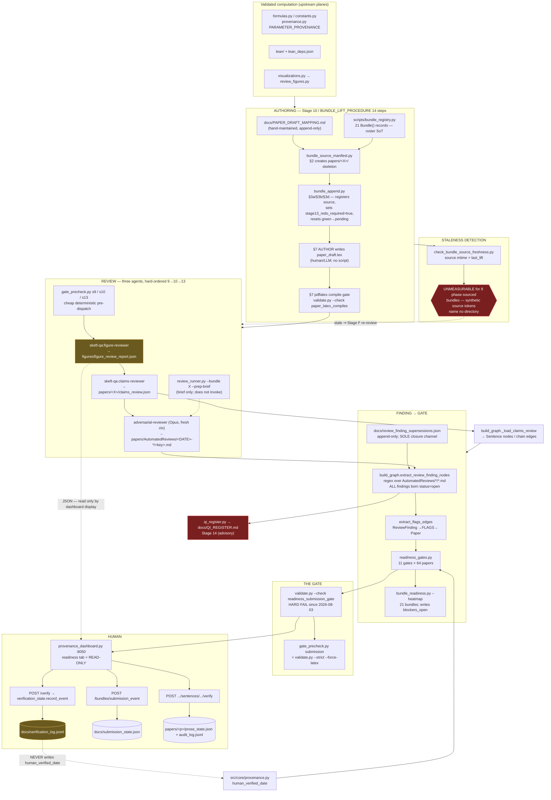

# E2E Architecture Map — The Publication Plane

**Scope:** validated computation → human signing off on a submission. Authoring (bundle lift + late absorption), the three review agents, finding→gate wiring, and the dashboard/sign-off surface. Figures/tables covered elsewhere and kept brief here.

**Method:** governing docs read first (Phase 1), implementation verified against them second (Phase 2). Every claim is tagged **VERIFIED** (I read the code/doc line or ran the command) or **INFERRED**. Intent claims cite `doc:line`.

**Branch:** `infra/adr-009-validation-modularization`. **Date:** 2026-08-06. **Read-only:** no repo file was modified except this one.

**Commands run (all read-only):** `validate.py --check {readiness_submission_gate, bundle_metadata_matches_graph, bundle_source_freshness, gate_edge_types_are_emitted} --no-archive`; in-process `extract_review_finding_nodes()`, `qi_register.cluster_findings()`, `qi_register.render_register()` (rendered to memory, never written).

---

## 0. Three-sentence shape

The plane is a **three-agent review loop wrapped around a bundle-authoring pipeline**: `bundle_source_manifest.py` → `bundle_append.py` scaffold a `papers/<X>/` bundle, an author writes the prose, then Stage 9 (figure) → Stage 10 (claims) → Stage 13 (adversarial) reviewer agents emit findings that `build_graph.py` turns into `ReviewFinding` nodes with `FLAGS` edges, which `readiness_gates.py` rolls into 11 per-paper gates and `bundle_readiness.py` rolls into a 21-bundle heatmap. The **only machine-readable channel back into the machine is the adversarial reviewer's markdown**, parsed by regex; the figure- and claims-reviewer JSON outputs reach no gate at all. The **hard gate is `validate.py --check readiness_submission_gate`** (repaired 2026-08-03 to actually fail), and the **only human sign-off recorded to disk that a gate reads is nothing** — the dashboard's parameter-confirm button writes a sidecar event log and never touches `src/core/provenance.py`, which is what the ParameterProvenance gate reads.

---

## 1. The plane as it actually is

**Dead / never-traversed edges in the diagram above** (all VERIFIED):
- `figure_review_report.json` → any gate. Its only reader is `provenance_dashboard.py:2493-2495` (display).
- `docs/verification_log.jsonl` → `provenance.py` `human_verified_date`. No writer exists on that path.
- `qi_register.py` → new QI items. Emits 0 items on the live corpus (§6, C-2).

---

## 2. Stage-by-stage: INTENDED vs IMPLEMENTED

| Stage / step | Intent (doc:line) | Implementation (file:line) | Status |
|---|---|---|---|
| **Inv #14** — every paper-shaped output picks a bundle at Stage 1, recorded in `PAPER_DRAFT_MAPPING.md` at Stage 12 | `WAVE_EXECUTION_PIPELINE.md:689`; `:75-84` | `docs/PAPER_DRAFT_MAPPING.md` (hand-maintained markdown table); parsed by `bundle_migration.parse_mapping`, consumed at `bundle_readiness.py:96`, `review_runner.py:45`, `check_bundle_source_freshness.py:106` | **CONFORMS** (but hand-maintained — see C-6) |
| **Roster SoT** — one row in `PAPER_STRATEGY.md` §6 + one `Bundle(...)` record | `BUNDLE_DIRECTORY_SCHEMA.md:212` | `scripts/bundle_registry.py:88-200` (21 `Bundle(...)` records), `:202` `BUNDLE_CODES`; guarded by `validate.py --check bundle_registry_consistency` | **CONFORMS** — genuine single source; `sentence_state._VALID_BUNDLE_TARGETS` is a back-compat re-export (`BUNDLE_DIRECTORY_SCHEMA.md:213`) |
| **§1** pre-lift checks | `BUNDLE_LIFT_PROCEDURE.md:24-33` | `bundle_source_manifest.py --bundle X --report` | **CONFORMS** (VERIFIED: script exists, 326 LoC) |
| **§2** bundle dir creation | `BUNDLE_LIFT_PROCEDURE.md:37-49` | `bundle_source_manifest.py:129-142` writes the full `bundle_metadata.json` incl. `stage{9,10,13}_status: "pending"`, `blockers_open: 0`, `advisories_open: 0` | **CONFORMS** |
| **§3a/§3b** initial lift / append (registers source; does NOT copy prose) | `BUNDLE_LIFT_PROCEDURE.md:53`, `:57-87` | `bundle_append.py` + `_update_metadata_post_append` at `:309-327` | **CONFORMS** |
| **§3c** post-append: `last_lift`=now, `stage13_redo_required`=true, statuses→pending | `BUNDLE_LIFT_PROCEDURE.md:91` | `bundle_append.py:316-325` | **CONFORMS** |
| **§3d** bookkeeping-only path | `BUNDLE_LIFT_PROCEDURE.md:93-123` | `bundle_append.py:357-382` (`--bookkeeping-only`, `lift_action`, `stage13_redo_required: False`) | **CONFORMS** |
| **§4** sentence-state migration | `BUNDLE_LIFT_PROCEDURE.md:127-137` | `bundle_migration.py`, `bundle_clusters.py` | **CONFORMS** (INFERRED — not exercised) |
| **§5** citation merge | `BUNDLE_LIFT_PROCEDURE.md:140` explicitly *"no script wraps this yet — defer to ad-hoc"* | none | **DEFERRED** (documented) |
| **§6** figure migration | `BUNDLE_LIFT_PROCEDURE.md:146-156` | manual + `validate.py --check bundle_figure_integrity` | **CONFORMS** (other agent's scope) |
| **§7** authoring + LaTeX compile gate before Stage 9 | `BUNDLE_LIFT_PROCEDURE.md:158-187` | Human/LLM authorship; compile enforced by `paper_latex_compiles` + `gate_precheck.py:115` `--force-latex` | **CONFORMS** |
| **§7 gates 1–4** (4-table attribution audit; hedging; prior-art verifiability; broadening consistency) | `BUNDLE_LIFT_PROCEDURE.md:172-186` | **no code** — reviewer-prompt discipline only; partially mirrored by `placeholder_not_cited` / `tracked_hypothesis_ledger` | **DRIFT (soft)** — the four "substantive content gates" are procedural, not machine-checked; the doc words them as mandatory gates |
| **Stage 9** figure review, ALL PASS no MINOR | `WAVE_EXECUTION_PIPELINE.md:384`; `BUNDLE_LIFT_PROCEDURE.md:190-204` | agent `.claude/plugins/skeft-qa/agents/figure-reviewer.md`; precheck `gate_precheck.py:44` | **DRIFT** — output JSON reaches no gate (§4, C-3) |
| **Stage 10** claims review, zero FAIL | `WAVE_EXECUTION_PIPELINE.md:439-440`; `BUNDLE_LIFT_PROCEDURE.md:206-222` | agent `claims-reviewer.md`; `claims_review.json` consumed by `build_graph.py:2390 _load_claims_review` → Sentence nodes; precheck `gate_precheck.py:45-46` | **CONFORMS (partial)** — reaches the graph as sentences, but its six finding classes never mint `ReviewFinding` nodes (§4) |
| **Reviewer ordering hard gate** — 13 may not run until 9 AND 10 are GREEN | `BUNDLE_LIFT_PROCEDURE.md:9`, `:230` | **no code enforces it.** `gate_precheck.py s13` runs the full suite but never reads `stage9_status`/`stage10_status` | **DRIFT** — a "hard gate" with no enforcement point. Live evidence: D8 has `stage13_status=green` with `stage9_status=pending`/`stage10_status=pending`; D6 `s9=not_started, s10=skeleton, s13=green` (VERIFIED, metadata dump) |
| **Stage 13** adversarial review; one paper per report; findings-only | `WAVE_EXECUTION_PIPELINE.md:579-602` | `adversarial-reviewer.md:199-264` (output contract), `:268` findings-only, `:272` one paper per invocation | **CONFORMS** |
| **Stage 13 auto-pickup** — findings become `ReviewFinding` nodes; `BLOCKER` flips the `ReadinessGate` to blocked | `WAVE_EXECUTION_PIPELINE.md:588`; `BUNDLE_LIFT_PROCEDURE.md:234` | `build_graph.py:1724` extractor + `:3660` `extract_flags_edges`; the flip is `readiness_gates.py:784-798` (`_eval_fix_propagation` escalates to blocked P1) | **CONFORMS** — but only since 2026-07-31; see `readiness_gates.py:746-754` for the prior hardwired-P2 defect |
| **Fixes need re-invocation, not an assertion** | `WAVE_EXECUTION_PIPELINE.md:597`; `BUNDLE_LIFT_PROCEDURE.md:255` | `build_graph.py:1867` birth-status invariant (`status = 'open'`, always) + `:1954-1967` blocking-closure bar (explicit status, ≥40 chars rationale, commit/date anchor) | **CONFORMS — strongly**. Best-engineered joint in the plane |
| **Supersession ledger append-only** | `WAVE_EXECUTION_PIPELINE.md:645`; `BUNDLE_LIFT_PROCEDURE.md:254` | `docs/review_finding_supersessions.json`; loaded `build_graph.py:1700-1721`; guarded by `ledger_ids_resolve`, `accepted_findings_carry_rationale` (`reviews.py:559`) | **CONFORMS** |
| **§12** iterate to GREEN: all three statuses green, `blockers_open==0`, `stage13_redo_required==false`, `freshness_stale==false` | `BUNDLE_LIFT_PROCEDURE.md:264-271` | `blockers_open`/`advisories_open` written by `bundle_readiness.py:724-725`; **nothing writes any `stage*_status` to green and nothing clears `stage13_redo_required`** (VERIFIED: grep over `scripts/` — only writers are `bundle_source_manifest.py:129-132` init and `bundle_append.py:317-325` reset) | **DRIFT** — the §12 exit criterion is satisfiable only by hand-editing `bundle_metadata.json`. Contradicts `BUNDLE_DIRECTORY_SCHEMA.md:79-80`, which attributes those writes to "reviewer-agent invocation" |
| **§13** dashboard refresh + heatmap regen (mandatory exit) | `BUNDLE_LIFT_PROCEDURE.md:273-282` | `datastar_bundles.py`, `bundle_readiness.py --heatmap`, `validate.py --check bundle_consistency --check bundle_source_freshness` | **CONFORMS** |
| **§14** bundle close: `READINESS_GATES.md` panel, change-log entry | `BUNDLE_LIFT_PROCEDURE.md:284-289` | manual | **CONFORMS** (manual by design) |
| **Absorption Stage A/A.alt** | `LATE_PHASE6_ABSORPTION_PROTOCOL.md:38-58` | manual + `readiness_submission_gate` | **CONFORMS** |
| **Absorption Stage B** — mapping row; user auth for a new bundle target | `LATE_PHASE6_ABSORPTION_PROTOCOL.md:60-73`, `:285-287` | manual edit of `PAPER_DRAFT_MAPPING.md` | **CONFORMS** (no machine auth gate — by design, it is a user decision) |
| **Absorption Stage C** — freshness trigger flags affected bundles | `LATE_PHASE6_ABSORPTION_PROTOCOL.md:75-86` | `check_bundle_source_freshness.py:179-203` | **DEFERRED — documented in the doc itself** at `LATE_PHASE6_ABSORPTION_PROTOCOL.md:88-96`: the trigger compares source-paper mtimes and **9 bundles (D6–D12, I2, I3) declare synthetic tokens naming no directory**. Now reports `UNMEASURABLE` instead of `fresh`. Fix = ADR-010 D6, gated on operator approval (`REMEDIATION_PLAN.md` §6a). **VERIFIED live**: 10 of 21 bundles report UNMEASURABLE |
| **`freshness_stale` semantics** — mtime signal, NOT a readiness verdict; Stage-F exit gate is `stage13_redo_required` | `LATE_PHASE6_ABSORPTION_PROTOCOL.md:200` (corrected 2026-07-31); `READINESS_GATES.md:258` | `check_bundle_source_freshness.py:226-251` (writes only when `write_metadata=True`), `bundle_append.py:318` clears it on lift | **CONFORMS to the corrected doc** — but `BUNDLE_DIRECTORY_SCHEMA.md:81` still says *"cleared after Stage-13 re-invocation"*, the exact rule the correction retired. **Stale doc, not stale code** |
| **Check purity** — a check must not mutate what it checks | `LATE_PHASE6_ABSORPTION_PROTOCOL.md:98-102` | `check_bundle_source_freshness.py:81-93` (`write_metadata=False` default; CLI passes True at `:259`) | **CONFORMS** |
| **Absorption Stages D.1–D.4 / E / F / G** | `LATE_PHASE6_ABSORPTION_PROTOCOL.md:104-229` | `bundle_append.py` (D.2/D.4), manual (D.3), `bundle_consistency` check (G) | **CONFORMS** |
| **Stage 14** — scan findings for patterns, emit QI items, timestamped snapshot per run, dashboard Process Health tab | `WAVE_EXECUTION_PIPELINE.md:624-627` | `qi_register.py:128-194` `cluster_findings`; `:309-313` `--snapshot`; dashboard `/api/qi` `provenance_dashboard.py:5118` | **DRIFT — severe.** Emits **0** items on the live corpus and regenerating **destroys** the register (§6, C-2). No snapshot has ever been written (`ls docs/QI_REGISTER*` → one file) |
| **Inv #13** — QI register auto-regen + manually curated, **never wiped** | `WAVE_EXECUTION_PIPELINE.md:687` | `qi_register.py:225-252` renders Open Items purely from auto-detected `items`; only `## Closed Items` is preserved (`:255-266`); `:278` admits *"manual-field persistence is a follow-up"* | **DRIFT** — the invariant is false for the Open Items block. VERIFIED by rendering to memory: 22,444-char curated block → `_(none)_` |
| **Stage 14 closure pathway #1** (per-finding supersession → `qi_register.py` excludes the QI) | `WAVE_EXECUTION_PIPELINE.md:639` | `qi_register.py:154-156` status filter | **CONFORMS** |
| **Stage 14 closure pathway #2** (structural prevention; manual move to `## Closed Items`) | `WAVE_EXECUTION_PIPELINE.md:641` | `qi_register.py:162,170-171` permanent gate-wide suppression | **CONFORMS — with an unacknowledged consequence** (C-2) |
| **QI Candidate section feeds Stage 14** | `WAVE_EXECUTION_PIPELINE.md:598`; `adversarial-reviewer.md:254-258`; promised again in `qi_register.py:7` and `:134` | **no consumer.** VERIFIED: the only `QI Candidate` strings in `scripts/` are `build_graph.py:1761-1762` (a severity-escalation comment) and the two `qi_register.py` docstrings | **DRIFT** — documented in three places, implemented in none |
| **Submission gate** — a paper MAY NOT be submitted unless GREEN; no exceptions | `READINESS_GATES.md:19`; `WAVE_EXECUTION_PIPELINE.md:600` | `validation/checks/bundles_readiness.py:597-677`; hard-fails since 2026-08-03 (`:606-617`) | **CONFORMS** — previously inverted (returned `passed=True` unconditionally with 61/64 papers RED) |
| **`--strict` mandatory at the Paper Submission Gate** | `WAVE_EXECUTION_PIPELINE.md:685` (Inv #12), `:72` | `validate.py:651-658` (6 strict legs); caller `gate_precheck.py:82,119-121` (`submission` stage, added 2026-08-05) | **CONFORMS** — had no caller until 2026-08-05 |
| **Inv #8** — paper submission requires human verification via the provenance dashboard | `WAVE_EXECUTION_PIPELINE.md:671`; `:721`; `READINESS_GATES.md:62-74` | `provenance_dashboard.py:1241` `/verify` mutates the in-memory dict only (`:1275`); `--write` raises `NotImplementedError` (`:5468`); the only real writer is `scripts/wave2_flip_provenance.py:178` | **DRIFT** — the *named mechanism* (the dashboard) cannot satisfy the invariant. Self-documented at `provenance_dashboard.py:5449-5467` |
| **Wave 4b auto-invalidation / `IMPACTED_BY`** | `Phase5v_Roadmap.md:311` (schema), deferral at `:408-410` | not emitted | **DEFERRED** (documented; rationale = full rebuild is ~10 s) |
| **Wave 5c dashboard action buttons** ("Mark reviewed", "Accept with note", "Trigger adversarial review") | `Phase5v_Roadmap.md:445-450` | absent — `readiness_tab.html` has two client-side filter buttons only; `/api/readiness` is GET-only (`provenance_dashboard.py:5414`) | **DEFERRED** (documented) |
| **Gate state `in-review`** — "human review in progress (dashboard write-back, Phase 5v Wave 3c)" | `READINESS_GATES.md:11` | `GateState` includes `'in-review'` (`readiness_gates.py:54`) but **no evaluator ever returns it** (VERIFIED: no `state = 'in-review'` assignment) | **DEFERRED** — declared state, unreachable, because Wave 5c never landed |

---

## 3. Readiness-gate table

Roster: `readiness_gates.py:814-826`. Canonical definitions: `docs/READINESS_GATES.md`. "Can it fire?" = can it reach `blocked`. "Can it pass?" = can it reach `passed` on real evidence (as opposed to vacuously).

| # | Gate | Prio | Intent (doc:line) | Reads | Fires? | Passes? | Status |
|---|---|---|---|---|---|---|---|
| 1 | **CitationIntegrity** | 1 | `READINESS_GATES.md:25-44` — bibitem metadata matches the primary source (title, authors, arXiv, DOI, venue) | `\bibitem{}` regex over `paper_draft.tex` + `PrimarySource` nodes (`readiness_gates.py:164-174`) | ✅ | ✅ | **DRIFT (narrowed).** Implements *registry coverage only*. The doc's four other pass-conditions (`arxiv_verified`/`doi_verified`, author-string match, title match, venue match) are not evaluated. Self-disclosed at `readiness_gates.py:146-148` ("DOI fetch-and-verify is deferred to Stage 13") — so it is a **documented-in-code** narrowing, not silent, but the canonical doc was not updated to match |
| 2 | **CrossPaperConsistency** | 1 | `READINESS_GATES.md:46-60` — no CONTRADICTS edges; no divergent `REPORTS`; shared bibkeys agree | `CONTRADICTS` in/out (`:196-197`); `REPORTS` cross-compare (`:203-217`) | ⚠️ **half** | ✅ (partly vacuous) | **DEFERRED debt.** `CONTRADICTS` has no emitter (`extract_contradiction_nodes` is `return []`, `build_graph.py:2297-2304`); declared in the Phase5v schema at `Phase5v_Roadmap.md:311`. So the *blocking* leg computes `total = 0` always; only the `REPORTS` leg (→ `needs-recheck`) is live. Third-party-verified by `graph_atlas.py:539`. The shared-bibkey condition is unimplemented |
| 3 | **ParameterProvenance** | 1 | `READINESS_GATES.md:62-76` — every dependent param has `llm_verified_date` AND `human_verified_date` | `DEPENDS_ON`→`param:` nodes, `meta.human_verified_date` (`:240-252`) | ✅ | ✅ | **CONFORMS**, and notably hardened 2026-08-05 (`:256-300`): an empty `param_ids` no longer passes vacuously — it cross-checks the `.tex` for unit-bearing literals and returns `open`. `llm_verified_date` is not checked (doc says both) |
| 4 | **ComputationCorrectness** | 1 | `READINESS_GATES.md:78-96` — every grounded formula has ≥1 `VERIFIES` edge with `test_kind ∈ {golden, identity, roundtrip}` | `CLAIMS`→`GROUNDED_IN`→`formula:` + incoming `VERIFIES` (`:325-349`) | ✅ | ✅ | **CONFORMS** |
| 5 | **LeanProofSubstance** | 1 | `READINESS_GATES.md:98-111` — no cited theorem is a `PlaceholderMarker`; no structurally-tautological body | `PlaceholderMarker` nodes + `_extract_prose_lean_candidates` (`:435-448`) | ✅ | ✅ | **CONFORMS** for the syntactic half; the semantic half (tautological bodies) is explicitly assigned to the adversarial reviewer by the doc (`READINESS_GATES.md:110`). DRY: it reuses the shared extractor rather than re-implementing `\texttt` matching (`:429-434`) — a deliberate anti-drift choice |
| 6 | **AssumptionDisclosure** | 1 | `READINESS_GATES.md:112-122` — every `ASSUMES`-linked hypothesis is named in the paper | `ASSUMES`→`hyp:` + substring match on lowercased `.tex` (`:479-499`) | ✅ | ✅ | **CONFORMS (weak heuristic).** Substring match on the key or the first 30 chars of the human name; the doc's "structure-field constraints" input is not implemented (matches the known scope carve-out at `WAVE_EXECUTION_PIPELINE.md:695`) |
| 7 | **NarrativeGrounding** | 1 | `READINESS_GATES.md:124-141` — every `interesting` `ProseClaim` has a `SUPPORTS` edge or an interpretive tag | `ProseClaim` nodes filtered by `meta.paper`; `idx.outgoing(pc, 'SUPPORTS')` (`:528-533`) | ✅ **but false** | ⚠️ **vacuously** | **DEFERRED debt with a live false-positive.** `SUPPORTS` has **no emitter** (declared `Phase5v_Roadmap.md:311`; anticipated *"once SUPPORTS/CONTRADICTS edges are emitted"* at `:442`). Consequence measured at `graph_atlas.py:521-528`: 9 `interesting` ProseClaims across 7 papers with zero outgoing edges ⇒ it **blocks exactly those 7** (incl. D6, D8, D10, where it is their *only* P1 blocker) and **passes vacuously for every other paper**. One dead edge type producing a false blocker and a silent pass simultaneously. Also carries the "corroborate before passing" hardening at `:548-563` |
| 8 | **ProductionRunHealth** | 1 | `READINESS_GATES.md:143-155` — linked `ProductionRun`s are `success`; MC-evidence prose needs a backing run | `PRODUCES` edges from `ProductionRun` (`:590`); `.tex` regex for "Monte Carlo evidence" (`:599`) | ⚠️ **one leg only** | ✅ | **DEFERRED debt.** `PRODUCES` has no emitter — deferred explicitly at `Phase5v_Roadmap.md:220` (*"PRODUCES edges deferred to Wave 4 where run-to-claim mapping is curated"*), and Wave 4 shipped without them. Measured (`graph_atlas.py:524-526`): 18 `ProductionRun` nodes, 17 with status `unknown`, **zero outgoing edges** ⇒ `relevant_runs` is always empty and the "failed run" leg can never fire. Only the prose-regex leg is live (it is what blocks paper6) |
| 9 | **NumericalFreshness** | 2 | `READINESS_GATES.md:161-189` — counts, tables, and prose literals all trace to canonical sources | stale `REPORTS`; `find_inline_numerical_literals`; `tables/*.tex` vs `tables.py` mtime (`:643-669`) | ⚠️ **`needs-recheck` only** | ✅ | **DRIFT (severity).** The doc's "Blocks on any" list (`:178-182`) says stale reports / stale tables / provenance drift **block**; the implementation always sets `needs-recheck` (`:691`), never `blocked`. Since `paper_aggregate_state` maps `needs-recheck`→yellow (`:870`), a stale numerical claim can never make a paper RED. **Good DRY:** the literal predicate is shared with the `numerical_literals` check via `validation._tex` (`:44-50`, `:646-654`) after a byte-identical copy was removed 2026-08-04 |
| 10 | **FirstClaimVerification** | 2 | `READINESS_GATES.md:191-203` — every `first-claim` is ledger-backed | `ProseClaim` `tags` only (`:721-724`) | ⚠️ **`needs-recheck` only** | ✅ | **DEFERRED — documented at `READINESS_GATES.md:203`** ("The ledger node type is not yet implemented. Until it lands, this gate is `needs-recheck` for every paper with a first-claim — advisory only"). Implementation matches exactly (`:727-729`). Note: the docstring at `:714` says it should check a `SUPPORTS` edge, but the body never queries one — the docstring is stale, the behaviour is correct |
| 11 | **FixPropagation** | 2→**1** | `READINESS_GATES.md:205-217` — no `FLAGS`-incoming finding is `open`; `fixed` findings carry a `SUPERSEDES`/commit reference | incoming `FLAGS`; `meta.status`; `meta.severity` (`:759-786`) | ✅ | ✅ | **CONFORMS + strengthened past the doc.** Since 2026-07-31 it self-escalates to `priority = 1` and `blocked` when an open finding is critical/major/blocker (`:784-798`), which the canonical doc does not describe. `SUPERSEDES` edges do not exist as a graph edge type — the ledger is the project-level analogue (`build_graph.py:1742-1744`), so the doc's second pass-condition is satisfied by a different mechanism than it names. **This gate is the sole reason 61+ papers are RED** (VERIFIED: live run shows most papers with `1 blocked: FixPropagation`) |

**Live verdict** (VERIFIED, `validate.py --check readiness_submission_gate --no-archive`, 10.9 s): FAIL. Effectively the whole 64-paper corpus is RED, the dominant single blocker being `FixPropagation`.

**Gates that cannot fire / cannot pass — summary:**
- Cannot fire (blocking leg dead): `CrossPaperConsistency` (CONTRADICTS), `ProductionRunHealth` (PRODUCES run-linkage leg).
- Cannot reach `blocked` by design-drift: `NumericalFreshness`, `FirstClaimVerification` (both cap at `needs-recheck`).
- Fires *falsely*: `NarrativeGrounding` on the 7 papers that happen to have extracted `interesting` ProseClaims.
- The project already has a derived meta-check for exactly this: **`validate.py --check gate_edge_types_are_emitted`** (`graph_atlas.py:543-600`), which walks both ASTs rather than hand-listing. **VERIFIED live**: PASS with warning — `3 gate-queried edge type(s) have no emitter, all disclosed: ['CONTRADICTS', 'PRODUCES', 'SUPPORTS']`. It is a *ratchet* (allowlist `GATE_EDGE_TYPES_WITHOUT_EMITTERS`, `:535-541`), so it prevents a 4th but does not force the 3 closed.

**Refutation attempts made.** I tried to find emitters for `SUPPORTS`/`CONTRADICTS`/`PRODUCES` outside `build_graph.py` — grepped all of `scripts/`, `src/`, `tests/` for the three literals; searched for a PG/AGE-side edge writer; checked `sync_graph_to_pg.py` is a mirror not a producer. Nothing. I also checked whether `_eval_first_claim_verification` really queries `SUPPORTS` (as `graph_atlas.py:537` claims): **it does not** — the comment naming "Gates 7/12 (NarrativeGrounding, FirstClaimSupport)" is itself drifted; there is no Gate 12 and no gate named `FirstClaimSupport` or `ContradictionFree` anywhere in the codebase (VERIFIED: those two strings appear only inside that one comment block, `graph_atlas.py:533-539`). The defect is real; the *comment describing it* names gates that do not exist.

---

## 4. The review agents

| | figure-reviewer | claims-reviewer | adversarial-reviewer |
|---|---|---|---|
| File | `.claude/plugins/skeft-qa/agents/figure-reviewer.md` (171 L) | `claims-reviewer.md` (555 L) | `adversarial-reviewer.md` (298 L) |
| Model | `inherit` (`:35`) | `inherit` (`:31`) | **`opus`** (`:28`) |
| Tools | Read/Glob/Grep/Bash (`:37`) | Read/Glob/Grep/Bash (`:33`) | + **WebFetch** (`:30`) |
| `bundle_target`? | ✅ `:71-79` | ✅ `:71-91` | ❌ **not accepted anywhere in the file** |
| Primary output | `figure_review_report.json` — *directory unqualified* (`:152`) | `papers/<X>/claims_review.json` (`:433`), schema `:435-507` | `papers/AutomatedReviews/{YYYY-MM-DD-HHMM}-internal-adversarial/{paper_key}.md` (`:202`) |
| Bundle output | `.../<DATE>-bundle-stage13/<X>-figures.md` (`:77`) — **format unspecified** | `.../<DATE>-bundle-stage13/<X>.md` (`:91`) — **format unspecified** | n/a |
| Findings-only? | not stated | not stated (implicitly, via JSON) | ✅ `:268`, `:277` |
| Re-invocation rule? | none | none | ✅ `:284` |
| Ledger aware? | no | **no** — defines its own separate reconciliation (`:364-428`) | ✅ `:277` |
| Reaches a gate? | **no** | via Sentence nodes only | ✅ `ReviewFinding` + `FLAGS` |

**The extractor contract** (`build_graph.py:1724-1977`): glob `papers/AutomatedReviews/*/*.md` (exactly one subdirectory), sections split on `### <num>` / `### Class <n>` (`_REVIEW_SECTION_RE`, `_CLASS_HEADING_RE`), severity from a `- **Severity:** <token>` line (authoritative, `:1796-1802`) else glyph in heading then `body[:600]` (`:1814-1826`), every finding born `open` (`:1867`).

**Conformance:**
- **adversarial-reviewer: CONFORMS.** Its mandated heading form `### 1.1 — 🔴 BLOCKER — …` (`:227`) and mandatory `- **Severity:**` line (`:229-240`) match the extractor exactly. Path depth = 1. ✅
- **claims-reviewer bundle mode: DRIFT.** The `.md` it must write sits *inside* the extractor's glob but the agent doc specifies **no** heading convention, no severity line, no glyph vocabulary. Its own vocabulary (PASS/FAIL/WARN/INFO/UNGROUNDED/TRANSITION, `:195-207`) does not intersect `_SEVERITY_DECL_MAP` except `info`. Its finding classes are **letter-coded** (IA/TP/SD/TN/HD/PC) while `_REVIEW_SECTION_RE` requires a digit — `### Class TN — …` matches neither regex. Result: zero findings minted, or findings defaulting to `advisory`. `validate.py --check review_docs_mint_findings` (`reviews.py:413`) exists precisely to red-build that.
- **figure-reviewer bundle mode: DRIFT, same class, worse.** Only output format in the whole file is the JSON schema (`:122-150`); its `pass|warning|fail` vocabulary maps to nothing; `BundleFigureMismatch` (`:76`) has no serialization at all.
- **figure-reviewer single-paper output is unread by any gate.** Sole consumer `provenance_dashboard.py:2493-2495` (display). It is *not* read by `build_graph.py`, `validate.py`, or any check. Additionally the doc says "the figures directory" (`:152`) while the manifest producer `review_figures.py:46` uses repo-root `figures/` and the dashboard expects `papers/<X>/figures/` — an ambiguity that silently loses the report.
- **Two disjoint supersession mechanisms.** `claims-reviewer.md:364-428` defines an auto-close + human-ratify protocol writing `non_reproducing_prior_findings[]` into `claims_review.json`, and never mentions `docs/review_finding_supersessions.json` — the ledger `build_graph._load_supersession_ledger` reads. Findings closed one way are invisible to the other.
- **`review_runner.py` is a brief-emitter, not an orchestrator.** Despite `BUNDLE_LIFT_PROCEDURE.md:228` calling it the Stage-13 "orchestrator", it only prints a prep brief (`:84-151`) or does a substring-coverage check on a finished doc (`:154-174`). It invokes nothing. Its `--help` still says "list all 18 bundles" (`:184`) against a 21-bundle roster — cosmetic, and it does read the roster correctly from `bundle_registry` (`:46,70`) after a `KeyError('D10')` outage documented at `:63-69`.
- **The real pre-dispatch orchestration is `gate_precheck.py`** (s9/s10/s13/s13-lean/submission, `:22-83`), which is well-constructed and carries its own defect history (`:30-43`: s9 used to run one check that could never fail).

---

## 5. Human decision points

| # | Decision | What the human sees | What it changes | Recorded in | Reaches a gate? |
|---|---|---|---|---|---|
| H1 | **Parameter confirm / reject / flag** | Parameters tab card + Confirm/Reject/Flag buttons (`dashboard.html:449/453/457`); on success a green `HUMAN VERIFIED` badge (`provenance_dashboard.py:1308-1310`) | In-memory `PARAMETER_PROVENANCE[key]['human_verified_date']` (`:1275`) — **lost on restart** | `docs/verification_log.jsonl` via `verification_state.record_event` (`verification_state.py:191`, append at `:255-262`) | ❌ **NO.** `readiness_gates.py:248` reads `human_verified_date` off graph meta, sourced from the Python dict (`build_graph.py:287,327`); `verification_state.apply_to_graph` (`:457-493`) stamps only `last_verification_*`. The one real writer is `scripts/wave2_flip_provenance.py:178`, a bulk CLI unreachable from the UI |
| H2 | **Sentence ratification** (`verified` / `interpretive` / `needs_fix` / `needs_recheck`) | Paper Provenance tab | Sentence prose state | `papers/
/prose_state.json` + `papers/
/audit_log.jsonl` (`sentence_state.py:411,428`) | Partially — `audit_log.jsonl` is read by `build_graph.py:2421 _load_audit_log` |
| H3 | **Cluster propagation** — bulk sign-off of one verdict across every paper in a claim cluster | Paper Provenance tab | Loops H2 across cluster members (`provenance_dashboard.py:3035-3080`) | same as H2, one pair per member | same as H2 |
| H4 | **Bundle submission event** (`drafted`/`stage13_pass`/`submitted`/`accepted`/`published`) + free-text evidence | Bundles tab form (`bundles_tab.html:175-203`) | Appends an event | `docs/submission_state.json` via `datastar_bundles.py:145-164` | ❌ no gate reads it |
| H5 | **Finding closure** — the load-bearing one | *No UI.* Hand-edit JSON | Flips a `ReviewFinding` `open`→`fixed`/`accepted`; for blocking severities requires explicit status + ≥40 chars rationale + commit/date anchor (`build_graph.py:1954-1967`) | `docs/review_finding_supersessions.json` (append-only) | ✅ **YES** — the only human action in the plane that moves a P1 gate |
| H6 | **Bundle stage statuses → green** | *No UI, no script* | `stage{9,10,13}_status`, `stage13_redo_required` | hand-edit `papers/<X>/bundle_metadata.json` | Indirectly: guarded by `bundle_metadata_matches_graph` |
| H7 | **QI item closure** | *No UI* | Move a `### qi-*` block into `## Closed Items` | `docs/QI_REGISTER.md` | Advisory only — and permanently suppresses that gate's QI (C-2) |
| H8 | **Aristotle submission / new axiom sign-off** | chat | — | `constants.py` registries | out of this plane's scope |

**Security posture of the sign-off surface (VERIFIED):** six state-mutating POST endpoints with **no authentication, no authorization, no CSRF token**; the only control is `app.run(host="localhost", …)` (`provenance_dashboard.py:5539`). `actor` is client-supplied and unvalidated (`:1301`, `:1335`, `:2957`, `:3054`), so the audit trail's "who" is untrusted. ADR-008 "trusted local auth" scopes to the Lean slot control plane (`docs/adrs/ADR-008-shared-lean-slot-control-plane.md`), **not** this dashboard. The Cypher read-only denylist (`:1657-1663`) has a comment assuming an auth layer that does not exist (`:1648`). `docs/submission_state.json` is a plain read-modify-write with no lock (`datastar_bundles.py:152-164`), unlike the other two sinks which use `flock`.

---

## 6. Concerns, ranked

### A. Undocumented drift (fix these — the doc says one thing, the code does another)

**C-1 — `Stage 14` is a no-op that destroys its own register when run.**
`qi_register.cluster_findings` can emit at most one item per gate name, keyed `qi-<gate>.lower()` (`qi_register.py:169`), and skips any id already in `## Closed Items` (`:170-171`). **VERIFIED live:** 10 of the 11 possible ids are already closed, `FixPropagation` reaches only 1 paper, `unclassified` (207 open findings across 16 papers) is skipped at `:165-166` ⇒ **`cluster_findings()` returns `[]` against 958 open findings.** Worse, `render_register` (`:225-252`) rebuilds Open Items purely from that empty list while preserving only Closed Items ⇒ **VERIFIED by rendering to memory: running the documented command replaces a 22,444-character block holding 10 hand-curated open QI items with `_(none)_` (37,604 → 14,405 bytes).** Pipeline Invariant #13 (`WAVE_EXECUTION_PIPELINE.md:687`) explicitly asserts "never wiped" and "New QI items … are added under `## Open Items` automatically by the next regen" — both false. The register was last regenerated **2026-04-28** against 411 findings (live: 1,561), and its own header note admits "none auto-detected from ReviewFinding graph nodes". *Refutation attempted:* I checked whether a `--stats`-only or manual-field-merge path preserves the block — it does not; `:278` concedes "manual-field persistence is a follow-up".

**C-2 — The dashboard cannot satisfy the invariant it is named in.**
`WAVE_EXECUTION_PIPELINE.md:671` and `:721` make human verification "via the provenance dashboard" the submission gate for Invariant #8. `provenance_dashboard.py:1275` mutates memory only; `--write` raises `NotImplementedError` (`:5468`); the gate reads the source dict (`readiness_gates.py:248`). The code documents this honestly at `:5449-5467`, so it is *known* — but the pipeline doc, which is the law, still names the broken mechanism. The working path (`wave2_flip_provenance.py:178`) is undocumented in any governing doc.

**C-3 — Stage 9's output reaches nothing.**
`WAVE_EXECUTION_PIPELINE.md:384` makes "all figures PASS LLM review" a gate; `BUNDLE_LIFT_PROCEDURE.md:202` says the verdict updates `bundle_metadata.json.stage9_status`. No code reads `figure_review_report.json` except the dashboard's display path (`provenance_dashboard.py:2493-2495`), and no code writes `stage9_status`. The agent doc does not even qualify the output directory (`figure-reviewer.md:152`). Stage 9 is honour-system end to end.

**C-4 — The "hard gate" reviewer ordering (9,10 GREEN before 13) has no enforcement point.**
`BUNDLE_LIFT_PROCEDURE.md:9` and `:230` state it twice, citing user direction. Nothing reads `stage9_status`/`stage10_status` before Stage 13. **VERIFIED live violations in the tree:** D8 `s9=pending, s10=pending, s13=green`; D6 `s9=not_started, s10=skeleton, s13=green`; D9 `s10=pending, s13=green`; I3 `s9=pending, s13=green`.

**C-5 — §12's exit criterion is unreachable by the documented workflow.**
`BUNDLE_LIFT_PROCEDURE.md:264-271` requires all three statuses `green` and `stage13_redo_required == false`. `BUNDLE_DIRECTORY_SCHEMA.md:79-80` attributes those writes to "reviewer-agent invocation". **VERIFIED:** the only writers are `bundle_source_manifest.py:129-132` (init to `pending`) and `bundle_append.py:317-325` (reset to `pending`); nothing ever writes `green` and nothing clears `stage13_redo_required`. Both reviewer agents that would do it (`figure-reviewer`, `claims-reviewer`) hold no `Write`/`Edit` tool. This is why 14 of 21 bundles carry `stage13_status: green` alongside open blockers — caught by `bundle_metadata_matches_graph` (VERIFIED live: **FAIL, 14 of 21 with drift**), so the *detection* is sound; the *transition mechanism* is the gap.

**C-6 — The `## QI Candidate` channel is documented three times and implemented zero times.**
`WAVE_EXECUTION_PIPELINE.md:598` ("that feeds Stage 14"), `adversarial-reviewer.md:254-258` (mandated section), `qi_register.py:7` and `:134` (docstring pathway (b)). No consumer exists. VERIFIED by grep over `scripts/`.

**C-7 — Two disjoint supersession mechanisms.**
`claims-reviewer.md:364-428` invents its own reconciliation protocol into `claims_review.json`, never referencing `docs/review_finding_supersessions.json`. A finding "auto-closed" by the claims reviewer stays `open` in the graph forever; a ledger closure is invisible to the claims reviewer's non-reproduction logic.

**C-8 — `NumericalFreshness` can never make a paper red.**
`READINESS_GATES.md:178-182` lists four blocking conditions; `readiness_gates.py:691` sets `needs-recheck` unconditionally, which `paper_aggregate_state:870` maps to yellow. A stale table or a >0.5 % provenance drift is therefore advisory in practice, contradicting the canonical definition.

**C-9 — `CitationIntegrity` implements one of five documented pass-conditions.**
`readiness_gates.py:164-182` checks bibkey-in-registry only. The doc's `arxiv_verified`/`doi_verified`/author/title/venue conditions (`READINESS_GATES.md:33-37`) are unevaluated by the gate. Partly compensated by `citation_primary_sources_present` and Stage 13, but the gate's name over-promises.

**C-10 — Doc-vs-doc contradictions on `freshness_stale` and the bundle verdict rule.**
`BUNDLE_DIRECTORY_SCHEMA.md:81` still says `freshness_stale` is "cleared after Stage-13 re-invocation" — the exact rule retired by `LATE_PHASE6_ABSORPTION_PROTOCOL.md:200` on 2026-07-31. `BUNDLE_DIRECTORY_SCHEMA.md:118-124` gives a bundle-verdict rule (from the three stage statuses) that `bundle_readiness.py:370-392` does not implement; the live rule is the S5 rule at `READINESS_GATES.md:249-256` (blockers + review-recordedness + blocked-P1 downgrade). Code follows the newer doc; the schema doc is stale.

**C-11 — Roster count drift in prose.** The workspace `CLAUDE.md` says "20 publication targets"; `PAPER_STRATEGY.md:27` and `:405` say twenty-one; `review_runner.py:184` `--help` says 18. The machine roster (`bundle_registry.py:88-200`, 21 records) is correct and is genuinely single-sourced — this is prose lag only, but it is the kind of thing a reader trusts.

**C-12 (minor) — `readiness_gates.py:299` contains `'\input{tables/}'` in a non-raw string**, emitting `SyntaxWarning: "\i" is an invalid escape sequence` on every validate run (VERIFIED: appears in the `gate_edge_types_are_emitted` run output). Cosmetic today; a future Python makes it an error.

### B. Deferred debt (documented; not drift — do not "fix" without re-opening the decision)

**D-1 — `PRODUCES` has no emitter.** Deferred at `Phase5v_Roadmap.md:220` to "Wave 4 where run-to-claim mapping is curated"; Wave 4 shipped (`:363`) without it. Gate 8's run-linkage leg is dead; 18 `ProductionRun` nodes, 17 status `unknown`, 0 edges.

**D-2 — `SUPPORTS` has no emitter.** Declared `Phase5v_Roadmap.md:311`; anticipated "once SUPPORTS/CONTRADICTS edges are emitted" at `:442`. Gate 7 blocks 7 papers falsely and passes vacuously elsewhere. **This is the highest-value deferred item**, because unlike D-1 and D-3 it produces *false blockers*, and it is the sole P1 blocker on D6/D8/D10.

**D-3 — `CONTRADICTS` has no emitter and `extract_contradiction_nodes` is a stub** (`build_graph.py:2297-2304`). Gate 2's blocking leg always computes 0.

**D-4 — Stage-C freshness trigger does not fire for phase-sourced bundles.** Documented in the protocol itself (`LATE_PHASE6_ABSORPTION_PROTOCOL.md:88-96`) with the fix named (ADR-010 D6, gated on operator approval). VERIFIED live: **10 of 21 bundles report `UNMEASURABLE`** (D6–D12, I2, I3, D10) — the honest state, but the trigger the whole absorption protocol hangs on cannot fire for half the roster.

**D-5 — `IMPACTED_BY` / auto-invalidation deferred** (`Phase5v_Roadmap.md:408-410`) with a sound rationale (full rebuild ≈ 10 s). Consequence: gate state is recomputed, never incrementally invalidated. Benign.

**D-6 — Wave 5c dashboard action buttons deferred** (`Phase5v_Roadmap.md:445-450`). Consequence: `GateState` `'in-review'` (`readiness_gates.py:54`; `READINESS_GATES.md:11`) is a declared-but-unreachable state, and every human gate transition is a hand-edit (H5/H6/H7).

**D-7 — Citation merge (§5) has no tooling** (`BUNDLE_LIFT_PROCEDURE.md:140`, explicit).

**D-8 — `apex_theorems` undeclared for 18 of 21 bundles** (VERIFIED: only D6, D9, L2 declare them). Documented as a ratchet with `UNDECLARED_APEX_CEILING = 21 → 0` (`BUNDLE_DIRECTORY_SCHEMA.md:105-114`); absence correctly reports `closure_measurable: false` rather than empty.

### C. What is working well (worth protecting)

- **The birth-status invariant + blocking-closure bar** (`build_graph.py:1851-1867`, `:1927-1967`) is the strongest joint in the plane. Its inline comments record eleven successive review rounds each finding a new bypass; the current design removes the *class* (ledger is the only channel) rather than narrowing it.
- **`gate_edge_types_are_emitted`** (`graph_atlas.py:543-600`) derives both the consumed and emitted edge-type populations from ASTs rather than hand-listing — and found `CONTRADICTS`, a third dead type the human audit missed (`:529-531`).
- **`bundle_registry.py` as roster SoT**, with `bundle_registry_consistency` failing the suite if a module re-hardcodes the roster (`BUNDLE_DIRECTORY_SCHEMA.md:212`). Two prior outages from local literals stopping at D9 are recorded at `bundle_readiness.py:99-108` and `review_runner.py:63-69`.
- **`readiness_gates.py:836-856`** — an evaluator that raises now yields `blocked`, not `open`. Absence of measurement no longer renders as success.
- **The GATES/GATE_DEFS pair currently has zero drift** (`readiness_gates.py:814-826` vs `provenance_dashboard.py:5140-5152`) — 11 names, same order, same priorities — after a prior two-copy port was collapsed (`:5136-5138`). It is still *structurally* duplicated with no check pinning them; that is a latent DRY risk, not a present defect.
- **`check_bundle_source_freshness.check()` is pure by default** (`:81-93`) — a check no longer mutates the artifact it checks.

---

## 7. What I could not determine

1. **Whether the bundle-mode `.md` outputs of claims-/figure-reviewer have ever minted findings.** The extractor's bundle-code regex would attribute them correctly, and 909 of 1,561 findings resolve bundle-only — so *some* bundle-era markdown parses. I could not attribute which agent authored each `<DATE>-bundle-stage13/*.md` on disk (no `reviewer:` frontmatter is mandated for the claims/figure variants) and did not read the 273 review files. `validate.py --check review_docs_mint_findings` would answer it per-file; I did not run it (long).
2. **Whether the four §7 "substantive content gates"** (`BUNDLE_LIFT_PROCEDURE.md:172-186`) are honoured in practice — that requires reading bundle drafts, out of scope here.
3. **Whether `apply_to_graph`'s `last_verification_*` stamps feed any consumer that a human would read as sign-off.** I traced the writer (`verification_state.py:457-493`) but not every downstream template.
4. **The PG+AGE path.** `SK_EFT_GRAPH_SOURCE=pg` selects a Postgres-backed graph (`provenance_dashboard.py:5474+`). I verified only the JSON path; if the PG mirror can diverge from `build_graph_json()`, a gate could read different data than I measured. `sync_graph_to_pg.py` appears to be a mirror, not an independent producer (INFERRED, not traced end to end).
5. **Whether the 139 findings with neither `inferred_paper` nor `inferred_bundle`** (VERIFIED count) are genuinely unattributable or a heuristic gap. They produce no `FLAGS` edge and therefore reach no gate.
6. **Historical Stage-14 snapshots.** `WAVE_EXECUTION_PIPELINE.md:626` mandates `docs/QI_REGISTER_{date}.md` per run; only `docs/QI_REGISTER.md` exists. I could not determine whether snapshots were ever written and deleted, or `--snapshot` was simply never passed.

---

*Read-only survey. `docs/audits/2026-08-06-e2e-map/PLANE-publication.md` is the only file written.*
