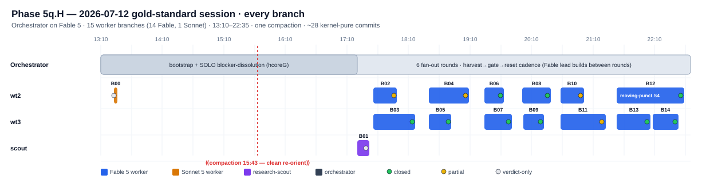

# Anatomy of a gold-standard session — Phase 5q.H, 2026-07-12

*A full-session trace (Sonnet re-analysis of every branch) of the run the operator flagged as ~10× a
normal session. Session `6b847cb9`, goal `20260712T150610`, 13:10–22:35, up to the current harvest
watermark. Method: the orchestrator transcript + all 15 in-scope subagent transcripts
(`<session>/subagents/agent-*.jsonl`) were distilled and analyzed one-branch-per-Sonnet-agent — the
subagent transcripts the routine harvest cannot see.*

---

## TL;DR — what made it a 10×

- **Model composition:** the **orchestrator ran on Fable 5** the entire session; it dispatched **15
  worker branches — 14 Fable 5, exactly 1 Sonnet 5** (the very first, a git-archaeology harvest).
  This was a Fable-driven loop, not an Opus one.
- **Output:** ~28 kernel-pure commits, 15 branches, 6 fan-out rounds, one compaction crossed cleanly,
  every `validate.py` gate 46/46. Every branch shipped kernel-pure `{propext, Classical.choice,
  Quot.sound}` or returned a decisive verdict. Zero unproductive grinds.
- **The single dominant driver:** **reconnaissance-before-write.** Every branch front-loaded a read of
  the dependency tower + grepped *exact* upstream signatures + queried `atlas_view.json` + checked
  `SETTLED_FORKS.md` **before writing a line of Lean** — and then compiled near-first-pass. A 743-line
  module landed in ~10 min of writing with two small error batches (B13); a 512-line engine port hit
  exactly one diagnostic on first write (B06). That front-loaded read *is* the 10×.
- **The frictions were tiny, uniform, and mostly one tool-schema quirk** (see Pareto §5) — which is the
  other half of the gold-standard signature: it hit the register's known-good practices *and dodged*
  its known frictions.

---

## 1. Timeline — every branch



*(If the SVG doesn't render inline, open [assets/session_20260712_timeline.svg](assets/session_20260712_timeline.svg).)*

**Shape of the session:**

```
13:10 ─ bootstrap: load skills, read goal/roadmap/exec-map/notebook, kill stray MCP,
        repo_state_probe (live truth), atlas-frontier keystone rank
13:23 ─ B00 Sonnet harvest (wt2) → verdict: wt1 chain is a byte-identical dup of main; 0 commits
13:26 ─ SOLO lead stretch: dissolve the phase's #1 blocker (hcoreG) by re-reading the mod-2 source —
        a prior session's "needs unbuilt manifold topology" verdict was an OVER-DIAGNOSIS
15:43 ─ ⟪COMPACTION⟫ → reload skills, repo_state_probe, resume on-frontier, no thread loss
17:20 ─ research-scout (B01): FG-via-PD over ℤ is provably impossible → fork BANNED, re-scope
17:36 ─ ROUND 1  (wt2 B02 · wt3 B03)   ┐
18:30 ─ ROUND 2  (wt2 B04 · wt3 B05)   │  each round:
19:24 ─ ROUND 3  (wt2 B06 · wt3 B07)   │  dispatch ≤2 workers → harvest (cherry-pick→build→
20:01 ─ ROUND 4  (wt2 B08 · wt3 B09)   │  notebook→gate 46/46→reset both slots to new main);
20:38 ─ ROUND 5  (wt2 B10 · wt3 B11)   │  lead builds solo bricks + no-go encodings BETWEEN rounds
21:33 ─ ROUND 6  (wt2 B12 · wt3 B13)   │
22:08 ─ ROUND 6b (wt3 B14, chained)    ┘
22:35 ─ harvest watermark
```

### Per-branch trace

| # | slot | model | mission | shipped | verdict | what worked (transferable) | friction |
|---|---|---|---|---|---|---|---|
| **B00** | wt2 | **Sonnet 5** | Harvest wt1 sourceIso chain | **0 commits — dup verdict**: all 7 wt1 commits already on main byte-identical (`2aa2f5f0`), main since advanced | verdict | git-archaeology (`log --grep` + `show --stat` + byte-`diff`) **then live `lean_verify` re-check on main's tip** before declaring dup | `lean_verify` wrong-param (2×) |
| **B01** | scout | Fable 5 | FG-via-PD literature | **NOT-FOUND verdict** → fork `5qH-fg-ek-over-Z-blocked` banned, loop re-scoped | verdict | staged broad→narrow plan; **batched parallel WebSearch**; primary-source (FNOP arXiv) not snippets; PDF-cache→Read fallback | 3+ WebFetch fails before finding the cache fallback |
| **B02** | wt2 | Fable 5 | E4/E5 gap-map + glue | 1c `SixteenDvdOfOrientationSpin` + `ASSEMBLY_GAP_MAP` | partial | **queried `atlas_view.json` FIRST** as structured recon; wide parallel `file_outline` sweep before writing | `lean_verify` param; 2 missing INDEX files |
| **B03** | wt3 | Fable 5 | E2 pin⁻ statement layer | 3c (Brown surgery, CharSurfaceCircle) | closed | **adapted an existing idiom** (`eucl_homology_zero`→`disk_homology_eq_zero`); `multi_attempt` to bisect a fake whnf wall | `lean_verify` param; whnf red-herring |
| **B04** | wt2 | Fable 5 | N1a Ω₄^Spin route | 4c, `HyperbolicNormalForm`+`SpinSigmaRoute` ~500 LOC | partial | pre-flight substrate audit; **per-decl `lean_verify` ×12** catching a transient `sorryAx`; scoped commits | deprecated-lemma chase; universe metavar; `sleep` blocked |
| **B05** | wt3 | Fable 5 | N6 hv2 wiring seam | 1c, 3 modules +327 | closed | ~10 min recon before first line; per-file verify | **`lean_diagnostic` empty-items false-negative** on unbuilt import → had to `lake build <module>` first |
| **B06** | wt2 | Fable 5 | N4 kron absolute-UCT port | 1c, 2 modules +512 | closed | **template-port**: read the relative engine + all consumers, then strip the quotient layer → 1 error on first write; API-verify-before-write | `lean_verify` param; Edit "not read yet" on root |
| **B07** | wt3 | Fable 5 | Freeze-B S²×D³ | 1c `SphereProductBounding` +358 | closed | **throwaway `lean_run_code`/`hover` probes against Mathlib API before drafting**; double build gate | `lean_verify` param; 1 probe mismatch (used as diagnostic) |
| **B08** | wt2 | Fable 5 | N5 witness tower | 1c `SphereWitnessTowerInt` +319 | closed | **search-before-build verified the "tower already in-tree" premise** (~12 min recon) before writing the synthesis layer | **self-review lacked a trivial-discharge check** → its `rfl`-closed `sphere4IntH2Basis_rank` (P3) passed its own gate, caught later by `proxy_body_audit` |
| **B09** | wt3 | Fable 5 | N2 pin⁻ vocabulary | 2c `CharSurfaceTrace` ~328 | closed | **grepped the DR blueprint for exact anchor items (A2/A5/A6)** to pin vocabulary to a cited step; non-dup check | `omit` placement; `lean_verify` param |
| **B10** | wt2 | Fable 5 | S4 zero-binder firing | 1c `SphereWitnessFiringInt` +243 | partial | ~15 read recon; `multi_attempt` before committing tactics; **per-decl verify enforcing the round-4 audit lesson** | `lean_verify` param |
| **B11** | wt3 | Fable 5 | S²×S² product homology | 4c; **introduced the canonical-collapse pattern** | partial | collapse = one `Homology.mapInt_bijective_of_comp_id_all` + comp/`rfl` naturality, reused 3× in 40 min | **loogle-vs-pin**: index returned `Prod.instPathConnectedSpace` the pin lacks → hand-built from `Path.prod` |
| **B12** | wt2 | Fable 5 | Moving-puncture S4 freeze | 4c; **zero-binder firing SHIPPED via a PIVOTED architecture** | closed | ~30 min dependency-tower recon; **autonomously recognized the assigned freeze was unprovable and pivoted to an equal-value route** rather than stalling | recursion-depth cycles; `sleep` blocked |
| **B13** | wt3 | Fable 5 | Slit-MV slice 1 | 1c, **743-line module** in ~10 min writing | closed | grep/sed *exact* upstream signatures; section-by-section diagnostic loop kept errors from compounding | 2 small error batches, 1 cycle each |
| **B14** | wt3 | Fable 5 | Arc slice 3 H₂(S²×S²)=ℤ² | 3c `SphereProdHTwoInt` | closed | **on chaining into a warm slot: hard-reset to main + kick background build, THEN read** (parallel window) | 1 "no goals" extra tactic; 1 rw mismatch |

Verdict-only branches (B00, B01) were *not* failures — a fast, confident "already done / provably
impossible" is a high-value outcome that prevented duplicate work and banned a dead fork.

---

## 2. The orchestration spine (Fable lead)

The three thirds of the lead transcript, analyzed separately:

- **Bootstrap + solo (13:10–17:20).** Skill load → strict context-sync ritual (goal → roadmap →
  exec-map → notebook INDEX → **`repo_state_probe.py` live truth, explicitly superseding any narrated
  summary**) → **atlas-frontier keystone ranking** to pick the highest-gating node. Then a solo
  MCP-first stretch that **dissolved the phase's #1 blocker by re-reading the mod-2 primary source** —
  a prior session had mis-diagnosed it as "needs genuine unbuilt manifold topology"; it was
  coefficient-agnostic algebra. One Sonnet harvest ran in parallel; a full build ran in the background
  while the lead did worktree hygiene.
- **Compaction crossing (15:43).** Reload skills → repo-probe → resume straight on-frontier using the
  durable goal-prompt (reused `goal_id`) → **no thread loss, no re-derivation.** Textbook.
- **Six fan-out rounds (17:20–22:35).** A uniform, fast cadence: **atlas-frontier re-rank → shape ≤2
  worker briefs from the refreshed gap-map → dispatch → harvest each return (cherry-pick → build →
  notebook → `TaskUpdate`) → periodic 46/46 gate → reset both slots to new main.** The lead built solo
  bricks and encoded kernel no-goes *between* rounds instead of idling. ~2–5 min per merge cycle let
  six rounds complete in one ~5.5-hour span. Two honesty self-corrections ("verdict first, message
  after") and one `extract_lean_deps.py` no-op were the only real snags.

---

## 3. What actually contributed to the success (ranked)

1. **Reconnaissance-before-write, universally.** The one behavior present in *all 15* branches and
   absent from ordinary sessions. Reading the tower + grepping exact signatures + querying the atlas +
   checking settled-forks *before* the first line converted "trial-and-error against an unknown API"
   (the dominant cost of unfamiliar-codebase Lean) into a single cheap up-front read. Everything
   downstream — near-first-pass compiles, minutes-not-hours branches — is a consequence.
2. **Objective, machine-derived prioritization.** Atlas-frontier keystone ranking + gap-map refresh
   drove *every* brick and round at the highest-leverage open node, and caught already-solved targets
   (`PoincareDual4Mid`) before effort was sunk. No subjective "what feels next."
3. **A tight, uniform harvest cadence that kept `main` always green.** No round ever inherited drift;
   every increment was independently kernel-pure and recoverable — which is *why* the compaction
   crossed cleanly.
4. **Correctness gates as habit, not afterthought.** Per-declaration `lean_verify` + double build gate
   + sorry/axiom grep before every commit, on every branch.
5. **Parallelism that actually parallelized.** Isolated per-slot `.lake` + ≤2-worker cap → zero
   coordination; the lead worked between rounds. Route-freedom + hunt-first briefs made workers
   *over-deliver* (discharge full theorems where only a freeze was scoped).
6. **Autonomy at the right moments.** B12 pivoted off an unprovable assigned architecture to an
   equal-value route without asking; the lead dissolved a stale blocker by going to source instead of
   trusting a prior verdict.

---

## 4. Pareto gems — the vital 20% to fold into the plugin

Ranked by (leverage × how many branches exhibited it). Each is a concrete addition to a plugin surface.

| # | Gem | Where it should live | Exact change | Evidence |
|---|---|---|---|---|
| **1** | **Reconnaissance-before-write is mandatory step 0.** Read the dependency tower end-to-end + grep *exact* upstream signatures + query `atlas_view.json` + check `SETTLED_FORKS.md` before writing any Lean. Sub-rules: verify every external Mathlib symbol via `local_search`/`loogle`/`hover` before drafting; adapt an existing structurally-analogous idiom over deriving fresh. | `skeft-qa:lean-worker` agent brief (as an enforced FIRST-ACTION block) **+** `skeft-qa:goal-dev` dev-loop | Add a "Recon gate (do before line 1)" checklist to the lean-worker dispatch template and the goal-dev loop steps. | B02,B03,B06,B07,B08,B09,B12,B13 (near-universal) |
| **2** | **Per-declaration `lean_verify` + double build gate + trivial-discharge check before commit.** Today branches verify axioms per-decl (good) but the self-check has **no triviality step** — a `rfl`-closed P3 lemma passed B08's own gate and was only caught by external `proxy_body_audit`. | `skeft-qa:lean-worker` brief + `goal-dev` pre-commit checklist | Codify: after diagnostics-clean, per new decl run `lean_verify` (axioms ⊆ {propext, Classical.choice, Quot.sound}) **and** a trivial-discharge self-check (no `rfl`/`decide`-closed structurally-named lemma), then module build + full root build + `sorry|native_decide|maxHeartbeats|axiom` grep, then explicit-path commit. | B04,B08,B10 + all |
| **3** | **Atlas-frontier keystone rank before every brick/round; refresh the gap-map after every harvest and derive the next briefs from it.** | `skeft-qa:goal-dev` skill + reinforce in `goal-prompt` | Make "re-rank frontier → refresh gap-map → shape briefs from it" an explicit per-round step. | orch parts 0/1/2 |
| **4** | **`lean_verify` call-signature is `{file_path, theorem_name}`** — NOT `{name}`/`{declaration}`. This one quirk cost ~2 wasted round-trips in **~10 of 15 branches.** | Lean MCP **reference** + one line in the `lean-worker` brief | Document the exact call shape (with a correct example) where workers will see it. Cheapest high-frequency fix in this whole set. | B00,B02,B03,B04,B06,B07,B09,B10 |
| **5** | **`lean_diagnostic_messages` empty-items false-negative:** when it returns `success:false` with an empty `items` array right after adding a new cross-file import, the real errors are hidden until the imported module has an `.olean` — run `lake build <justAddedModule>` first, then re-query. | Lean MCP friction **reference** | Add the symptom→fix entry. Silent failure mode that will recur on every wiring/glue task. | B05 |
| **6** | **Verify loogle hits against the pinned Mathlib (5e932f97 / v4.29.1)** — the live index reports lemmas the pin lacks; on a miss, grep local `.lake` mathlib and build from primitives. | Lean MCP **reference** + `lean-worker` brief | Add to the search-decision guidance. | B11 |
| **7** | **`reset-slot` hardening:** (a) **content-diff-before-force-reset** — when the guard refuses on a cherry-pick patch-id mismatch (not true ancestry), `git diff <slot> <main> --stat` to prove identity before `checkout -B`, then let the skill re-clone `.lake`; (b) **chained-slot warm-up** — on re-entering a live slot, hard-reset to main + kick the build in the background, *then* do mandatory reads (parallel window). | `skeft-qa:reset-slot` skill | Fold both into the skill so it stops recurring (a) hit ~3 of 6 rounds. | orch 1/2 (a); B14 (b) |
| **8** | **Worker briefs: explicit route-freedom + "hunt existing in-tree infrastructure first."** Repeatedly caused workers to discharge full theorems instead of the scoped freeze — shortening the critical path at zero orchestration cost. | `skeft-qa:lean-worker` dispatch template | Standardize the "route freedom + hunt-first" clause in the brief. | orch 2; B02,B08 |
| **9** | **Integrity + settle discipline:** "verdict first, message after" (never pre-draft an N/N gate claim before reading the output) **+** encode-on-settle (a prose `SETTLED_FORKS` entry ships its kernel-pure no-go module + `KERNEL_NOGO_REGISTRY` entry the same turn). | `skeft-qa:wave-close` skill + CLAUDE.md line | Both were self-caught this session; codify so they're not luck. | orch 2 |
| **10** | **Lean authoring micro-patterns:** prototype in a disposable scratch file then port to the production name + delete; bisect-by-truncation to localize a whnf/heartbeat timeout's hot tactic. | `lean4:lean4` skill / friction **reference** | Add to the friction catalog. | orch 0 |
| **11** | **`research-scout` brief parity + PDF fallback baked in.** The scout dispatch still lacks the mandatory-reads/hard-rules/deliverable-format block the lean-worker brief has, and each scout re-discovers the "WebFetch chokes on PDF → fetch raw PDF (auto-cached) → `Read` at page level" fallback live. | `skeft-qa:research-scout` agent definition | Add the structural block + bake the PDF-cache fallback into the agent's own instructions (cross-link `reference-webfetch-pdf-cache-direct-read`). | B01 |

**If you do only three:** #1 (recon-before-write into the lean-worker brief), #2 (the pre-commit
gate incl. the missing triviality check), and #4 (the one-line `lean_verify` signature fix). #1 is the
10× itself; #2 closes the one correctness hole that slipped to the external audit; #4 is a one-line
edit that de-frictions two-thirds of all workers.

---

## 5. On the model story

The productivity did not strictly come from a bigger model, although the lead and 14/15 workers were Fable.
It came from **process**: recon-before-write, machine-derived prioritization, an always-green harvest
cadence, and habitual per-declaration verification. These gems are the mechanism, and they're model-portable. Folding them into the briefs/skills/references above is how a future loop reproduces this session by default rather than by luck.

---

*Sources: orchestrator transcript `6b847cb9` (Fable 5, span 0–watermark) + 15 subagent transcripts
under `6b847cb9/subagents/`, distilled and analyzed one-branch-per-Sonnet-agent, 2026-07-12. Companion:
the [exemplar-session-detection GAP-A proposal](proposals/exemplar-session-detection.md) (the harvest
lens that would flag a session like this automatically).*
